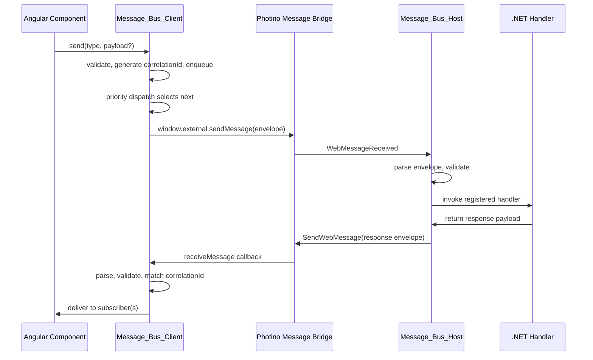

# Message Bus Service — Design

#[[file:.kiro/specs/_global/design-shared.md]]

## Overview

Two-sided message bus replacing direct bridge calls. Angular `Message_Bus_Client` (singleton injectable) handles outbound queuing, priority dispatch, correlation tracking, inbound routing. .NET `Message_Bus_Host` handles inbound parsing, sequential handler dispatch, outbound encoding. Wire protocol: newline-delimited envelope over existing string bridge.

## Architecture



## Components

### Message_Bus_Client (Angular)

`@Injectable({ providedIn: 'root' })` singleton.

**Public API:**
- `configure(messageType, config: Partial<MessageTypeConfig>)` — set queue mode, priority, timeout
- `send(messageType, payload?): string` — returns correlationId
- `cancel(correlationId)` — remove from pending silently
- `subscribe(messageType, handler): SubscriptionHandle` — returns handle w/ `unsubscribe()`
- `setFallbackHandler(handler | null)` — catch-all for unsubscribed non-system msgs
- `setSystemHandler(handler)` — default handler for unsubscribed system msgs
- `errors$: Observable<BusError>` — structured error stream

**Internal state:**
- `queues: Map<string, MessageQueue>` — per-type outbound queues
- `pendingRequests: Map<string, PendingRequest>` — correlationId → pending info
- `timeoutTimers: Map<string, Timer>` — per-request timeout
- `subscribers: Map<string, Set<Handler>>` — per-type subscriber sets
- `systemInboundQueue / normalInboundQueue` — two-queue inbound system
- `arrivalCounter: number` — global monotonic counter

**Dispatch algorithm:** Select queue w/ lowest priority value; tiebreak by earliest arrivalTimestamp. Sequential — one in-flight at a time via iterative while loop.

**Inbound routing:** Parse → validate → system prefix? → system queue. Else: in pending? → remove + normal queue. Else: has subscribers? → normal queue (Backend_Push). Else: fallback? → normal queue. Else: discard + debug log. Microtask drain: system queue first (all), then normal queue.

### Message_Bus_Host (.NET)

`sealed class MessageBusHost : IDisposable`

**Public API:**
- `RegisterHandler(messageType, Func<string, string, Task<string?>>)` — handler receives (correlationId, payload), returns response or null
- `Send(messageType, payload)` — Backend_Push w/ generated GUID correlationId
- `SendSystemMessage(systemType, payload)` — validates `"system:"` prefix
- `SendResponse(messageType, correlationId, payload)` — explicit response

**Sequential processing:** `Channel<string>` (unbounded, single-reader). Event handler enqueues. Background `Task.Run` loop dequeues + processes one at a time. Handler exception → catch, log, send `system:error`.

**Null-response semantics:** `null` → no wire message (fire-and-forget). `""` → wire message w/ empty payload. Non-null string → wire message w/ payload.

### IMessageBridge (interface)

```csharp
public interface IMessageBridge
{
    void SendWebMessage(string message);
    event EventHandler<string>? WebMessageReceived;
}
```

`PhotinoMessageBridge` adapts `PhotinoWindow` to this interface.

### MessageProtocol (shared, both sides)

Static class w/ `Encode`, `Decode`, `ValidateMessageType`, `ValidateCorrelationId`, `ValidatePayload`. Identical logic in TypeScript and C#.

## Wire Format

```
{Message_Type}\n{Correlation_ID}\n{payload}
```

| Field | Constraints |
|-------|-------------|
| Message_Type | `[a-z0-9:-]+`, 1–64 chars |
| Correlation_ID | `[a-zA-Z0-9-]+`, 1–36 chars |
| Payload | 0–2,097,152 chars, may contain `\n` |

## Capacity Constraints

| Resource | Limit |
|----------|-------|
| Accumulate queue per type | 100 messages |
| Latest-wins queue per type | 1 message |
| Pending-requests map (global) | 1000 entries |
| Payload size | 2,097,152 chars |

## Error Handling

| Scenario | Behavior |
|----------|----------|
| Bridge throws on send | Log, emit error$, leave pending → timeout fires |
| Protocol parse failure | Discard, log warning |
| Invalid fields (outbound) | Throw to caller |
| Invalid fields (inbound) | Discard, log warning |
| Handler throws (host) | Catch, log, send `system:error` |
| Subscriber throws | Catch, log, continue to next |
| Queue overflow | Discard newest, log warning, emit error$ |
| Pending overflow (1000) | Throw to caller |
| Timeout | Remove from pending, notify subscriber, emit error$ |
| No retry | All failures fire-once-discard |

## Correctness Properties

1. **Protocol round-trip** — encode then decode preserves all fields
2. **No-payload equivalence** — undefined and "" produce identical wire output
3. **Correlation_ID uniqueness** — all send() calls return distinct IDs
4. **Inbound routing correctness** — subscribers receive, fallback catches orphans
5. **Subscriber error isolation** — non-throwing subscribers still receive
6. **Per-type delivery order** — FIFO within same type
7. **Unsubscribe stops delivery** — no messages after unsubscribe
8. **Accumulate FIFO + capacity** — order preserved, max 100, overflow discards newest
9. **Latest-wins newest** — always stores most recent, max 1
10. **Config immutability** — no reconfig after first enqueue
11. **Priority dispatch ordering** — lowest priority value first, tiebreak by timestamp
12. **Sequential dispatch** — one in-flight at a time
13. **System inbound priority** — system messages delivered before normal
14. **Validation rejects invalid** — correct accept/reject per field rules
15. **Pending lifecycle** — response/timeout/cancel transitions correct
16. **Latest-wins pending cleanup** — discarded ID removed from pending
17. **Pending capacity** — throw at 1000
18. **Sequential host processing** — no concurrent handlers, arrival order
