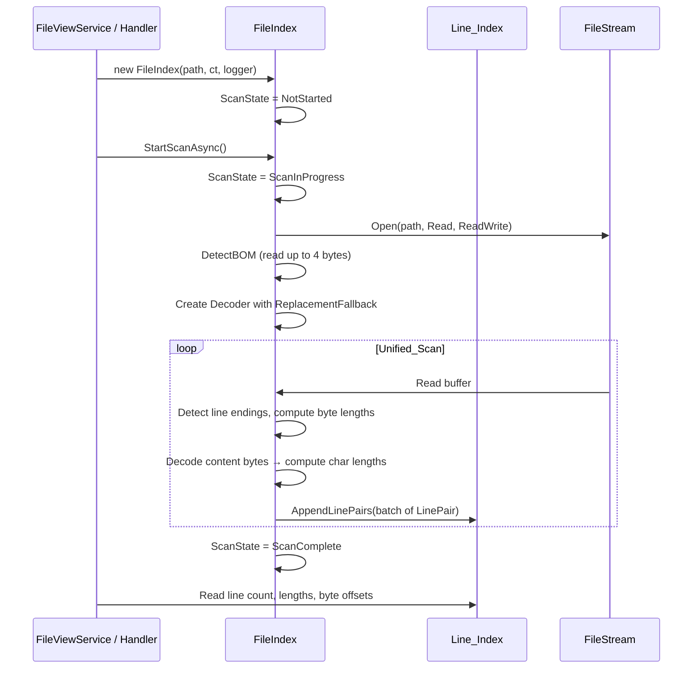
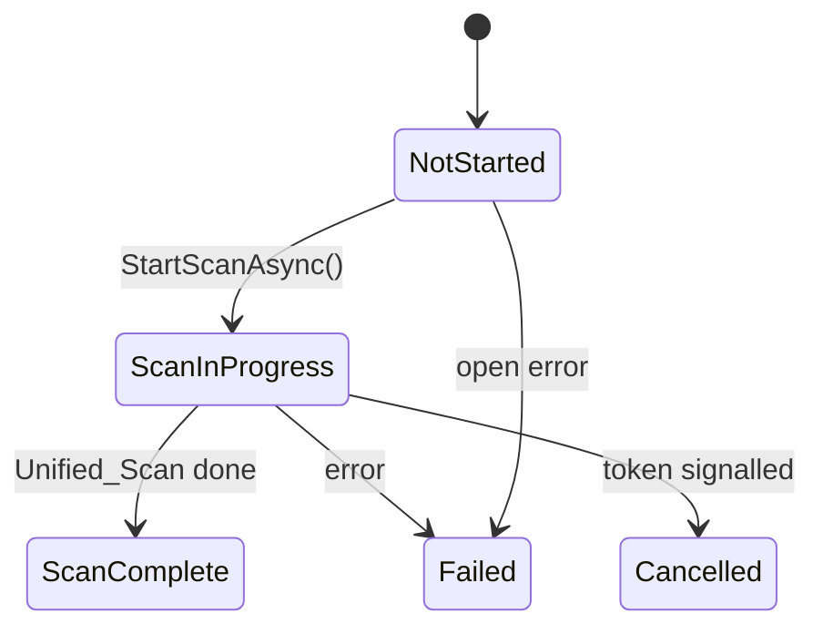
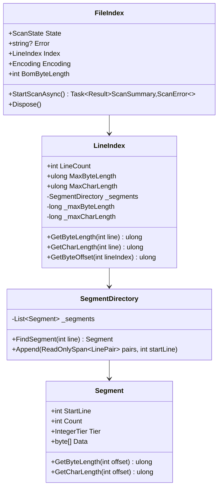

# File Index — Design

#[[file:.kiro/specs/_global/design-shared.md]]

## Overview

FileIndex scans a single file in one unified pass to build a memory-compact, thread-safe index of per-line metadata. The scan detects encoding via BOM, then reads the file sequentially — detecting line endings, recording byte lengths, AND computing character lengths simultaneously. The index uses a single SegmentDirectory storing interleaved (Byte_Length, Char_Length) pairs per line with variable-width integer tiers for minimal memory footprint.

Key behaviors:
- Single-pass scanning (Unified_Scan): BOM detection → sequential scan loop → both lengths per line
- Non-exclusive file access (FileShare.ReadWrite)
- Thread-safe Line_Index: single writer, multiple concurrent readers, no torn reads
- `AppendLinePairs(ReadOnlySpan<LinePair>)` writes both values atomically per batch
- Tier selection based on max Byte_Length in segment (Char_Length ≤ Byte_Length always fits)
- 4 unsigned integer tiers (byte/ushort/uint/ulong)
- Memory-optimal segment boundaries (split only when savings exceed metadata cost)
- Byte_Length includes line-ending delimiter bytes → enables byte-offset navigation via prefix sum
- Simple state machine: NotStarted → ScanInProgress → ScanComplete (or Failed/Cancelled)
- `GetCharLength` returns non-nullable `ulong` (no progressive availability concept)
- Encoding detection via BOM (UTF-8/16/32); `Encoding` + `BomByteLength` exposed immediately
- CancellationToken + ILogger<FileIndex> injection, IDisposable lifecycle

Integration: caller (FileViewService / Program.cs handler) creates FileIndex, calls StartScanAsync, polls State, reads Index. FileIndex has zero awareness of callers.

## Architecture







## Components and Interfaces

### FileIndex (C#)

```csharp
namespace TextViewer.Services;

public sealed class FileIndex : IDisposable
{
    public FileIndex(string filePath, CancellationToken cancellationToken, ILogger<FileIndex> logger);

    public ScanState State => _state;        // volatile
    public string? Error => _error;          // volatile
    public LineIndex Index { get; }
    public Encoding Encoding { get; private set; } = Encoding.UTF8;
    public int BomByteLength { get; private set; } = 0;

    public Task<Result<ScanSummary, ScanError>> StartScanAsync();
    public void Dispose();
}
```

### LineIndex (C#)

```csharp
namespace TextViewer.Services;

public sealed class LineIndex
{
    public int LineCount => _lineCount;                          // volatile int
    public ulong MaxByteLength => (ulong)Interlocked.Read(ref _maxByteLength);
    public ulong MaxCharLength => (ulong)Interlocked.Read(ref _maxCharLength);

    public ulong GetByteLength(int lineIndex);
    public ulong GetCharLength(int lineIndex);
    public ulong GetByteOffset(int lineIndex);

    internal void AppendLinePairs(ReadOnlySpan<LinePair> pairs);
    internal void Clear();
}
```

### LinePair (C#)

```csharp
namespace TextViewer.Services;

internal readonly record struct LinePair(ulong ByteLength, ulong CharLength);
```

### SegmentDirectory (C#)

```csharp
namespace TextViewer.Services;

internal sealed class SegmentDirectory
{
    public int TotalLines { get; }
    public Segment FindSegment(int lineIndex);
    public (Segment, int SegmentIndex) FindSegmentWithIndex(int lineIndex);
    public void Append(ReadOnlySpan<LinePair> pairs, int startLineIndex);
    public void Clear();
    internal static IntegerTier SelectTier(ulong maxByteLength);
}
```

### Segment (C#)

```csharp
namespace TextViewer.Services;

internal sealed class Segment
{
    public int StartLine { get; }
    public int Count { get; }
    public IntegerTier Tier { get; }
    internal byte[] Data { get; }

    public ulong GetByteLength(int offsetWithinSegment);
    public ulong GetCharLength(int offsetWithinSegment);
}
```

## Data Models

### ScanState Enum

```csharp
public enum ScanState
{
    NotStarted = 0,
    ScanInProgress = 1,
    ScanComplete = 2,
    Failed = 3,
    Cancelled = 4
}
```

### ScanSummary / ScanError

```csharp
public sealed record ScanSummary(int LineCount, Encoding Encoding, int BomByteLength);
public sealed record ScanError(ScanErrorCode Code, string Message);
public enum ScanErrorCode { FileNotFound, AccessDenied, IoError, OutOfMemory, Cancelled, Unknown }
```

### IntegerTier Enum

```csharp
internal enum IntegerTier : byte
{
    Byte = 1,    // max 255
    UShort = 2,  // max 65,535
    UInt = 4,    // max 4,294,967,295
    ULong = 8    // max 18,446,744,073,709,551,615
}
```

### Segment Memory Layout

Each segment stores interleaved pairs of (Byte_Length, Char_Length):
- **Metadata**: StartLine (4B) + Count (4B) + Tier (1B) = 9 bytes overhead
- **Data**: Count × 2 × TierSize bytes
- **Layout**: `[byteLen0, charLen0, byteLen1, charLen1, ...]`

### Tier Selection

```
selectTier(maxByteLength) → IntegerTier
    if maxByteLength <= 255:       return Byte
    if maxByteLength <= 65535:     return UShort
    if maxByteLength <= 4294967295: return UInt
    return ULong
```

### Segment Boundary Decision

Greedy O(N) single-pass during append:
1. Next line needs wider tier → start new segment
2. Next line could use narrower tier AND `memorySaved > 9` → start new segment
3. Otherwise → continue current run

Full `Optimize()` exists for offline/test use (merge+split until optimal).

### Unified Scan Algorithm

```
1. DetectBOM (read up to 4 bytes → set Encoding + BomByteLength)
2. Create Decoder with ReplacementFallback
3. Seek to byte 0 (BOM bytes included in first line's byteLength, excluded from charLength)
4. Sequential read loop (64KB buffer):
   - Detect line endings (LF/CR/CRLF)
   - Accumulate content bytes per line (excluding delimiters, excluding BOM on first line)
   - On line boundary: compute byteLength (content + delimiter), decode content → charLength
   - Emit LinePair, batch at 1000 pairs → flush via AppendLinePairs
5. Flush final line + remaining batch
```

### Byte-Offset Navigation

```
GetByteOffset(lineIndex):
    if lineIndex == 0: return 0
    if lineIndex == LineCount: return totalByteLength
    (segment, segmentIndex) = FindSegmentWithIndex(lineIndex)
    offset = segmentPrefixBytes[segmentIndex]
    for i in 0..<(lineIndex - segment.StartLine):
        offset += segment.GetByteLength(i)
    return offset
```

### Thread-Safety Model

| Operation | Mechanism | Guarantee |
|-----------|-----------|-----------|
| ScanState read | `volatile` field | No torn read |
| Error read | `volatile` field | Atomic reference |
| LineCount read | `volatile int` | Atomic read |
| GetByteLength | Segment data immutable after write; lock + volatile count publish | No torn read |
| GetCharLength | Same as GetByteLength — both written atomically in AppendLinePairs | No torn read |
| MaxByteLength | `Interlocked.Read` on `long`; updated inside `_writeLock` | Atomic 64-bit read |
| MaxCharLength | `Interlocked.Read` on `long`; updated inside `_writeLock` | Atomic 64-bit read |
| GetByteOffset | Reads only committed segments | Consistent sum |
| AppendLinePairs | `_writeLock`; publishes segment then increments `_lineCount` | Complete pairs only |
| Encoding | Set once before scan publishes lines | Immutable after init |
| BomByteLength | Set once before scan publishes lines | Immutable after init |

**Key simplification**: No `_charLengthsWrittenUpTo` counter. Both values written together in `AppendLinePairs`. A line is either fully visible (both lengths) or not visible at all.

**Abort invariant**: On abort, writer clears all segments and resets `_lineCount` to 0 before state transition. No partial Line_Index exposed.

### Error Property Format

| Scenario | Format |
|----------|--------|
| File not found | `"Failed to open {filePath}: FileNotFoundException"` |
| Access denied | `"Failed to open {filePath}: UnauthorizedAccessException"` |
| I/O error on open | `"Failed to open {filePath}: IOException"` |
| Scan failure | `"Scan failed for {filePath}: {ExceptionType}"` |

### Logging Levels

| Event | Level |
|-------|-------|
| Scan start | Information |
| Scan complete/cancelled | Information |
| Access error (open) | Error |
| Scan failure | Information |
| Disposal events | Debug |
| Resource release failure | Warning |

## Correctness Properties

### Property 1: Byte-length round-trip

*For any* byte sequence, sum of stored Byte_Lengths == file size, reconstruction == original bytes, line count == delimiters + trailing content (zero for empty files).

**Validates: Requirements 1.1, 2.1, 2.2, 2.3**

### Property 2: Char-length correctness

*For any* file content and detected encoding, stored Char_Length == `.Length` of .NET string from decoding content bytes (excluding delimiter, excluding BOM on first line) with ReplacementFallback.

**Validates: Requirements 3.1, 3.2**

### Property 3: Abort produces no partial index

*For any* failure point during scan, after abort Line_Index has zero lines, ScanState is Failed or Cancelled.

**Validates: Requirements 1.4, 2.4, 6.1, 6.3**

### Property 4: State machine transition validity

*For any* scan event sequence, ScanState only transitions forward through valid edges. Failed/Cancelled are terminal.

**Validates: Requirements 5.7**

### Property 5: Concurrent read safety

*For any* interleaving of writer + readers, every reader observes complete value or absence (lineIndex >= LineCount). No torn reads.

**Validates: Requirements 7.1, 7.2, 3.3**

### Property 6: Segment tier minimality

*For any* segment, IntegerTier == smallest tier fitting max Byte_Length in that segment.

**Validates: Requirements 7.3, 8.1**

### Property 7: Segment boundary optimality

*For any* adjacent segments (after Optimize), merging doesn't reduce memory AND splitting doesn't reduce memory.

**Validates: Requirements 8.2, 8.3**

### Property 8: Byte-offset fast-path preservation

*For any* valid line index, `GetByteOffset` via segment-prefix metadata == baseline cumulative sum.

**Validates: Requirements 11.1, 11.2, 11.3, 11.4**

## Error Handling

| Scenario | Behavior | ScanState | Error Property |
|----------|----------|-----------|----------------|
| File not found | Skip scan, log Error | Failed | `"Failed to open {path}: FileNotFoundException"` |
| Access denied | Skip scan, log Error | Failed | `"Failed to open {path}: UnauthorizedAccessException"` |
| I/O error on open | Skip scan, log Error | Failed | `"Failed to open {path}: IOException"` |
| I/O error during scan | Abort, clear Line_Index | Failed | `"Scan failed for {path}: IOException"` |
| Invalid bytes during scan | Use U+FFFD, count as 1 code unit | continues | (no error) |
| CancellationToken during scan | Stop I/O ≤500ms, clear Line_Index | Cancelled | (no error) |
| Memory failure during scan | Abort, clear Line_Index | Failed | `"Scan failed for {path}: OutOfMemoryException"` |
| Resource release failure on Dispose | Log Warning, continue | unchanged | unchanged |

### Disposal Strategy

```csharp
public void Dispose()
{
    try { _stream?.Dispose(); }
    catch (Exception ex) { _logger.LogWarning(ex, "Failed to close file stream"); }

    try { Index.Clear(); }
    catch (Exception ex) { _logger.LogWarning(ex, "Failed to clear index"); }

    _logger.LogDebug("FileIndex disposed for {FilePath}", _filePath);
}
```

## Testing Strategy

### Property-Based Tests (FsCheck + xUnit)

| Property | Generators | Asserts |
|----------|-----------|---------|
| 1: Byte-length round-trip | Random byte arrays (0–10KB) w/ mixed line endings | Sum == file size; reconstruct == original; line count correct |
| 2: Char-length correctness | Random strings encoded UTF-8 w/ optional BOM, multi-byte, invalid bytes | Stored == .NET Encoding.GetCharCount (with ReplacementFallback) |
| 3: Abort no partial index | Random byte arrays + random cancellation point | LineCount == 0; State is Failed or Cancelled |
| 4: State machine validity | Random event sequences {Success, Failure, Cancel} | All transitions follow valid forward edges |
| 5: Concurrent read safety | Random LinePair batches + concurrent reader threads | No torn values |
| 6: Tier minimality | Random LinePair arrays spanning tier boundaries | Tier == selectTier(max byteLength) |
| 7: Boundary optimality | Random LinePair arrays with tier-crossing patterns | No profitable merge or split |

### Unit Tests

| Test | Validates |
|------|-----------|
| Opens with FileShare.ReadWrite, FileAccess.Read | Req 9.1 |
| Missing file → Failed + correct Error | Req 9.3 |
| Access denied → Failed + correct Error | Req 9.2 |
| LF/CR/CRLF/mixed line endings | Req 2.1 |
| Byte_Length includes delimiter bytes | Req 2.2 |
| Final unterminated line | Req 2.2 |
| Empty file → 0 lines | Req 2.3 |
| Scan error → empty Line_Index | Req 1.4 |
| UTF-8 multi-byte chars | Req 3.1 |
| BOM excluded from Char_Length | Req 3.1 |
| Invalid bytes → U+FFFD | Req 3.2 |
| BOM detection for each signature | Req 4.1 |
| File < 4 bytes BOM detection | Req 4.3 |
| State transitions (happy path) | Req 5.2, 5.3 |
| GetByteOffset correctness | Req 11.1, 11.2 |
| MaxCharLength is non-nullable ulong | Req 10.3 |
| Dispose releases handle | Req 12.2 |
| Disposal failure → log + continue | Req 12.3 |
| Double Dispose → no exception | Req 12.4 |
| CancellationToken → Cancelled | Req 5.5 |

### Integration Tests

| Test | Validates |
|------|-----------|
| Scan real file end-to-end (byte + char lengths correct) | Req 1.1, 1.2 |
| No second file read (stream never seeks backward after BOM) | Req 1.3 |
| Concurrent readers during scan | Req 7.1 |
| Cancellation stops ≤500ms | Req 5.5, 6.2 |
| Large file (1M+ lines) no OOM | Req 8 |
| GetByteOffset matches file positions | Req 11.1 |

### Test Boundaries

- **Unit**: mock FileStream, test LineIndex/segmentation/BOM detection in isolation
- **Property**: pure logic (segmentation, tier selection, line parsing, char decoding, pairs)
- **Integration**: real file I/O, real threading, real cancellation
- **No UI tests**: caller/Status_Display behavior tested in separate frontend spec
