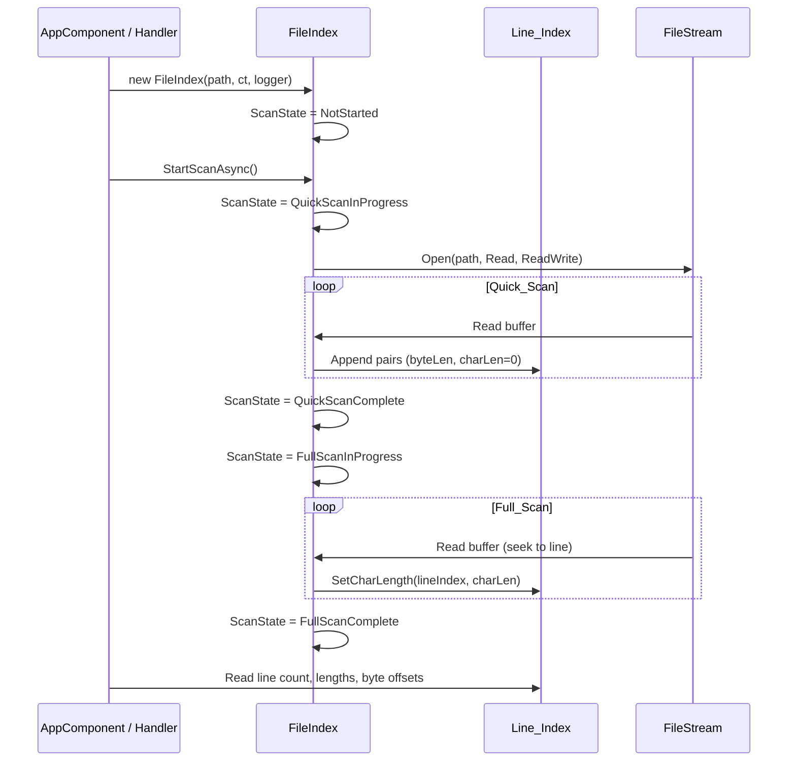
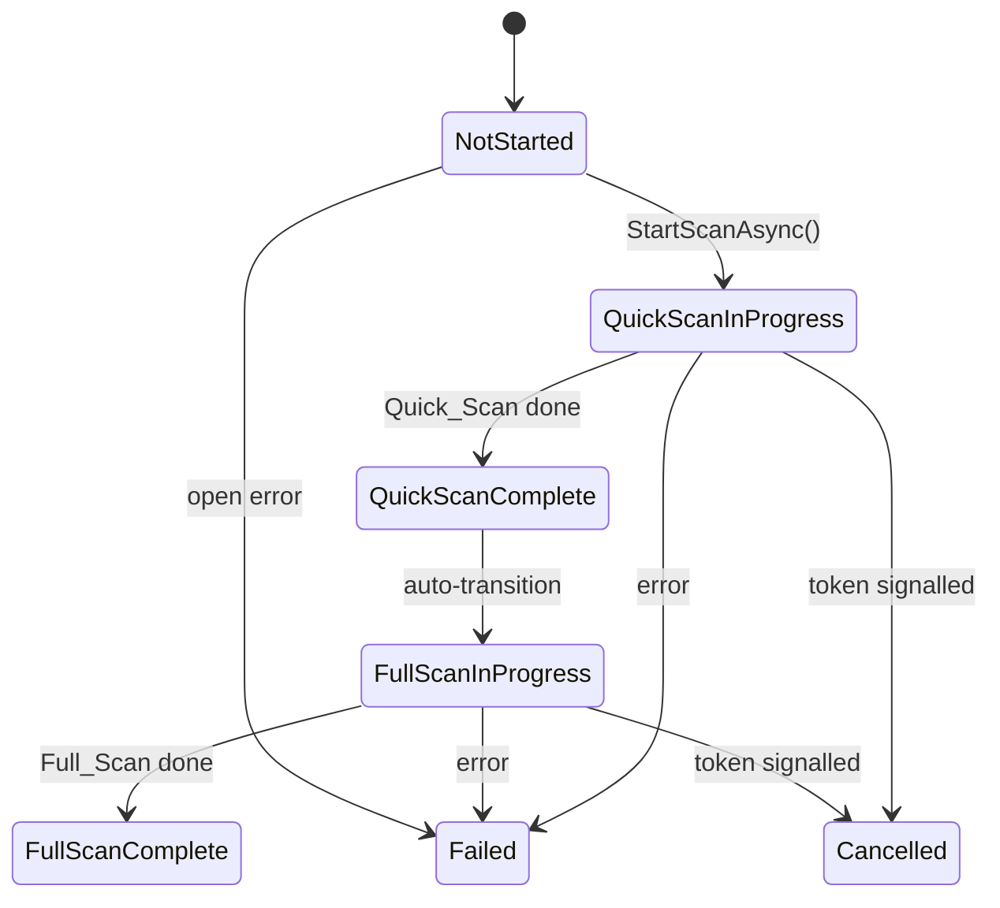
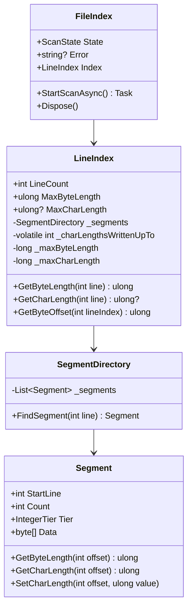

# File Index — Design

#[[file:.kiro/specs/_global/design-shared.md]]

## Overview

FileIndex scans a single file in two phases to build a memory-compact, thread-safe index of per-line metadata. Quick_Scan identifies line boundaries and records byte lengths (including delimiter bytes); Full_Scan decodes content and records character lengths. The index uses a single SegmentDirectory storing interleaved (Byte_Length, Char_Length) pairs per line, with variable-width integer tiers grouped into segments for minimal memory footprint and a sorted directory enabling O(log N) line lookups.

Key behaviors:
- Two-phase scanning (Quick_Scan → Full_Scan), automatic progression
- Non-exclusive file access (FileShare.ReadWrite)
- Thread-safe Line_Index: single writer, multiple concurrent readers, no torn reads
- Unified segment storage: pairs of (Byte_Length, Char_Length) per line, interleaved
- Tier selection based on max Byte_Length in segment (Char_Length ≤ Byte_Length always fits)
- 4 unsigned integer tiers (byte/ushort/uint/ulong)
- Memory-optimal segment boundaries (split only when savings exceed metadata cost)
- Byte_Length includes line-ending delimiter bytes → enables byte-offset navigation via prefix sum
- Encoding detection via BOM (UTF-8/16/32); `Encoding` + `BomByteLength` exposed immediately after scan starts
- CancellationToken + ILogger<FileIndex> injection, IDisposable lifecycle
- ScanState enum for polling-based progress observation

Integration: caller (AppComponent) creates FileIndex via Message Bus handler response, polls ScanState, displays metrics in Status_Display. FileIndex has zero awareness of callers.

## Architecture







## Components and Interfaces

### FileIndex (C#)

```csharp
namespace TextViewer.Services;

public sealed class FileIndex : IDisposable
{
    private readonly string _filePath;
    private readonly CancellationToken _cancellationToken;
    private readonly ILogger<FileIndex> _logger;
    private FileStream? _stream;
    private volatile ScanState _state = ScanState.NotStarted;
    private volatile string? _error;

    public FileIndex(string filePath, CancellationToken cancellationToken, ILogger<FileIndex> logger)
    {
        _filePath = filePath ?? throw new ArgumentNullException(nameof(filePath));
        _cancellationToken = cancellationToken;
        _logger = logger ?? throw new ArgumentNullException(nameof(logger));
        Index = new LineIndex();
    }

    public ScanState State => _state;
    public string? Error => _error;
    public LineIndex Index { get; }
    public Encoding Encoding { get; private set; } = Encoding.UTF8;
    public int BomByteLength { get; private set; } = 0;

    public Task StartScanAsync();
    public void Dispose();
}
```

### LineIndex (C#)

```csharp
namespace TextViewer.Services;

public sealed class LineIndex
{
    private readonly object _writeLock = new();
    private SegmentDirectory _segments = new();
    private volatile int _lineCount;
    private volatile int _charLengthsWrittenUpTo;
    private long _maxByteLength;
    private long _maxCharLength;

    public int LineCount => _lineCount;
    public ulong MaxByteLength => (ulong)Interlocked.Read(ref _maxByteLength);
    public ulong? MaxCharLength => _charLengthsWrittenUpTo == 0 ? null : (ulong)Interlocked.Read(ref _maxCharLength);
    public ulong GetByteLength(int lineIndex);
    public ulong? GetCharLength(int lineIndex);
    public ulong GetByteOffset(int lineIndex);

    internal void AppendByteLengths(ReadOnlySpan<ulong> byteLengths);
    internal void SetCharLength(int lineIndex, ulong charLength);
    internal void FinalizeCharLengths();
    internal void Clear();
}
```

### SegmentDirectory (C#)

```csharp
namespace TextViewer.Services;

internal sealed class SegmentDirectory
{
    private readonly List<Segment> _segments = new();

    public Segment FindSegment(int lineIndex);
    public void Append(ReadOnlySpan<ulong> byteLengths, int startLineIndex);
    public void SetCharLength(int lineIndex, ulong charLength);
    public int TotalLines { get; }
}
```

### Segment (C#)

```csharp
namespace TextViewer.Services;

internal sealed class Segment
{
    public int StartLine { get; }
    public int Count { get; }
    public IntegerTier Tier { get; }
    private byte[] _data;

    public ulong GetByteLength(int offsetWithinSegment);
    public ulong GetCharLength(int offsetWithinSegment);
    public void SetCharLength(int offsetWithinSegment, ulong value);
}
```

### Integration with Message Bus

FileIndex creation triggered by existing `open-file` handler response flow. The Angular caller receives the file path, then the .NET side creates a `FileIndex` instance. The caller polls `State` and reads `Index` properties to update the Status_Display. FileIndex itself has no Message Bus dependency.

## Caller Contract

Responsibilities belong to the caller (AppComponent / handler layer), NOT to FileIndex.

### Lifecycle Management

1. Caller creates `FileIndex(path, cancellationToken, logger)` and calls `StartScanAsync()`
2. Caller periodically polls `State` and updates Status_Display
3. Caller calls `Dispose()` when done

### New File Selection

1. Signal `CancellationToken` on previous FileIndex
2. `Dispose()` previous FileIndex
3. Clear all metrics from previous file in Status_Display
4. Create new `FileIndex` for new path

### Failed / Cancelled Observation

- On `Failed` or `Cancelled`: do NOT display partial metrics; revert Status_Display
- On `Failed`: display `Error` field in main content area (replacing "hello world")

### Max Length Computation

LineIndex exposes `MaxByteLength` (ulong) and `MaxCharLength` (ulong?) properties — O(1) cached reads. Values tracked incrementally: `AppendByteLengths` updates `_maxByteLength` inside `_writeLock`; `SetCharLength` updates `_maxCharLength` before publishing `_charLengthsWrittenUpTo`. `MaxCharLength` returns null when no char lengths written yet. `Clear()` resets both to 0. Thread-safe via `Interlocked.Read` on `long` backing fields.

## Data Models

### ScanState Enum

```csharp
namespace TextViewer.Services;

public enum ScanState
{
    NotStarted = 0,
    QuickScanInProgress = 1,
    QuickScanComplete = 2,
    FullScanInProgress = 3,
    FullScanComplete = 4,
    Failed = 5,
    Cancelled = 6
}
```

### IntegerTier Enum

```csharp
namespace TextViewer.Services;

internal enum IntegerTier : byte
{
    Byte = 1,    // 1 byte per value, max 255
    UShort = 2,  // 2 bytes per value, max 65,535
    UInt = 4,    // 4 bytes per value, max 4,294,967,295
    ULong = 8   // 8 bytes per value, max 18,446,744,073,709,551,615
}
```

### Segment Memory Layout

Each segment stores interleaved pairs of (Byte_Length, Char_Length):
- **Metadata**: StartLine (int, 4B) + Count (int, 4B) + Tier (byte, 1B) = 9 bytes overhead
- **Data**: Count × 2 × TierSize bytes

```
Data layout: [byteLen0, charLen0, byteLen1, charLen1, ...]
Segment memory = 9 + (Count × 2 × TierSize)
```

### Pair Access Formulas

```
GetByteLength(offset): read TierSize bytes at position offset × 2 × TierSize
GetCharLength(offset): read TierSize bytes at position (offset × 2 + 1) × TierSize
SetCharLength(offset, value): write TierSize bytes at position (offset × 2 + 1) × TierSize
```

### Tier Selection Algorithm

```
function selectTier(maxByteLength: ulong) -> IntegerTier:
    if maxByteLength <= 255:       return Byte
    if maxByteLength <= 65535:     return UShort
    if maxByteLength <= 4294967295: return UInt
    return ULong
```

### Segment Boundary Decision

Greedy O(N) single-pass algorithm during scanning:
1. Next line needs **wider** tier → start new segment
2. Next line could use **narrower** tier AND `memorySaved > 9` → start new segment
3. Otherwise → continue current run

```
narrowing condition:
remainingLines = lines still to append from current position
memorySaved = remainingLines × 2 × (currentTierSize - narrowTierSize)
metadataCost = 9
split if memorySaved > metadataCost
```

No merge/split during Append. Full `Optimize()` exists for offline/test use only.

### Byte-Offset Navigation

```
GetByteOffset(lineIndex):
    offset = 0
    for i in 0..lineIndex-1:
        offset += GetByteLength(i)
    return offset

Invariant: GetByteOffset(0) == 0
Invariant: GetByteOffset(LineCount) == fileSize
```

### Thread-Safety Model

| Operation | Mechanism | Guarantee |
|-----------|-----------|-----------|
| ScanState read | `volatile` field | No torn read |
| Error read | `volatile` field | Atomic reference |
| LineCount read | `volatile int` | Atomic read |
| GetByteLength | Segment data immutable after write; lock + volatile count publish | No torn read |
| GetCharLength | `Interlocked` write; volatile `_charLengthsWrittenUpTo` | No torn read |
| MaxByteLength | `Interlocked.Read` on `long` field; updated inside `_writeLock` | Atomic 64-bit read |
| MaxCharLength | `Interlocked.Read` on `long` field; updated before `_charLengthsWrittenUpTo` publish | Atomic 64-bit read |
| GetByteOffset | Reads only committed segments | Consistent sum |
| AppendByteLengths | `_writeLock`; publishes segment then increments `_lineCount` | Complete pairs only |
| SetCharLength | `Interlocked.Exchange` on char slot | Atomic write |
| Encoding | Set once before scan publishes lines | Immutable after init |
| BomByteLength | Set once before scan publishes lines | Immutable after init |

**Visibility ordering**: `_lineCount` incremented AFTER segment data fully written. Char-length uses `_charLengthsWrittenUpTo` counter — returns null (not yet processed) or final value.

**Quick_Scan abort invariant**: On abort, writer resets `_lineCount` to 0 and clears all segments before state transition. No partial Line_Index exposed.

### Error Property Format

| Scenario | Format |
|----------|--------|
| File not found | `"Failed to open {filePath}: FileNotFoundException"` |
| Access denied | `"Failed to open {filePath}: UnauthorizedAccessException"` |
| I/O error on open | `"Failed to open {filePath}: IOException"` |
| Scan failure | `"Scan failed for {filePath}: {ExceptionType}"` |

### Logging Levels

| Event | Level |
|-------|-------|
| Scan start | Information |
| Phase transition | Information |
| Access error | Error |
| Non-access scan issue | Information |
| Disposal events | Debug |
| Resource release failure | Warning |

## Correctness Properties

### Property 1: Quick_Scan byte-length round-trip

*For any* byte sequence representing file content, the sum of all stored Byte_Lengths SHALL equal the total file size in bytes, AND reconstructing the file by concatenating each line's Byte_Length bytes SHALL produce the original byte sequence.

Also validates byte-offset navigation: sum of Byte_Lengths[0..N-1] == file offset of line N.

**Validates: Requirements 2.2, 2.3, 2.4**

### Property 2: Full_Scan char-length correctness

*For any* file content and detected encoding, the Char_Length stored for each line SHALL equal `.Length` of the .NET string produced by decoding that line's content bytes (excluding delimiter bytes) with the encoding (using ReplacementFallback), excluding any BOM character.

**Validates: Requirements 3.2, 3.3, 3.4**

### Property 3: Segment tier minimality

*For any* segment, the IntegerTier SHALL be the smallest tier whose max value ≥ max Byte_Length in that segment.

**Validates: Requirements 4.4, 5.1**

### Property 4: Segment boundary optimality

*For any* adjacent segments, merging SHALL NOT reduce total memory, AND splitting either further SHALL NOT reduce total memory.

**Validates: Requirements 5.2, 5.3**

### Property 5: Segment directory lookup correctness

*For any* valid line index, `FindSegment(lineIndex)` SHALL return correct segment and correct values.

**Validates: Requirements 5.4**

### Property 6: State machine transition validity

*For any* sequence of scan events, ScanState SHALL only transition through valid edges.

**Validates: Requirements 7.1, 7.2, 7.3, 7.4, 7.5**

### Property 7: Concurrent read safety (no torn values)

*For any* interleaving of writer + readers, every reader SHALL observe complete previous or complete new value — never partial.

**Validates: Requirements 4.1, 4.2, 4.3**

## Error Handling

| Scenario | Behavior | ScanState | Error Property |
|----------|----------|-----------|----------------|
| File not found | Skip scan, log Error | Failed | `"Failed to open {path}: FileNotFoundException"` |
| Access denied | Skip scan, log Error | Failed | `"Failed to open {path}: UnauthorizedAccessException"` |
| I/O error on open | Skip scan, log Error | Failed | `"Failed to open {path}: IOException"` |
| I/O error during Quick_Scan | Abort, clear Line_Index | Failed | `"Scan failed for {path}: IOException"` |
| I/O error during Full_Scan | Abort | Failed | `"Scan failed for {path}: IOException"` |
| Invalid bytes during Full_Scan | Use U+FFFD, count as 1 | continues | (no error) |
| CancellationToken during Quick_Scan | Stop I/O ≤500ms, clear Line_Index | Cancelled | (no error) |
| CancellationToken during Full_Scan | Stop I/O ≤500ms, Quick_Scan data preserved | Cancelled | (no error) |
| Memory failure during Quick_Scan | Abort, clear Line_Index | Failed | `"Scan failed for {path}: OutOfMemoryException"` |
| Memory failure during Full_Scan | Abort | Failed | `"Scan failed for {path}: OutOfMemoryException"` |
| Resource release failure on Dispose | Log Warning, continue | unchanged | unchanged |

### Disposal Strategy

```csharp
public void Dispose()
{
    try { _stream?.Dispose(); }
    catch (Exception ex) { _logger.LogWarning(ex, "Failed to close file stream"); }

    try { Index.Clear(); }
    catch (Exception ex) { _logger.LogWarning(ex, "Failed to clear index"); }

    _logger.LogDebug("FileIndex disposed for {FilePath}", _filePath);
}
```

## Testing Strategy

### Property-Based Tests (FsCheck + xUnit)

| Property | Generators | Asserts |
|----------|-----------|---------|
| 1: Byte-length round-trip | Random byte arrays (0–10KB) w/ mixed line endings | Sum == file size; reconstruct == original |
| 2: Char-length correctness | Random strings encoded UTF-8/UTF-16/ASCII w/ BOM, multi-byte, invalid | Stored == .NET string.Length |
| 3: Tier minimality | Random ulong[] (0–1000 lines) spanning tier boundaries | Tier == selectTier(max) |
| 4: Boundary optimality | Random ulong[] w/ tier-crossing patterns | No profitable merge/split |
| 5: Directory lookup | Random Line_Index (1–10000 lines), random queries | Correct segment + values |
| 6: State machine | Random {Success, Failure, Cancel} sequences | Valid edges only |
| 7: Concurrent safety | Random writes + concurrent reads | No torn values |

### Unit Tests

| Test | Validates |
|------|-----------|
| Opens with FileShare.ReadWrite | Req 1.1 |
| Opens with FileAccess.Read | Req 1.2 |
| Missing file → Failed + correct Error | Req 1.4 |
| Access denied → Failed + correct Error | Req 1.3 |
| LF/CR/CRLF/mixed line endings | Req 2.2 |
| Byte_Length includes delimiter bytes | Req 2.3 |
| Final unterminated line | Req 2.3 |
| Empty file → 0 lines | Req 2.4 |
| Quick_Scan error → empty Line_Index | Req 2.5 |
| Full_Scan auto-starts | Req 3.1 |
| UTF-8 multi-byte chars | Req 3.2 |
| BOM excluded from Char_Length | Req 3.2 |
| Invalid bytes → U+FFFD | Req 3.4 |
| GetByteOffset correctness | Req 2.3 |
| Interleaved pair storage | Req 4.4 |
| Tier by max Byte_Length | Req 4.4, 5.1 |
| SetCharLength doesn't affect byte slot | Req 4.3 |
| Dispose releases handle | Req 6.2 |
| Disposal failure → log + continue | Req 6.3 |
| CancellationToken → Cancelled | Req 7.5 |
| State transitions (happy path) | Req 7.1–7.3 |
| Zero-line → no segments | Req 5.5 |
| Tier widening/narrowing | Req 5.3 |

### Integration Tests

| Test | Validates |
|------|-----------|
| Scan real file end-to-end | Req 2, 3 |
| GetByteOffset matches file positions | Req 2.3 |
| Concurrent readers during scan | Req 4.1 |
| Cancellation stops ≤500ms | Req 6.1 |
| Large file (1M+ lines) no OOM | Req 5 |
| File modified by other process during scan | Req 1.1 |

### Test Boundaries

- Unit: mock FileStream, test Line_Index/segmentation in isolation
- Property: pure logic (segmentation, tier selection, line parsing, pairs)
- Integration: real file I/O, real threading, real cancellation
- No UI tests — caller behavior tested in separate frontend spec
