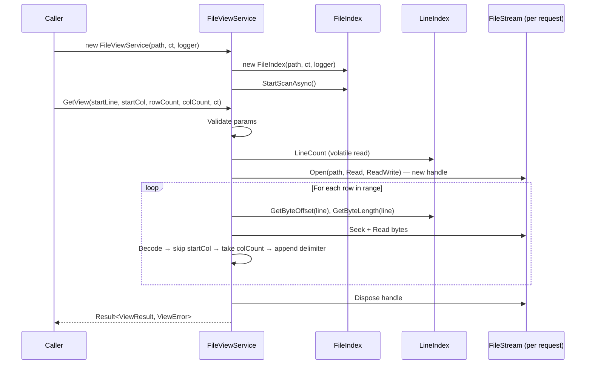
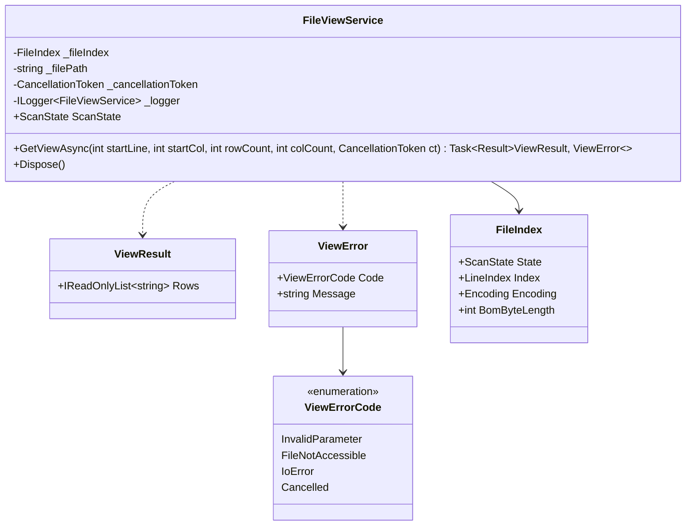

# File View Service — Design

#[[file:.kiro/specs/_global/design-shared.md]]

## Overview

File_View_Service produces rectangular text views from an indexed file. Given (startLine, startCol, rowCount, colCount), reads only bytes needed for requested region using FileIndex byte offsets, decodes with detected encoding, returns list of row strings representing viewport.

Key behaviors:
- Owns private FileIndex instance (lifecycle management)
- Opens independent file handles per request → concurrent safety (≥4 simultaneous)
- Uses FileIndex `Encoding` + `BomByteLength` for character decoding
- Partial decode: only decodes up to (startCol + colCount) chars per line → O(view) not O(line)
- Result pattern for errors (`Result<ViewResult, ViewError>`), `OperationCanceledException` for cancellation
- Serves partial results during scan (empty strings for unscanned lines)
- Reuses existing `ScanState` enum for lifecycle observation
- Column = .NET char (UTF-16 code unit); delimiters appended but not counted

## Architecture





## Components and Interfaces

### FileViewService (C#)

```csharp
namespace TextViewer.Services;

public sealed class FileViewService : IDisposable
{
    private readonly string _filePath;
    private readonly FileIndex _fileIndex;
    private readonly ILogger<FileViewService> _logger;
    private readonly CancellationToken _serviceCancellationToken;

    public FileViewService(string filePath, CancellationToken cancellationToken, ILogger<FileViewService> logger);

    public ScanState ScanState => _fileIndex.State;

    public Task<Result<ViewResult, ViewError>> GetViewAsync(
        int startLine, int startCol, int rowCount, int colCount,
        CancellationToken cancellationToken = default);

    public void Dispose();
}
```

### ViewResult

```csharp
namespace TextViewer.Services;

public sealed class ViewResult
{
    public IReadOnlyList<string> Rows { get; }
    public ViewResult(IReadOnlyList<string> rows) { Rows = rows; }
}
```

### ViewError

```csharp
namespace TextViewer.Services;

public enum ViewErrorCode
{
    InvalidParameter,
    FileNotAccessible,
    IoError,
    Cancelled
}

public sealed class ViewError
{
    public ViewErrorCode Code { get; }
    public string Message { get; }
    public ViewError(ViewErrorCode code, string message) { Code = code; Message = message; }
}
```

### Result&lt;T, E&gt;

```csharp
namespace TextViewer.Services;

public readonly struct Result<T, E>
{
    private readonly T? _value;
    private readonly E? _error;
    public bool IsSuccess { get; }

    public T Value => IsSuccess ? _value! : throw new InvalidOperationException("Result is error");
    public E Error => !IsSuccess ? _error! : throw new InvalidOperationException("Result is success");

    private Result(T value) { _value = value; _error = default; IsSuccess = true; }
    private Result(E error, bool _) { _value = default; _error = error; IsSuccess = false; }

    public static Result<T, E> Success(T value) => new(value);
    public static Result<T, E> Failure(E error) => new(error, false);
}
```

## Data Models

### View Request Parameters

| Parameter | Type | Constraint | Meaning |
|-----------|------|-----------|---------|
| startLine | int | ≥ 0 | 0-based first row |
| startCol | int | ≥ 0 | 0-based first column |
| rowCount | int | ≥ 1 | Number of rows |
| colCount | int | ≥ 1 | Max content chars per row |

### Row String Format

Each row = `[content][delimiter]` where:
- `content` = up to `colCount` chars starting at `startCol` (may be shorter or empty)
- `delimiter` = original line ending (`\n`, `\r\n`, `\r`, or empty for last unterminated line)
- Column = .NET `char` (UTF-16 code unit) — surrogate pair = 2 columns
- BOM excluded from content and column counting

### Result Count Rules

| Condition | Result |
|-----------|--------|
| Scan in progress, request extends beyond scanned | Rows for scanned lines + empty strings to fill rowCount |
| Scan complete, request extends beyond EOF | Only existing rows (count < rowCount) |
| startLine ≥ total lines (scan complete) | Single empty string |
| Empty file (0 lines, scan complete) | Single empty string |

### GetView Algorithm (pseudocode)

```
GetViewAsync(startLine, startCol, rowCount, colCount, ct):
    // 1. Validate
    if startLine < 0: return Failure(InvalidParameter, "Start_Line must be >= 0")
    if startCol < 0: return Failure(InvalidParameter, "Start_Column must be >= 0")
    if rowCount < 1: return Failure(InvalidParameter, "Row_Count must be >= 1")
    if colCount < 1: return Failure(InvalidParameter, "Column_Count must be >= 1")

    ct.ThrowIfCancellationRequested()

    // 2. Snapshot line count (volatile read)
    scannedLines = _fileIndex.Index.LineCount
    scanComplete = _fileIndex.State >= ScanState.QuickScanComplete

    // 3. Edge cases
    if scanComplete AND scannedLines == 0: return Success([""])
    if scanComplete AND startLine >= scannedLines: return Success([""])

    // 4. Open independent file handle
    stream = new FileStream(path, Open, Read, ReadWrite)
    encoding = _fileIndex.Encoding
    bomLen = _fileIndex.BomByteLength

    // 5. Extract rows
    rows = []
    for i in 0..rowCount-1:
        lineIdx = startLine + i
        if scanComplete AND lineIdx >= scannedLines: break
        if NOT scanComplete AND lineIdx >= scannedLines:
            rows.Add("")
            continue

        byteOffset = _fileIndex.Index.GetByteOffset(lineIdx)
        byteLen = _fileIndex.Index.GetByteLength(lineIdx)

        // Streaming decode: read bytes, count chars, stop early
        charsNeeded = startCol + colCount
        (content, delimiter) = decodeUpTo(stream, byteLen, encoding, bomLen if lineIdx==0, charsNeeded)

        if startCol >= content.Length:
            rows.Add(delimiter)
        else:
            end = min(startCol + colCount, content.Length)
            rows.Add(content[startCol..end] + delimiter)

    stream.Dispose()

    // 6. Ensure non-empty
    if rows.Count == 0: rows.Add("")
    return Success(ViewResult(rows))
```

### Partial Decode Algorithm (decodeUpTo)

For long lines, decode incrementally — stop once enough characters produced:

```
decodeUpTo(stream, byteLen, encoding, bomSkip, charsNeeded):
    // 1. Determine delimiter bytes at end of line
    delimiterBytes = peekDelimiter(stream, byteLen)  // 0, 1, or 2
    contentByteLen = byteLen - delimiterBytes

    // 2. Skip BOM if first line
    readStart = bomSkip
    remaining = contentByteLen - bomSkip

    // 3. Streaming decode with Decoder (maintains state across chunks)
    decoder = encoding.GetDecoder()  // with ReplacementFallback
    content = StringBuilder()
    charsDecoded = 0

    while remaining > 0 AND charsDecoded < charsNeeded:
        chunkSize = min(remaining, bufferSize)
        read chunkSize bytes from stream
        chars = decoder.GetChars(chunk, flush: remaining == chunkSize)
        take = min(chars.Length, charsNeeded - charsDecoded)
        content.Append(chars, 0, take)
        charsDecoded += take
        readStart += chunkSize
        remaining -= chunkSize

    // 4. Read delimiter string
    delimiter = readDelimiterString(stream, byteOffset + contentByteLen, delimiterBytes)
    return (content.ToString(), delimiter)
```

Key: 10MB line w/ startCol=0, colCount=80 → decode stops after ~80 chars. O(startCol + colCount) not O(lineByteLen).

### Thread-Safety Model

| Operation | Mechanism | Guarantee |
|-----------|-----------|-----------|
| FileIndex.Index.LineCount | volatile int | Atomic read, monotonically increasing |
| FileIndex.State | volatile field | Atomic read |
| FileIndex.Encoding | Set once before scan publishes lines | Immutable after init |
| FileIndex.BomByteLength | Set once before scan publishes lines | Immutable after init |
| GetByteOffset / GetByteLength | Reads committed segment data | No torn reads |
| File handle per request | Independent FileStream | No seek/read interference |

## Correctness Properties

### Property 1: Row extraction correctness

*For any* file content (any encoding, line endings) and valid view request params, each row in result SHALL equal substring of decoded line starting at startCol with length up to colCount, followed by line's original delimiter — matching independent full-file decode + slice.

**Validates: Requirements 1.2, 4.1, 4.5**

### Property 2: Result count invariant

*For any* file with N scanned lines (scan complete) and valid request with startLine S, rowCount R: if S ≥ N → exactly 1 empty string; otherwise exactly min(R, N - S) rows.

**Validates: Requirements 1.4, 1.5, 1.6, 1.7**

### Property 3: Invalid parameters rejected before I/O

*For any* request where startLine < 0, startCol < 0, rowCount < 1, or colCount < 1 → ViewError with InvalidParameter without opening file handle or querying FileIndex.

**Validates: Requirements 1.8, 3.1–3.5**

### Property 4: Invalid byte replacement

*For any* byte sequence with invalid subsequences for detected encoding → each invalid subsequence decodes to U+FFFD, each U+FFFD counts as exactly one column.

**Validates: Requirements 4.2**

### Property 5: Column counting — code units counted, delimiters excluded

*For any* row extraction, content characters ≤ colCount .NET chars; appended delimiter does not reduce content budget.

**Validates: Requirements 4.3, 4.4**

### Property 6: FileIndex immutability during extraction

*For any* view request, FileIndex LineCount and line byte lengths observable before request remain unchanged after — extraction is strictly read-only.

**Validates: Requirements 5.3**

## Error Handling

| Scenario | Behavior | Result |
|----------|----------|--------|
| Invalid params | Return immediately, no I/O | `Failure(InvalidParameter, "{param} must be >= {min}")` |
| File not found / deleted | Catch `FileNotFoundException` | `Failure(FileNotAccessible, "File not accessible: {path}: FileNotFoundException")` |
| Access denied | Catch `UnauthorizedAccessException` | `Failure(IoError, "Read error: {path}: UnauthorizedAccessException")` |
| I/O error during read | Catch `IOException` | `Failure(IoError, "Read error: {path}: IOException")` |
| CancellationToken signalled | Throw `OperationCanceledException` | Exception propagates |
| FileIndex in Failed state | Check before opening handle | `Failure(FileNotAccessible, "File index failed: {path}")` |

### Disposal

```csharp
public void Dispose()
{
    _fileIndex.Dispose();
    _logger.LogDebug("FileViewService disposed for {FilePath}", _filePath);
}
```

Per-request file handles disposed in `finally` block within `GetViewAsync`.

## Testing Strategy

### Property-Based Tests (FsCheck + xUnit)

| Property | Generators | Asserts |
|----------|-----------|---------|
| 1: Row extraction | Random byte content (0–4KB) w/ mixed encodings + line endings, random valid params | Extracted row == independent decode + slice |
| 2: Result count | Random line counts (0–100), random startLine/rowCount spanning/exceeding file | Count == min(R, max(0, N-S)) or 1 for edge cases |
| 3: Invalid params rejected | Random negative/zero values | Error returned, no file I/O (mock verifies) |
| 4: Invalid byte replacement | Random bytes w/ injected invalid sequences per encoding | U+FFFD present, column count correct |
| 5: Column counting | Random strings w/ surrogates, control chars, various delimiters | Content length ≤ colCount; delimiter outside budget |
| 6: FileIndex immutability | Random requests against populated FileIndex | LineCount + byte lengths unchanged |

Config: `[Property(MaxTest = 10)]` per workspace testing policy.

### Unit Tests

| Test | Validates |
|------|-----------|
| Valid request → correct rows (ASCII, LF) | Req 1.1, 1.2 |
| startCol beyond line length → delimiter only | Req 1.3 |
| Empty file → single empty string | Req 1.7 |
| startLine beyond EOF → single empty string | Req 1.6 |
| Negative startLine → InvalidParameter error | Req 3.1 |
| Zero rowCount → InvalidParameter error | Req 3.3 |
| UTF-16 LE file w/ BOM → BOM excluded | Req 4.5 |
| Surrogate pair spans 2 columns | Req 4.3 |
| Tab char = 1 column | Req 4.3 |
| CRLF delimiter appended, not counted | Req 4.4 |
| File opened with FileAccess.Read | Req 5.2 |
| File opened with FileShare.ReadWrite | Req 5.2 |
| IOException → IoError result | Req 6.2 |
| FileNotFoundException → FileNotAccessible | Req 6.3 |
| Cancellation → OperationCanceledException | Req 6.4 |
| ViewError has code + message | Req 6.5 |
| ScanState reflects FileIndex state | Req 2.4 |
| Dispose disposes FileIndex | Req 2.5 |

### Integration Tests

| Test | Validates |
|------|-----------|
| 4 concurrent requests → all correct | Req 5.1 |
| Request during QuickScan → partial result | Req 1.4, 2.3 |
| Real UTF-8 file end-to-end | Req 1, 4 |
| Real UTF-16 file end-to-end | Req 4.1 |
| Real UTF-32 LE/BE files w/ BOM | Req 4.1, 4.5 |
| Cancellation stops mid-extraction | Req 2.6, 6.4 |

### Test Boundaries

- **Unit**: Mock FileIndex/FileStream, test extraction logic in isolation
- **Property**: Pure extraction logic (decode + slice + count), validation logic
- **Integration**: Real file I/O, real FileIndex scan, real concurrency
