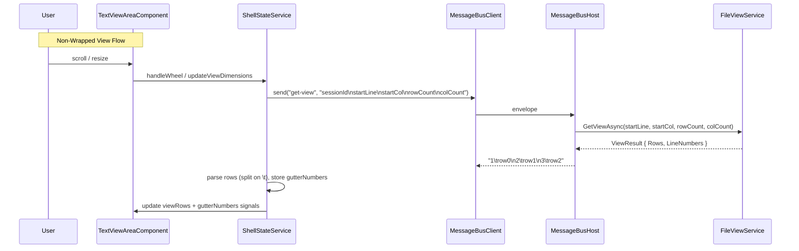
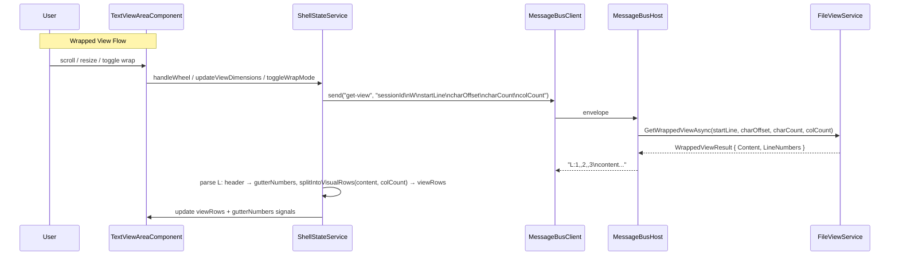

# Line Wrap & Line Numbers — Design

## Overview

Line number gutter and wrap mode. Backend provides per-row line numbers in both modes — frontend displays them directly (no local computation). Key components:

- **Line_Number_Gutter** — absolute-positioned column, width from Total_Logical_Lines digit count
- **Wrap_Mode toggle** — Status_Bar checkbox, application-level state
- **Wrapped-mode request** — 6-field format: viewSessionId\nW\nstartLine\ncharacterOffset\ncharacterCount\ncolCount
- **Backend GetWrappedViewAsync** — character-count extraction + per-visual-row line number computation
- **Response formats** — non-wrapped: `{lineNum}\t{content}` per row; wrapped: `L:{n1},{n2},...\n{content}`
- **Frontend rendering** — splits wrapped content at Col_Count boundaries, reads gutterNumbers from response
- **Wrapped scrolling** — navigates by Visual_Row (Character_Offset increments of Col_Count)
- **Gutter-aware measurement** — Col_Count subtracts Gutter_Width

## Architecture





### Design Decisions

1. **Gutter as absolute-positioned sibling** — immune to horizontal scroll, measurement subtracts gutter width from available width for Col_Count
2. **Gutter width from Total_Logical_Lines** — stable during scrolling, only changes when scan discovers more lines
3. **Wrap_Mode is application-level** — stored as signal in ShellStateService, non-active tabs marked needsRefresh
4. **Single "get-view" handler dispatches both modes** — inspects 2nd field for "W" marker
5. **Backend computes line numbers** — eliminates race conditions between scroll state and response content; frontend reads gutterNumbers directly from response
6. **6-field wrapped request** — includes colCount so backend can compute per-visual-row line numbers matching frontend's splitIntoVisualRows logic
7. **Frontend splits response into Visual_Rows** — backend returns flat content; frontend splits at Col_Count boundaries and newlines
8. **Scrollbar_Max in wrapped mode from backend** — `get-wrapped-line-count` handler returns total visual rows as single integer; frontend sets verticalMax directly. See `design-wrapped-line-count.md` for full protocol.
9. **No word wrap** — hard wrap at exact Col_Count boundary
10. **Empty gutter cells use non-breaking space** — prevents height collapse in wrapped mode continuation rows

## Protocol Contract

### Non-Wrapped Response Format

Each row prefixed with 1-based line number + TAB separator:
```
{lineNum}\t{rowContent}\n{lineNum}\t{rowContent}\n...
```

Rules:
- Split on FIRST `\t` only per row (content may contain tabs)
- `lineNum = startLine + i + 1` for row index `i`
- If `tabIdx === -1` → malformed, log error, keep previous state

### Wrapped Response Format

Line-numbers header + newline + content:
```
L:{n1},{n2},{n3},...\n{content}
```

Rules:
- First line starts with `L:` prefix
- Comma-separated values: integer = line number, empty = continuation row (null)
- Parse: `header.split(',').map(v => v === '' ? null : parseInt(v))`
- Content after header passed to `splitIntoVisualRows(content, colCount)`

### Wrapped Request Format

```
viewSessionId\nW\nstartLine\ncharacterOffset\ncharacterCount\ncolCount
```

6 fields. Backend also accepts 5-field legacy (colCount defaults to 1).

### Alignment Invariant

- Non-wrapped: `LineNumbers.Length == Rows.Length`
- Wrapped: `LineNumbers.Length == splitIntoVisualRows(content, colCount).Length`

Backend asserts invariant before serializing. Violation = bug.

## Components and Interfaces

### TabViewState Extension (shell.types.ts)

```typescript
export interface TabViewState {
  // ... existing fields ...
  characterOffset: number;       // wrapped-mode scroll position within startLine
  needsRefresh: boolean;         // needs content refresh on activation
  gutterNumbers: (number | null)[] | null;  // backend-provided line numbers per visual row
}
```

### ShellStateService Signals

```typescript
readonly wrapMode = signal<boolean>(false);
readonly charMetricsWidth = signal<number>(0);
readonly activeGutterNumbers = computed<(number | null)[]>(() => {
  const state = this.activeTabViewState();
  if (!state) return [];
  return state.gutterNumbers ?? [];
});
readonly activeGutterWidth = computed(() => computeGutterWidth(totalLines, charWidth));
readonly activeTotalLogicalLines = computed(() => sb.verticalMax);  // verticalMax = visual rows in wrapped mode
```

Note: `lineLengths` and `totalLogicalLines` signals removed — replaced by backend `get-wrapped-line-count`. See `design-wrapped-line-count.md`.

### Pure Functions (line-wrap-utils.ts)

```typescript
computeGutterWidth(totalLogicalLines, charWidth): number
computeColCount(availablePixelWidth, gutterWidth, charWidth): number
splitIntoVisualRows(content, colCount): string[]
computeWrappedGutterNumbers(content, colCount, startLine, characterOffset): (number | null)[]
```

Note: `computeWrappedGutterNumbers` exists but is dead code (kept for test reference only). Production code reads `gutterNumbers` from backend response. Wrapped scrollbar max and scroll-by-visual-row logic moved to backend — see `design-wrapped-line-count.md`.

### Backend: ViewResult

```csharp
public sealed class ViewResult {
    public IReadOnlyList<string> Rows { get; }
    public IReadOnlyList<int> LineNumbers { get; }  // parallel array: startLine + i + 1
}
```

### Backend: WrappedViewResult

```csharp
public sealed class WrappedViewResult {
    public string Content { get; }
    public IReadOnlyList<int?> LineNumbers { get; }  // per visual row: number or null
}
```

### Backend: GetWrappedViewAsync

```csharp
public Task<Result<WrappedViewResult, ViewError>> GetWrappedViewAsync(
    int startLine, int characterOffset, int characterCount,
    int colCount = 1, CancellationToken cancellationToken = default)
```

- Extracts up to characterCount content chars from startLine at characterOffset
- Newlines not counted toward characterCount but included in output
- Tracks logical line per content char via charLineMap
- `ComputeWrappedLineNumbers(content, colCount, charLineMap)` assigns line numbers: first visual row of each logical line → number, continuations → null

### Backend: HandleGetView Response Serialization

Non-wrapped:
```csharp
// Each row: "{lineNum}\t{rowContent}"
var lines = result.Value.Rows.Select((row, i) =>
    $"{result.Value.LineNumbers[i]}\t{Program.StripDelimiter(row)}");
return string.Join("\n", lines);
```

Wrapped:
```csharp
// Header: "L:{n1},{n2},..." + "\n" + content
var header = "L:" + string.Join(",",
    wrappedResult.LineNumbers.Select(n => n.HasValue ? n.Value.ToString() : ""));
return header + "\n" + wrappedResult.Content;
```

### Frontend: handleViewResponse Parsing

Non-wrapped: split each row on first `\t` → lineNum + content. Store in gutterNumbers + viewRows.

Wrapped: extract `L:` header (first `\n`), parse comma-separated → gutterNumbers. Remaining content → `splitIntoVisualRows(content, colCount)` → viewRows.

### Gutter Template

```html
<div class="line-number-gutter" #gutterEl [style.width.px]="gutterWidth()">
  @for (num of gutterNumbers(); track $index) {
    <div class="gutter-cell">{{ num ?? '\u00A0' }}</div>
  }
</div>
```

### Wrapped-Mode Scroll Logic

Scroll navigation uses visual row index directly. Frontend stores `startLine` as visual row index in wrapped mode, sends it in get-view request. Backend resolves to (startLine, characterOffset) via `ResolveVisualRowIndex`. See `design-wrapped-line-count.md` for details.

- Arrow key: clamp(startLine ± 1, 0, verticalMax - rowCount)
- Wheel: clamp(startLine ± 3, 0, verticalMax - rowCount)
- Drag: proportional position → visual row index

## Correctness Properties

1. **Backend-Provided Line Numbers Match Displayed Rows** — for any response with per-row line number metadata, frontend displays exactly those numbers aligned to corresponding rows
2. **Preservation** — non-gutter behavior unchanged (request formats, scrollbar computation, error handling, row content display, tab lifecycle)
3. **Gutter Width Computation** — for any totalLines ≥ 1 and charWidth > 0: result = digits(totalLines) × charWidth + 16
4. **splitIntoVisualRows** — every row ≤ colCount chars, no row contains newlines, empty content → empty array
5. **Wrapped Scroll Position** — scroll actions clamp visual row index within [0, verticalMax - rowCount]
6. **Backend Wrapped Content-Count Invariant** — response contains at most characterCount content chars (excluding delimiters)
7. **Backend Wrapped Parameter Validation** — invalid params → error string starting with "ERROR:"
8. **Wrapped Request Payload Round-Trip** — encode then parse recovers original values
9. **Wrapped Scrollbar_Max** — equals backend-computed total visual rows via `get-wrapped-line-count` (see `design-wrapped-line-count.md` Property 1)
10. **Col_Count with Gutter** — equals max(1, floor((pixelWidth - gutterWidth) / charWidth))

## Testing Strategy

- Property-based tests: fast-check `{ numRuns: 10 }` (TS), FsCheck `[Property(MaxTest = 10)]` (C#)
- Bug condition exploration test confirms old approach broken (tests pure functions with stale state → fails by design)
- Preservation tests confirm non-gutter behavior unchanged after fix
- Backend tests verify new response formats (`{lineNum}\t{content}`, `L:` header)
- Frontend tests verify response parsing and gutterNumbers storage
