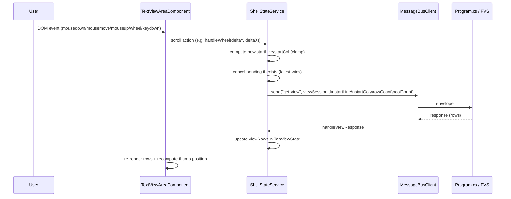

# Scroll Navigation — Design

#[[file:.kiro/specs/_global/design-shared.md]]

## Overview

Scroll Navigation makes existing scrollbar UI interactive. Extends text-handling design (TabViewState, scrollbar polling, view request orchestration). Adds:

- **Scroll position tracking** — `startLine`/`startCol` per tab in `TabViewState`
- **Thumb dragging** — mousedown → mousemove computes position → mouseup sends view request
- **Wheel scrolling** — deltaY/deltaX → ±3 lines/cols per tick
- **Arrow key scrolling** — focus-based, ±1 line/col per press
- **Proportional thumb** — size = viewport/content ratio, position = startLine/startCol fraction
- **Latest-wins cancellation** — scroll cancels pending request, sends new with latest position

All scroll state logic in `ShellStateService`. `TextViewAreaComponent` forwards DOM events and renders computed styles.

## Architecture



### Design Decisions

1. **ShellStateService owns scroll state** — `startLine`/`startCol` stored per tab in `TabViewState`. Service exposes action methods. Component forwards events only.

2. **Latest-wins cancellation** — Rapid scroll events cancel pending `get-view` via `messageBus.cancel()`, send new request with latest position. No queuing, no debounce.

3. **Optimistic thumb during drag** — Thumb position updates on every mousemove via computed signal. Rows update only when response arrives.

4. **Rows stay visible during pending** — Previous rows remain while awaiting scroll response. Error responses keep previous rows, show error separately.

5. **Document-level drag listeners** — `mousemove`/`mouseup` on `document` during drag so dragging outside track still works. Cleaned up on mouseup.

6. **user-select: none during drag** — Applied to `document.body` on drag start, removed on drag end.

7. **Thumb size/position as computed signals** — Derived from `startLine`, `startCol`, `scrollbarState`, `viewDimensions`. Component reads signals, applies as inline styles.

8. **Arrow keys require focus** — Host element has `tabindex="0"`. Arrow keys only handled when focused. `preventDefault` suppresses browser scroll.

9. **Wheel always captured** — Wheel events on text-view-area always handled (preventDefault). No focus requirement.

10. **Non-interactive when content fits** — If `scrollbarMax ≤ viewportSize`, thumb non-interactive. All scroll actions no-op.

11. **Per-tab scroll position persistence** — `startLine`/`startCol` in `TabViewState`. Tab switch restores thumb position from stored values without new view request.

12. **Drag formula uses (scrollbarMax − viewportSize)** — Maps pixel delta to scrollable range `[0, maxScroll]`. Full-track drag = position 0 to last valid position.

## Components and Interfaces

### TabViewState Extension (shell.types.ts)

Added to existing `TabViewState` (defined in `design-text-handling.md`):

```typescript
// NEW fields added to TabViewState
startLine: number;  // default 0
startCol: number;   // default 0
```

### DragState (shell.types.ts)

```typescript
export interface DragState {
  axis: 'vertical' | 'horizontal';
  startMousePos: number;
  startScrollPos: number;
  trackLength: number;
  scrollbarMax: number;
  viewportSize: number;
}
```

### ShellStateService Extensions

```typescript
// Constants (module-level)
export const WHEEL_STEP = 3;
export const ARROW_STEP = 1;
export const MIN_THUMB_SIZE = 20;

export function clamp(value: number, min: number, max: number): number;

// New signals
readonly dragState = signal<DragState | null>(null);

// Thumb computed signals
readonly verticalThumbRatio = computed(() => /* rowCount / verticalMax, 1 when fits */);
readonly horizontalThumbRatio = computed(() => /* colCount / horizontalMax, 1 when fits */);
readonly verticalThumbFraction = computed(() => /* startLine / (verticalMax - rowCount), 0 when non-scrollable */);
readonly horizontalThumbFraction = computed(() => /* startCol / (horizontalMax - colCount), 0 when non-scrollable */);

// Action methods
handleWheel(deltaY: number, deltaX: number): void;
handleArrowKey(direction: 'up' | 'down' | 'left' | 'right'): void;
handleVerticalDragStart(mouseY: number, trackLength: number): void;
handleHorizontalDragStart(mouseX: number, trackLength: number): void;
handleDragMove(mousePos: number): void;
handleDragEnd(): void;

// Private helpers
private updateScrollPosition(sessionId: string, startLine?: number, startCol?: number): void;
private sendScrollViewRequest(sessionId: string, startLine: number, startCol: number): void;
```

### sendScrollViewRequest (latest-wins)

```typescript
private sendScrollViewRequest(sessionId: string, startLine: number, startCol: number): void {
  const existing = this.tabViewStates().get(sessionId);
  if (!existing) return;
  if (existing.pendingCorrelationId) {
    this.messageBus.cancel(existing.pendingCorrelationId);
  }
  const dims = this.viewDimensions();
  if (!dims) return;
  const payload = `${sessionId}\n${startLine}\n${startCol}\n${dims.rowCount}\n${dims.colCount}`;
  const correlationId = this.messageBus.send('get-view', payload);
  // update TabViewState with new pendingCorrelationId, startLine, startCol
}
```

### TextViewAreaComponent Extensions

```typescript
// ViewChild refs
@ViewChild('verticalTrack') verticalTrack!: ElementRef<HTMLElement>;
@ViewChild('horizontalTrack') horizontalTrack!: ElementRef<HTMLElement>;

// Exposed signals
readonly verticalThumbRatio = this.state.verticalThumbRatio;
readonly verticalThumbFraction = this.state.verticalThumbFraction;
readonly horizontalThumbRatio = this.state.horizontalThumbRatio;
readonly horizontalThumbFraction = this.state.horizontalThumbFraction;

// Event handlers
onWheel(event: WheelEvent): void;
onKeydown(event: KeyboardEvent): void;
onVerticalThumbMousedown(event: MouseEvent): void;
onHorizontalThumbMousedown(event: MouseEvent): void;

// Thumb computation
computeVerticalThumbPx(): number;   // max(20, ratio × trackHeight)
computeVerticalThumbTopPx(): number; // fraction × (trackHeight - thumbPx)
computeHorizontalThumbPx(): number;
computeHorizontalThumbLeftPx(): number;
```

### Template Changes

Host div gains `tabindex="0"`, `(wheel)`, `(keydown)`. Thumb elements gain `(mousedown)`, `[style.height.px]`/`[style.top.px]` (vertical), `[style.width.px]`/`[style.left.px]` (horizontal). Track elements gain `#verticalTrack`/`#horizontalTrack` refs.

### CSS Changes

Removed fixed `height: 40px` / `width: 40px` from thumb. Added `cursor: grab` / `cursor: grabbing` on active. Kept `min-height: 20px` / `min-width: 20px` as fallback.

## Data Models

### Scroll Constants

| Constant | Value | Used By |
|----------|-------|---------|
| WHEEL_STEP | 3 | Wheel handler |
| ARROW_STEP | 1 | Arrow key handler |
| MIN_THUMB_SIZE | 20 | Thumb size computation (px) |

### Thumb Rendering Model

| Computed | Formula | Applied As |
|----------|---------|-----------|
| verticalThumbRatio | rowCount / verticalMax | height % of track |
| horizontalThumbRatio | colCount / horizontalMax | width % of track |
| verticalThumbFraction | startLine / (verticalMax − rowCount) | top offset % |
| horizontalThumbFraction | startCol / (horizontalMax − colCount) | left offset % |

Min thumb: 20px enforced in component when converting ratio to pixels.

## Correctness Properties

### Property 1: Scroll step clamped to valid range

For any current position, step (1 or 3), direction, scrollbarMax > viewportSize: result = clamp(current + sign × step, 0, scrollbarMax − viewportSize), always in [0, maxScroll].

### Property 2: Drag position clamped to valid range

For any DragState with trackLength > 0, scrollbarMax > viewportSize, any delta: result = clamp(startScrollPos + round(delta / trackLength × maxScroll), 0, maxScroll), always in [0, maxScroll].

### Property 3: Non-interactive when content fits viewport

For any scrollbarMax ≤ viewportSize: all scroll actions no-op, thumb fraction = 0, thumb ratio = 1.

### Property 4: Thumb position fraction proportional to scroll position

For any startLine in [0, maxScroll]: fraction = startLine / maxScroll, in [0, 1].

### Property 5: Thumb size ratio proportional to viewport coverage

For any viewportSize > 0, scrollbarMax > viewportSize: ratio = viewportSize / scrollbarMax, in (0, 1). Pixel conversion ≥ 20px.

## Error Handling

| Scenario | Handling |
|----------|----------|
| View request fails during/after scroll | Keep previous rows; show error in status area. No retry. |
| Drag outside window | Document-level listeners still fire; drag continues |
| Rapid scroll events | Latest-wins cancellation |
| Tab closed while scroll pending | Existing close-tab logic cancels pendingCorrelationId |
| scrollbarMax changes during drag | Drag uses captured values; stale but safe |
| Zero track length | Guard: drag start rejected (division by zero prevention) |

## Testing Strategy

### Property-Based Tests (fast-check, 10 iterations)

| Test | Property | Validates |
|------|----------|-----------|
| Scroll step clamping | Property 1 | Req 3.1, 3.2, 4.1–4.4 |
| Drag position clamping | Property 2 | Req 1.2, 2.2 |
| Non-interactive guard | Property 3 | Req 1.5, 2.5, 3.6, 3.7, 5.6, 6.4 |
| Thumb position fraction | Property 4 | Req 5.1, 5.2, 5.4, 5.5 |
| Thumb size ratio | Property 5 | Req 6.1, 6.2 |

### Unit Tests

| Test | Validates |
|------|-----------|
| Drag start captures initial state | Req 1.1, 2.1 |
| Drag end clears state, sends request | Req 1.4, 2.4 |
| user-select during drag | Req 1.6, 2.6 |
| Wheel preventDefault | Req 3.5 |
| No request at boundary | Req 3.4, 4.6 |
| Arrow keys ignored without tab | Req 4.8 |
| Latest-wins cancellation | Req 7.2 |
| View response updates rows | Req 7.3, 8.1 |
| Previous rows preserved pending | Req 8.3 |
| Error keeps rows | Req 8.4 |
| Tab switch restores position | Req 7.5 |
| Thumb recomputed on response | Req 5.3 |
