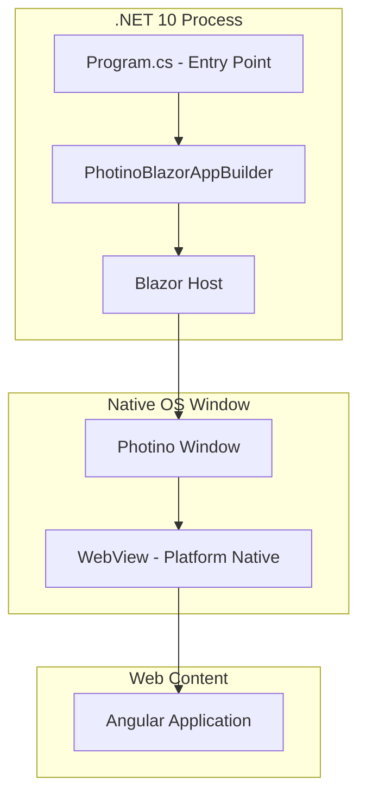
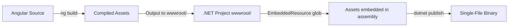

# Shared Design Context

## Architecture Layers

- **Native layer**: Photino → OS-native window w/ platform webview
- **Host layer**: Photino.Blazor → bridges .NET and webview, serves static content, routes messages
- **Frontend layer**: Angular → compiled to static assets, served through Blazor host

## Communication Model

All frontend↔backend communication routes through the **Message Bus** layer. Application code never calls the raw Photino bridge directly.

- Raw transport: `window.external.sendMessage` / `PhotinoWindow.SendWebMessage`
- Message Bus wraps transport with: envelope protocol, correlation tracking, queuing, priority dispatch, timeout, error handling
- Full architecture + API: see `design-bus-service.md`

## Build Pipeline

- MSBuild `BuildAngular` target runs `npx ng build` before compile
- Angular output → `wwwroot/` → embedded in assembly
- `ManifestEmbeddedFileProvider(typeof(Program).Assembly, "wwwroot")` serves at runtime

## Project Layout (Key Files)

| File | Role |
|------|------|
| `Program.cs` | Entry point, window config, MessageBusHost setup, handler registration |
| `App.razor` | Blazor root component, HTML shell loading Angular |
| `TextViewer.csproj` | MSBuild orchestration, publish config, embedded resources |
| `ClientApp/src/app/app.component.ts` | Angular root component — injects MessageBusClient |
| `ClientApp/src/app/app.component.html` | Angular root template |
| `ClientApp/src/app/services/message-bus-client.service.ts` | Message_Bus_Client singleton |
| `Services/MessageBusHost.cs` | Message_Bus_Host (.NET) |
| `Services/FileIndex.cs` | FileIndex — two-phase file scanner |
| `Services/FileViewService.cs` | FileViewService — rectangular view extraction |
| `Services/MessageProtocol.cs` | Wire protocol encode/decode/validate (C#) |
| `Services/IMessageBridge.cs` | Bridge abstraction for testability |
| `Services/PhotinoMessageBridge.cs` | Photino adapter implementing IMessageBridge |
| `ClientApp/angular.json` | Angular CLI build config → outputs to `wwwroot/` |

## Error Handling Patterns

| Category | Strategy |
|----------|----------|
| Missing embedded assets | Provider returns not-found → blank page; build validation prevents |
| WebView unavailable | Photino throws `PlatformNotSupportedException` → app exits |
| Build-time failures | MSBuild target fails → blocks build |
| Message Bus errors | See `design-bus-service.md` error handling table |

## Design Conventions

- **Fail-fast on startup**: No recovery for infrastructure failures
- **Signal-based state**: Angular signals for reactive UI
- **Guard patterns**: Prevent duplicate operations via nullable correlationId (null = idle, non-null = awaiting)
- **No persistent storage**: State in component signals, resets on restart (until file content features)
- **Single project structure**: .NET host + Angular source in one repo
