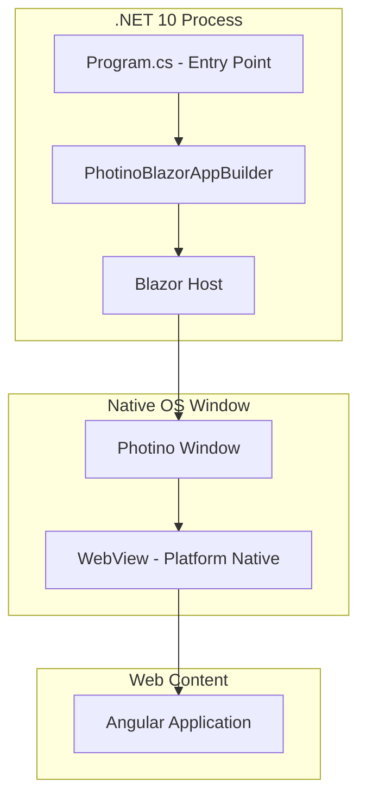
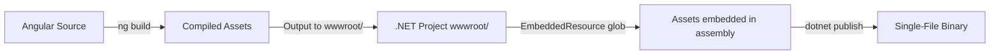

# Shared Design Context

## Architecture Layers

- **Native layer**: Photino → OS-native window w/ platform webview
- **Host layer**: Photino.Blazor → bridges .NET and webview, serves static content, routes messages
- **Frontend layer**: Angular → compiled to static assets, served through Blazor host

## Communication Model

All frontend↔backend communication routes through the **Message Bus** layer. Application code never calls the raw Photino bridge directly.

- Raw transport: `window.external.sendMessage` / `PhotinoWindow.SendWebMessage`
- Message Bus wraps transport with: envelope protocol, correlation tracking, queuing, priority dispatch, timeout, error handling
- Full architecture + API: see `design-bus-service.md`

## Build Pipeline

- MSBuild `BuildAngular` target runs `npx ng build` before compile
- Angular output → `wwwroot/` → embedded in assembly
- `ManifestEmbeddedFileProvider(typeof(Program).Assembly, "wwwroot")` serves at runtime

## Project Layout (Key Files)

| File | Role |
|------|------|
| `Program.cs` | Entry point, window config, MessageBusHost setup, handler registration |
| `App.razor` | Blazor root component, HTML shell loading Angular |
| `TextViewer.csproj` | MSBuild orchestration, publish config, embedded resources |
| `ClientApp/src/app/app.component.ts` | Angular root — shell host, keyboard shortcut, error modal |
| `ClientApp/src/app/app.component.html` | Shell layout template (CSS Grid) |
| `ClientApp/src/app/shell/shell-state.service.ts` | ShellStateService — signal-based tab/menu/status state |
| `ClientApp/src/app/shell/shell.types.ts` | Tab, TabPosition types |
| `ClientApp/src/app/shell/extract-file-name.ts` | File name extraction utility |
| `ClientApp/src/app/shell/menu-bar/` | MenuBarComponent (File menu, Open/Exit) |
| `ClientApp/src/app/shell/tab-container/` | TabContainerComponent (tab headers, close) |
| `ClientApp/src/app/shell/text-view-area/` | TextViewAreaComponent (content / empty state) |
| `ClientApp/src/app/shell/status-bar/` | StatusBarComponent (active file path) |
| `ClientApp/src/app/services/message-bus-client.service.ts` | Message_Bus_Client singleton |
| `Services/MessageBusHost.cs` | Message_Bus_Host (.NET) |
| `Services/FileIndex.cs` | FileIndex — two-phase file scanner |
| `Services/FileViewService.cs` | FileViewService — rectangular view extraction |
| `Services/MessageProtocol.cs` | Wire protocol encode/decode/validate (C#) |
| `Services/IMessageBridge.cs` | Bridge abstraction for testability |
| `Services/PhotinoMessageBridge.cs` | Photino adapter implementing IMessageBridge |
| `ClientApp/angular.json` | Angular CLI build config → outputs to `wwwroot/` |

## Error Handling Patterns

| Category | Strategy |
|----------|----------|
| Missing embedded assets | Provider returns not-found → blank page; build validation prevents |
| WebView unavailable | Photino throws `PlatformNotSupportedException` → app exits |
| Build-time failures | MSBuild target fails → blocks build |
| Message Bus errors | See `design-bus-service.md` error handling table |

## Result Type Pattern

All operations that can fail or produce structured outcomes SHALL use `Result<T, E>` (`Services/Result.cs`) instead of:
- Nullable returns (ambiguous null)
- Out parameters
- Throwing exceptions for expected failures
- Mutating state fields that callers must poll

### When to use Result

| Scenario | Use Result | Example |
|----------|-----------|---------|
| Parse/decode that can fail | Yes | `MessageProtocol.Decode` → `Result<MessageEnvelope, DecodeError>` |
| Async operation w/ known failure modes | Yes | `FileIndex.StartScanAsync` → `Task<Result<ScanSummary, ScanError>>` |
| Dispatch/routing w/ validation pipeline | Yes | `MessageBusHost.DispatchMessageAsync` → `Result<DispatchOutcome, DispatchError>` |
| Service method w/ domain errors | Yes | `FileViewService.GetViewAsync` → `Result<ViewResult, ViewError>` |
| Infrastructure failure (unrecoverable) | No — throw | WebView init, DI resolution |
| Void success w/ no meaningful outcome | No — use Task/void | Fire-and-forget sends |

### Error type conventions

- Use an **enum** for the error code (e.g. `DecodeError`, `ScanErrorCode`, `ViewErrorCode`, `DispatchErrorCode`)
- Pair with a **record** carrying `(Code, Message)` when callers need human-readable context
- Keep error enums small and specific to the operation — no god-enum
- Name pattern: `{Operation}Error` or `{Operation}ErrorCode` + `{Operation}Error` record

### Success type conventions

- Use a **record** or **record struct** for structured success data (e.g. `MessageEnvelope`, `ScanSummary`, `ViewResult`)
- Use an **enum** when success has discrete outcomes w/o data (e.g. `DispatchOutcome.ResponseSent`)
- Prefer `readonly record struct` for small value-like results (≤3 fields, no heap alloc needed)

## Design Conventions

- **Fail-fast on startup**: No recovery for infrastructure failures
- **Signal-based state**: Angular signals for reactive UI
- **Guard patterns**: Prevent duplicate operations via nullable correlationId (null = idle, non-null = awaiting)
- **Minimal persistent storage**: Only user preferences (e.g. tab position) persisted to localStorage; all runtime state resets on restart
- **Single project structure**: .NET host + Angular source in one repo
