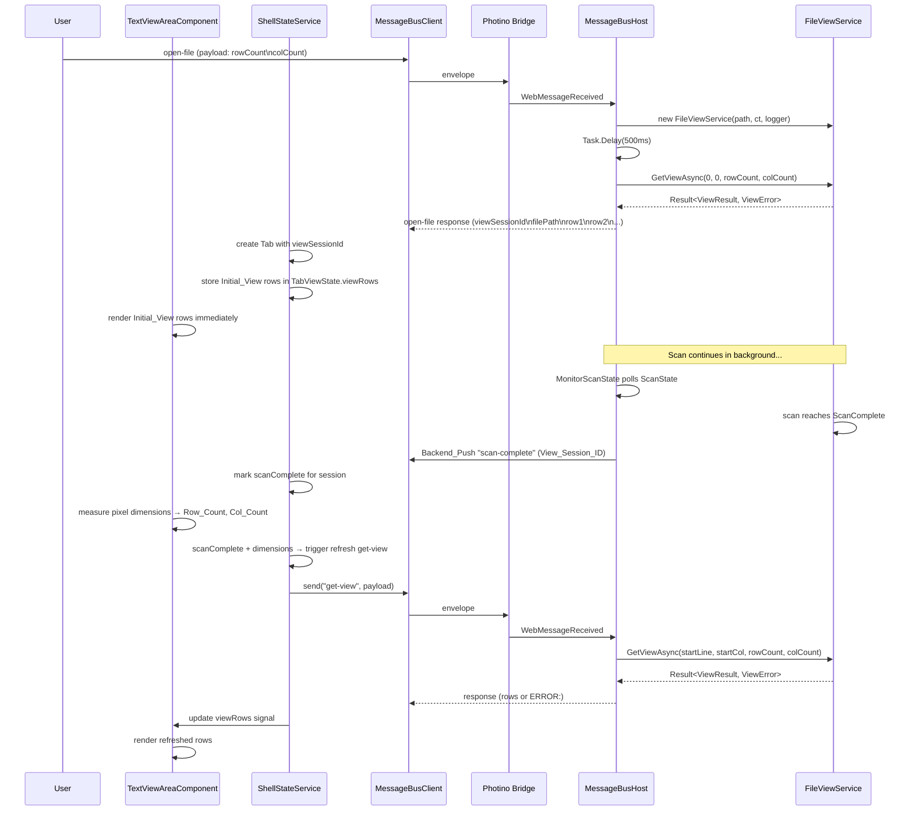
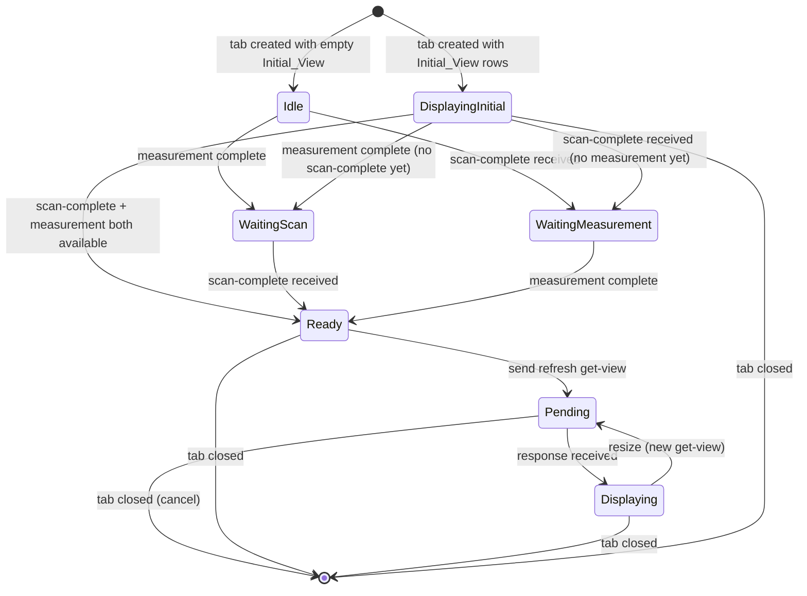
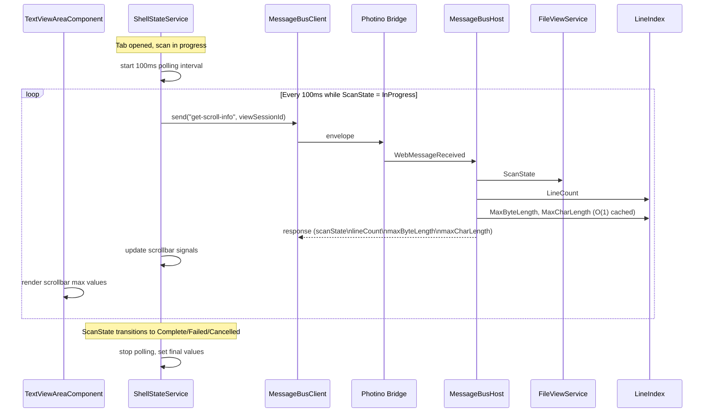
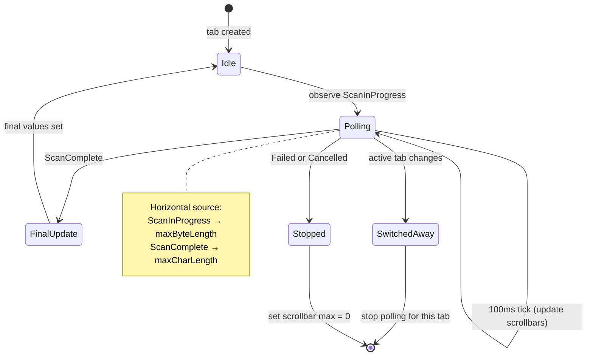

# Text Handling — Design

#[[file:.kiro/specs/_global/design-shared.md]]

## Overview

Text Handling connects the UI Shell's Text_View_Area to the backend FileViewService. When a file is opened, the frontend includes viewport dimensions in the open-file request. The backend creates a FileViewService, waits 500ms for the scan to make initial progress, calls GetViewAsync to produce an Initial_View, and returns it alongside the View_Session_ID and file path in the open-file response. The frontend renders this Initial_View immediately. Later, when the full scan completes, the backend pushes a single "scan-complete" notification, and the frontend sends a refresh "get-view" request to obtain fully-indexed content. The feature introduces:

- **View_Session_ID** — UUID generated by backend on open-file, keying all subsequent communication
- **Initial_View in open-file response** — backend waits 500ms after creating FileViewService, calls GetViewAsync with viewport dimensions from the request, includes rows in the response for immediate rendering
- **Measurement pipeline** — computes Row_Count/Col_Count from pixel dimensions and monospace Char_Metrics
- **View request orchestration** — state machine gating refresh requests on (active tab + scan-complete + measurement)
- **Scan-complete notification** — single backend push at ScanComplete state triggers frontend refresh
- **Get-view handler** — backend parses request, invokes FileViewService.GetViewAsync, returns rows
- **Row rendering** — TextViewAreaComponent displays rows with per-tab caching
- **Session lifecycle** — create on open, dispose on close, keyed by View_Session_ID
- **Scrollbar range tracking** — vertical scrollbar max = total line count, horizontal scrollbar max = max byte_length (during scan) or max char_length (scan complete), progressively updated during scan
- **Progressive scrollbar polling** — 100ms interval polling during active scans, with scan-state-aware source selection and tab-switch lifecycle management
- **Get-scroll-info handler** — backend message returning current line count, max byte_length, max char_length, and scan state for a session

The design extends existing components (ShellStateService, TextViewAreaComponent, Program.cs) rather than introducing new services, keeping the architecture flat.

## Architecture









### Design Decisions

1. **ShellStateService owns orchestration** — All view-request state machine logic lives in ShellStateService (extended). TextViewAreaComponent is a pure projection of signals. Keeps state machine testable without DOM.

2. **Per-tab state record** — `TabViewState` tracks scan-complete status, pending request, cached rows, and deferred-request flag per View_Session_ID. Stored in `Map<string, TabViewState>` signal within ShellStateService.

3. **Measurement lives in TextViewAreaComponent** — Pixel measurement requires DOM access (ElementRef). Component measures and emits dimensions via output signal. ShellStateService reads this signal to gate requests.

4. **Debounced resize via ResizeObserver** — `ResizeObserver` on host element with 150ms debounce (setTimeout). More reliable than window resize events for layout changes (tab position toggle).

5. **Open-file response format change** — Response payload: `viewSessionId\nfilePath\nrow1\nrow2\n...`. First two fields = metadata, remaining lines = Initial_View rows. Zero rows if scan hasn't produced data after 500ms.

6. **Session map in Program.cs** — `Dictionary<string, FileViewService>` in closure scope of Program.Main. Simple, no DI needed — matches existing handler registration pattern.

7. **Scan-complete via ScanState polling** — FileViewService exposes `ScanState` (volatile read from FileIndex). Open-file handler starts background task polling ScanState, sends single "scan-complete" push at ScanComplete.

8. **Accumulate queue for scan-complete** — Configured as accumulate mode so ScanComplete notification delivered reliably (not latest-wins which could drop it).

9. **500ms delay for Initial_View** — Open-file handler awaits `Task.Delay(500)` after creating FileViewService, giving scan time to index initial content. Then calls `GetViewAsync(0, 0, rowCount, colCount)` using viewport dimensions from request payload.

10. **Viewport dimensions in open-file request** — Frontend includes current viewport dimensions (rowCount, colCount) in open-file request payload. Fallback: 40 rows × 120 cols if dimensions not yet available.

11. **Scrollbar polling via "get-scroll-info" message** — Frontend polls at 100ms intervals during active scans rather than backend pushing. Avoids backend timer complexity; frontend controls update cadence. Backend handler is stateless — reads current LineIndex snapshot on each call.

12. **Scan-state-aware horizontal source** — During ScanInProgress, horizontal scrollbar uses max byte_length (best available approximation). At ScanComplete, uses max char_length (final). Backend returns both; frontend selects based on reported scan state.

13. **Per-tab polling lifecycle** — Polling tied to active tab. On tab switch, polling stops for old tab and starts for new tab if its scan still in progress. Prevents background polling for inactive tabs.

14. **Backend uses cached LineIndex max values** — LineIndex exposes `MaxByteLength` and `MaxCharLength` properties (O(1) reads, tracked incrementally during scan). "get-scroll-info" handler reads these directly — no iteration required.

15. **ScrollInfo stored per-tab in TabViewState** — Scrollbar max values cached in TabViewState so tab switches restore scrollbar state instantly without backend round-trip.

## Components and Interfaces

### Tab Type Extension (shell.types.ts)

```typescript
export interface Tab {
  id: string;
  filePath: string;
  fileName: string;
  viewSessionId: string; // UUID from backend open-file response
}
```

### TabViewState (shell.types.ts)

```typescript
export interface TabViewState {
  scanComplete: boolean;
  viewRows: string[] | null;
  errorMessage: string | null;
  pendingCorrelationId: string | null;
  deferred: boolean;
  scrollbarState: ScrollbarState;
}
```

### ViewDimensions (shell.types.ts)

```typescript
export interface ViewDimensions {
  rowCount: number;
  colCount: number;
}
```

### ScrollInfo (shell.types.ts)

```typescript
export interface ScrollInfo {
  lineCount: number;
  maxByteLength: number;
  maxCharLength: number;
  scanState: ScanStateValue;
}

export type ScanStateValue =
  | 'NotStarted'
  | 'ScanInProgress'
  | 'ScanComplete'
  | 'Failed'
  | 'Cancelled';
```

### ScrollbarState (shell.types.ts)

```typescript
export interface ScrollbarState {
  verticalMax: number;
  horizontalMax: number;
  disabled: boolean;
}
```

### ShellStateService Extensions

```typescript
// New state signals
readonly tabViewStates = signal<Map<string, TabViewState>>(new Map());
readonly viewDimensions = signal<ViewDimensions | null>(null);

// New computed signals
readonly activeViewRows = computed(() => {
  const tab = this.activeTab();
  if (!tab) return null;
  const state = this.tabViewStates().get(tab.viewSessionId);
  return state?.viewRows ?? null;
});
readonly activeViewError = computed(() => {
  const tab = this.activeTab();
  if (!tab) return null;
  const state = this.tabViewStates().get(tab.viewSessionId);
  return state?.errorMessage ?? null;
});
readonly isViewPending = computed(() => {
  const tab = this.activeTab();
  if (!tab) return false;
  const state = this.tabViewStates().get(tab.viewSessionId);
  return state?.pendingCorrelationId !== null;
});
readonly activeScrollbarState = computed(() => {
  const tab = this.activeTab();
  if (!tab) return null;
  const state = this.tabViewStates().get(tab.viewSessionId);
  return state?.scrollbarState ?? null;
});

// New actions
updateViewDimensions(dims: ViewDimensions): void;

// Internal orchestration (private)
private tryTriggerViewRequest(): void;
private handleScanComplete(viewSessionId: string): void;
private handleViewResponse(msg: InboundMessage): void;

// Scrollbar polling (private)
private scrollPollTimer: ReturnType<typeof setInterval> | null;
private startScrollPolling(viewSessionId: string): void;
private stopScrollPolling(): void;
private handleScrollInfoResponse(msg: InboundMessage): void;
```

### TextViewAreaComponent Extensions

```typescript
@Component({
  selector: 'app-text-view-area',
  standalone: true,
  templateUrl: './text-view-area.component.html',
  styleUrl: './text-view-area.component.css'
})
export class TextViewAreaComponent implements AfterViewInit, OnDestroy {
  private readonly state = inject(ShellStateService);
  private readonly el = inject(ElementRef);

  readonly activeTab = this.state.activeTab;
  readonly hasOpenTabs = this.state.hasOpenTabs;
  readonly viewRows = this.state.activeViewRows;
  readonly viewError = this.state.activeViewError;
  readonly isViewPending = this.state.isViewPending;
  readonly scrollbarState = this.state.activeScrollbarState;

  private resizeObserver: ResizeObserver | null = null;
  private debounceTimer: ReturnType<typeof setTimeout> | null = null;
  private measureEl: HTMLElement | null = null;

  ngAfterViewInit(): void { this.setupResizeObserver(); }
  ngOnDestroy(): void {
    this.resizeObserver?.disconnect();
    if (this.debounceTimer) clearTimeout(this.debounceTimer);
    this.measureEl?.remove();
  }

  private setupResizeObserver(): void { /* ... */ }
  private measure(): void { /* ... */ }
  private computeCharMetrics(): { width: number; height: number } { /* ... */ }
}
```

### TextViewAreaComponent Template

```html
<div class="text-view-area" #contentArea>
  @if (!hasOpenTabs()) {
    <div class="empty-state">Ctrl-O to open a file</div>
  } @else if (viewError()) {
    <div class="view-error">{{ viewError() }}</div>
  } @else if (viewRows()) {
    <div class="view-content">
      @for (row of viewRows(); track $index) {
        <div class="view-row">{{ row }}</div>
      }
    </div>
  }

  @if (scrollbarState(); as sb) {
    @if (!sb.disabled) {
      <div class="scrollbar-vertical" aria-label="Vertical scrollbar">
        <div class="scrollbar-track"><div class="scrollbar-thumb"></div></div>
        <span class="scrollbar-max">{{ sb.verticalMax }}</span>
      </div>
      <div class="scrollbar-horizontal" aria-label="Horizontal scrollbar">
        <div class="scrollbar-track"><div class="scrollbar-thumb"></div></div>
        <span class="scrollbar-max">{{ sb.horizontalMax }}</span>
      </div>
    }
  }
</div>
```

### Scrollbar Visual Design

Each scrollbar consists of:
- **Track** — dark background strip (14px wide/tall) at right edge (vertical) or bottom edge (horizontal)
- **Thumb** — draggable indicator within track, rounded corners, hover highlight; currently static (positioned at start, fixed size) until scroll navigation implemented
- **Numeric label** — Scrollbar_Max value at end of track (bottom for vertical, right for horizontal) in small muted text

Layout: `.view-content` has right/bottom margins (14px each) to avoid overlapping scrollbar tracks. 14×14 corner gap where vertical and horizontal scrollbars meet.

### Frontend Open-File Response Parsing (ShellStateService)

```typescript
// Parse response: viewSessionId\nfilePath\nrow1\nrow2\n...
const firstNewline = msg.payload.indexOf('\n');
if (firstNewline === -1) {
  // Backward compat: no newline means entire payload is filePath
  viewSessionId = crypto.randomUUID();
  filePath = msg.payload;
  initialRows = null;
} else {
  viewSessionId = msg.payload.substring(0, firstNewline);
  const afterFirst = msg.payload.substring(firstNewline + 1);
  const secondNewline = afterFirst.indexOf('\n');
  if (secondNewline === -1) {
    filePath = afterFirst;
    initialRows = null;
  } else {
    filePath = afterFirst.substring(0, secondNewline);
    const rowData = afterFirst.substring(secondNewline + 1);
    initialRows = rowData.length > 0 ? rowData.split('\n') : null;
  }
}

const newTabViewState: TabViewState = {
  scanComplete: false,
  viewRows: initialRows,
  errorMessage: null,
  pendingCorrelationId: null,
  deferred: false,
  scrollbarState: { verticalMax: 0, horizontalMax: 0, disabled: true },
};
```

### Frontend Open-File Request Payload (ShellStateService)

```typescript
triggerOpenFile(): void {
  if (this.pendingCorrelationId() !== null) return;
  this.pendingCorrelationId.set('__pending__');
  const dims = this.viewDimensions();
  const rowCount = dims?.rowCount ?? 40;
  const colCount = dims?.colCount ?? 120;
  const payload = `${rowCount}\n${colCount}`;
  const correlationId = this.messageBus.send('open-file', payload);
  this.pendingCorrelationId.set(correlationId);
}
```

### Scrollbar Polling Logic (ShellStateService)

```typescript
private scrollPollTimer: ReturnType<typeof setInterval> | null = null;
private scrollPollSessionId: string | null = null;

private startScrollPolling(viewSessionId: string): void {
  this.stopScrollPolling();
  this.scrollPollSessionId = viewSessionId;
  this.scrollPollTimer = setInterval(() => {
    if (this.scrollPollSessionId) {
      this.messageBus.send('get-scroll-info', this.scrollPollSessionId);
    }
  }, 100);
  this.messageBus.send('get-scroll-info', viewSessionId); // immediate first poll
}

private stopScrollPolling(): void {
  if (this.scrollPollTimer !== null) {
    clearInterval(this.scrollPollTimer);
    this.scrollPollTimer = null;
  }
  this.scrollPollSessionId = null;
}

private handleScrollInfoResponse(msg: InboundMessage): void {
  const payload = msg.payload;
  if (payload.startsWith('ERROR:')) return;
  const fields = payload.split('\n');
  if (fields.length !== 4) return;

  const scanState = fields[0] as ScanStateValue;
  const lineCount = parseInt(fields[1], 10);
  const maxByteLength = parseInt(fields[2], 10);
  const maxCharLength = parseInt(fields[3], 10);
  if (isNaN(lineCount) || isNaN(maxByteLength) || isNaN(maxCharLength)) return;

  const horizontalMax = computeHorizontalMax(scanState, maxByteLength, maxCharLength);
  const verticalMax = lineCount;
  const disabled = verticalMax === 0 && horizontalMax === 0;

  const sessionId = this.scrollPollSessionId;
  if (!sessionId) return;
  this.updateTabScrollbar(sessionId, { verticalMax, horizontalMax, disabled });

  if (['ScanComplete', 'Failed', 'Cancelled'].includes(scanState)) {
    this.stopScrollPolling();
    if (scanState === 'Failed' || scanState === 'Cancelled') {
      this.updateTabScrollbar(sessionId, { verticalMax: 0, horizontalMax: 0, disabled: true });
    }
  }
}

function computeHorizontalMax(
  scanState: ScanStateValue, maxByteLength: number, maxCharLength: number
): number {
  switch (scanState) {
    case 'ScanInProgress':
      return maxByteLength;
    case 'ScanComplete':
      return maxCharLength;
    default:
      return 0;
  }
}
```

### Scrollbar Polling Lifecycle Rules

| Trigger | Action |
|---------|--------|
| open-file response received | Start polling for new session (scan starts in ScanInProgress) |
| active tab changes to tab with scan in progress | Start polling for new active tab's session |
| active tab changes to tab with scan complete | Stop polling; scrollbar values already cached in TabViewState |
| get-scroll-info response with terminal scan state | Stop polling; set final values (or zero on Failed/Cancelled) |
| tab closed while polling active for that tab | Stop polling |
| scan-complete notification received | Perform one final get-scroll-info poll, then stop |

### Get-View Handler (Program.cs)

```csharp
var sessions = new Dictionary<string, FileViewService>();
var sessionLock = new object();

messageBus.RegisterHandler("get-view", async (correlationId, payload) =>
{
    var fields = payload.Split('\n');
    if (fields.Length != 5)
        return "ERROR:Invalid payload structure: expected 5 fields";

    var viewSessionId = fields[0];
    if (!int.TryParse(fields[1], out var startLine) || startLine < 0)
        return "ERROR:Invalid field: startLine";
    if (!int.TryParse(fields[2], out var startCol) || startCol < 0)
        return "ERROR:Invalid field: startCol";
    if (!int.TryParse(fields[3], out var rowCount) || rowCount < 1)
        return "ERROR:Invalid field: rowCount";
    if (!int.TryParse(fields[4], out var colCount) || colCount < 1)
        return "ERROR:Invalid field: colCount";

    FileViewService? service;
    lock (sessionLock) { sessions.TryGetValue(viewSessionId, out service); }
    if (service is null)
        return $"ERROR:Session not found: {viewSessionId}";

    var result = await service.GetViewAsync(startLine, startCol, rowCount, colCount);
    if (!result.IsSuccess)
        return $"ERROR:{result.Error.Message}";

    var rows = result.Value.Rows;
    var stripped = new string[rows.Count];
    for (int i = 0; i < rows.Count; i++)
        stripped[i] = StripDelimiter(rows[i]);
    return string.Join('\n', stripped);
});
```

### Open-File Handler Modification (Program.cs)

```csharp
messageBus.RegisterHandler("open-file", async (correlationId, payload) =>
{
    try
    {
        var files = app.MainWindow.ShowOpenFile("Open File", "", false, null);
        if (files != null && files.Length > 0 && !string.IsNullOrEmpty(files[0]))
        {
            var filePath = files[0];
            var viewSessionId = Guid.NewGuid().ToString();

            int rowCount = 40, colCount = 120;
            if (!string.IsNullOrEmpty(payload))
            {
                var dims = payload.Split('\n');
                if (dims.Length >= 2)
                {
                    if (int.TryParse(dims[0], out var r) && r >= 1) rowCount = r;
                    if (int.TryParse(dims[1], out var c) && c >= 1) colCount = c;
                }
            }

            var logger = app.Services.GetRequiredService<ILogger<FileViewService>>();
            var service = new FileViewService(filePath, appLifetimeCts.Token, logger);
            lock (sessionLock) { sessions[viewSessionId] = service; }

            _ = MonitorScanState(service, viewSessionId, messageBus);
            await Task.Delay(500);

            var initialRows = "";
            try
            {
                var result = await service.GetViewAsync(0, 0, rowCount, colCount);
                if (result.IsSuccess && result.Value.Rows.Count > 0)
                {
                    var stripped = new string[result.Value.Rows.Count];
                    for (int i = 0; i < result.Value.Rows.Count; i++)
                        stripped[i] = StripDelimiter(result.Value.Rows[i]);
                    initialRows = "\n" + string.Join('\n', stripped);
                }
            }
            catch { /* empty Initial_View on failure */ }

            return $"{viewSessionId}\n{filePath}{initialRows}";
        }
        return "";
    }
    catch (Exception ex)
    {
        return $"ERROR:{ex.GetType().Name}: {ex.Message}";
    }
});
```

### Close-File Handler (Program.cs)

```csharp
messageBus.RegisterHandler("close-file", (correlationId, payload) =>
{
    var viewSessionId = payload;
    lock (sessionLock)
    {
        if (sessions.Remove(viewSessionId, out var service))
            service.Dispose();
    }
    return Task.FromResult<string?>(null);
});
```

### Scan-Complete Monitor (Program.cs)

```csharp
static async Task MonitorScanState(
    FileViewService service, string viewSessionId, MessageBusHost messageBus)
{
    while (true)
    {
        await Task.Delay(50);
        var state = service.ScanState;
        if (state >= ScanState.ScanComplete)
        {
            messageBus.Send("scan-complete", viewSessionId);
            break;
        }
        if (state == ScanState.Failed) break;
    }
}
```

### StripDelimiter Helper (Program.cs)

```csharp
static string StripDelimiter(string row)
{
    if (row.Length == 0) return row;
    if (row.EndsWith("\r\n")) return row[..^2];
    if (row[^1] == '\n' || row[^1] == '\r') return row[..^1];
    return row;
}
```

### Get-Scroll-Info Handler (Program.cs)

```csharp
messageBus.RegisterHandler("get-scroll-info", (correlationId, payload) =>
{
    var viewSessionId = payload;
    FileViewService? service;
    lock (sessionLock) { sessions.TryGetValue(viewSessionId, out service); }
    if (service is null)
        return Task.FromResult<string?>($"ERROR:Session not found: {viewSessionId}");

    var scanState = service.ScanState;
    var lineIndex = service.LineIndex;
    var lineCount = lineIndex.LineCount;

    // O(1) cached max values from LineIndex
    ulong maxByteLength = lineIndex.MaxByteLength;
    ulong maxCharLength = lineIndex.MaxCharLength;

    return Task.FromResult<string?>(
        $"{scanState}\n{lineCount}\n{maxByteLength}\n{maxCharLength}");
});
```

### FileViewService.LineIndex Property

```csharp
public LineIndex LineIndex => _fileIndex.Index;
```

## Data Models

### View Request Payload Format

```
{View_Session_ID}\n{startLine}\n{startCol}\n{rowCount}\n{colCount}
```

| Field | Position | Type | Constraints |
|-------|----------|------|-------------|
| View_Session_ID | 0 | string | UUID, no newlines |
| startLine | 1 | int | 0–2,147,483,647, decimal digits only |
| startCol | 2 | int | 0–2,147,483,647, decimal digits only |
| rowCount | 3 | int | 1–2,147,483,647, decimal digits only |
| colCount | 4 | int | 1–2,147,483,647, decimal digits only |

Delimiter: U+000A. Exactly 4 newlines in valid payload (5 fields).

### View Response Format

**Success:** Row strings joined by `\n` (U+000A). Line-ending delimiters stripped before joining.

**Error:** `ERROR:` prefix followed by error description.

### Open-File Request Payload Format

```
{rowCount}\n{colCount}
```

Frontend includes viewport dimensions. Fallback: `40\n120` if not yet measured.

### Open-File Response Format (modified)

**Success with Initial_View:** `{viewSessionId}\n{filePath}\n{row1}\n{row2}\n...`

**Success with empty Initial_View:** `{viewSessionId}\n{filePath}` (two fields, no rows)

**Cancel:** Empty string (unchanged).

**Error:** `ERROR:{description}` (unchanged).

### Get-Scroll-Info Request Payload

Single field: `{View_Session_ID}` (no newlines).

### Get-Scroll-Info Response Format

**Success:**
```
{scanState}\n{lineCount}\n{maxByteLength}\n{maxCharLength}
```

| Field | Position | Type | Description |
|-------|----------|------|-------------|
| scanState | 0 | string | ScanState enum name |
| lineCount | 1 | int | Total lines discovered so far |
| maxByteLength | 2 | ulong | Max byte_length across all discovered lines |
| maxCharLength | 3 | ulong | Max char_length across all discovered lines |

**Error:** `ERROR:Session not found: {viewSessionId}`

### Scrollbar Value Selection Rules

| ScanState | Vertical Max | Horizontal Max |
|-----------|-------------|----------------|
| NotStarted | 0 | 0 |
| ScanInProgress | lineCount (current) | maxByteLength (current) |
| ScanComplete | lineCount (final) | maxCharLength (final) |
| Failed | 0 | 0 |
| Cancelled | 0 | 0 |

### Session Storage

```csharp
Dictionary<string, FileViewService> sessions; // in Program.Main closure
object sessionLock; // protects sessions dictionary
```

### Measurement Algorithm

```
measure():
  if no active tab → skip
  pixelWidth = hostElement.clientWidth
  pixelHeight = hostElement.clientHeight
  charMetrics = computeCharMetrics()
  rowCount = max(1, floor(pixelHeight / charMetrics.height))
  colCount = max(1, floor(pixelWidth / charMetrics.width))
  emit { rowCount, colCount }

computeCharMetrics():
  create off-screen span (position:absolute, visibility:hidden, white-space:pre)
  apply same font-family + font-size as .view-row
  set textContent = "M"
  measure getBoundingClientRect() → { width, height }
  remove span
  return { width, height }
```

### View Request Orchestration Rules

| Condition | Action |
|-----------|--------|
| open-file response received with Initial_View rows | Store rows in TabViewState.viewRows immediately, render |
| activeTab + scanComplete + dimensions available + no pending | Send refresh get-view |
| activeTab + scanComplete + dimensions NOT available | Set deferred=true |
| dimensions become available + deferred=true for active tab | Send refresh get-view, clear deferred |
| active tab changes + deferred for old tab | Cancel deferred for old tab |
| active tab changes to tab with scanComplete + dimensions | Send refresh get-view (if no cached rows from refresh, or resize occurred) |
| resize + scanComplete for active tab | Send get-view with new dimensions |
| tab closed | Cancel pending, send close-file, remove TabViewState |
| pending response received | Store rows in cache, clear pending |

## Correctness Properties

### Property 1: Dimension computation correctness

*For any* positive pixel width W, pixel height H, positive char width CW, and positive char height CH, the computed Row_Count SHALL equal max(1, floor(H / CH)) and Col_Count SHALL equal max(1, floor(W / CW)).

**Validates: Requirements 1.3, 1.4**

### Property 2: View request orchestration invariant

*For any* sequence of events (tab-activate, scan-complete, measurement-complete, resize, tab-close), the system SHALL send a refresh get-view request if and only if all three conditions hold (active tab exists, scan-complete received for that tab's session, dimensions available), SHALL never have more than one pending request per tab, and SHALL cancel pending/deferred requests when the associated tab is closed or deactivated. The Initial_View from the open-file response SHALL be rendered immediately without requiring scan-complete or measurement.

**Validates: Requirements 2.1, 2.2, 2.4, 2.5, 2.6, 2.7, 3.3, 8.4**

### Property 3: Payload format round-trip

*For any* valid View_Session_ID (string without newlines), startLine ≥ 0, startCol ≥ 0, rowCount ≥ 1, colCount ≥ 1 (all within 0–2,147,483,647), encoding these values as a newline-delimited 5-field string and then parsing that string SHALL recover the original values exactly.

**Validates: Requirements 4.1, 6.1, 6.2**

### Property 4: Response encoding correctness

*For any* list of row strings (each potentially ending with \n, \r\n, or \r), the success response encoding SHALL produce a string equal to the rows with line-ending delimiters stripped, joined by \n. *For any* error message string, the error response SHALL be "ERROR:" concatenated with that message.

**Validates: Requirements 4.4, 4.5, 6.5, 6.6**

### Property 5: Payload parse error identification

*For any* malformed payload (wrong field count, or any numeric field containing non-digit characters, leading zeros on values > 0, or values outside 0–2,147,483,647), the parser SHALL return an error response beginning with "ERROR:" that identifies the specific structural or field-level failure.

**Validates: Requirements 4.6, 6.3, 6.4**

### Property 6: Session lifecycle invariant

*For any* sequence of open-file and close-file operations, each open-file SHALL produce a unique View_Session_ID and store a retrievable FileViewService instance; each close-file SHALL dispose and remove the instance; get-view for a closed or never-opened session SHALL return an error; multiple opens of the same file path SHALL produce independent sessions.

**Validates: Requirements 7.1, 7.3, 7.5**

### Property 7: Open-file response format round-trip

*For any* valid viewSessionId (string without newlines), filePath (string without newlines), and list of Initial_View row strings (each without newlines), encoding them as `viewSessionId\nfilePath\nrow1\nrow2\n...` and then parsing that string SHALL recover the original viewSessionId, filePath, and row list exactly. When the row list is empty, the encoding SHALL be `viewSessionId\nfilePath` (no trailing newline).

**Validates: Requirements 7.2, 8.3, 8.4**

### Property 8: Open-file request payload round-trip

*For any* rowCount ≥ 1 and colCount ≥ 1 (both within 1–2,147,483,647), encoding them as `rowCount\ncolCount` and then parsing that string SHALL recover the original values exactly. When the payload is empty or malformed, the backend SHALL use fallback values (40 rows, 120 cols).

**Validates: Requirements 8.2, 8.6**

### Property 9: Vertical scrollbar invariant

*For any* active session with scan data available (ScanState = ScanInProgress or ScanComplete), the vertical scrollbar max SHALL equal the current LineCount from the FileIndex Line_Index. When the active tab changes, the vertical scrollbar max SHALL immediately reflect the new active tab's session line count. When LineCount is zero, the scrollbar SHALL be disabled.

**Validates: Requirements 9.1, 9.2, 9.3, 9.4, 9.5**

### Property 10: Horizontal scrollbar source selection

*For any* active session, the horizontal scrollbar max SHALL equal max byte_length across all discovered lines when ScanState is ScanInProgress, and SHALL equal max char_length across all lines when ScanState is ScanComplete. When the active tab changes, the horizontal scrollbar max SHALL immediately reflect the new active tab's session max width using the appropriate source for that session's scan state. When the max width is zero, the scrollbar SHALL be disabled.

**Validates: Requirements 10.1, 10.2, 10.3, 10.4, 10.5, 10.6, 10.7**

### Property 11: Progressive polling lifecycle

*For any* sequence of scan state transitions and tab switches, the frontend SHALL poll at 100ms intervals if and only if the active tab's session ScanState is ScanInProgress. Polling SHALL start when a tab becomes active with an in-progress scan. Polling SHALL stop when the scan reaches a terminal state (ScanComplete, Failed, Cancelled) or when the active tab changes.

**Validates: Requirements 11.1, 11.2, 11.3, 11.4, 11.5, 11.6**

### Property 12: Get-scroll-info response round-trip

*For any* valid ScanState name string, lineCount ≥ 0, maxByteLength ≥ 0, and maxCharLength ≥ 0, encoding them as `scanState\nlineCount\nmaxByteLength\nmaxCharLength` and then parsing that string SHALL recover the original values exactly.

**Validates: Requirements 9.1, 10.1, 11.1**

## Error Handling

| Scenario | Layer | Behavior |
|----------|-------|----------|
| Char_Metrics measurement returns 0 width/height | Frontend | Fallback (8px width, 16px height) — prevents division by zero |
| get-view payload parse failure | Backend | `ERROR:Invalid payload structure: expected 5 fields` or `ERROR:Invalid field: {fieldName}` |
| Session not found for get-view | Backend | `ERROR:Session not found: {viewSessionId}` |
| FileViewService.GetViewAsync returns ViewError | Backend | `ERROR:{viewError.Message}` |
| scan-complete for unknown session (frontend) | Frontend | Discard silently |
| GetViewAsync fails during 500ms initial view | Backend | Empty Initial_View (zero rows); frontend shows empty until scan-complete refresh |
| View response for non-active tab | Frontend | Store in TabViewState cache, don't render |
| View response after tab closed | Frontend | Discard — TabViewState already removed |
| close-file for unknown session (backend) | Backend | No-op, return null |
| ResizeObserver not supported | Frontend | Fallback to window resize event with same debounce |
| open-file response parse failure (no newline) | Frontend | Treat entire payload as filePath (backward compat) |
| get-scroll-info for unknown session | Backend | `ERROR:Session not found: {viewSessionId}` |
| get-scroll-info response parse failure | Frontend | Discard silently — scrollbar retains previous values |
| get-scroll-info response after tab closed | Frontend | Discard — TabViewState removed, polling stopped |
| Scan Failed/Cancelled during polling | Frontend | Stop polling, set scrollbar max = 0, disable |
| LineIndex max reads during active write | Backend | Safe — MaxByteLength/MaxCharLength use Interlocked.Read; values monotonically increase |

## Testing Strategy

### Property-Based Tests (fast-check, `{ numRuns: 10 }`)

**Frontend test file:** `src/app/shell/text-handling.property.spec.ts`

| Property | Generators | Asserts |
|----------|-----------|---------|
| 1: Dimension computation | Random positive floats for pixel W/H (1–5000) and char W/H (1–100) | rowCount = max(1, floor(H/CH)), colCount = max(1, floor(W/CW)) |
| 2: View request orchestration | Random event sequences from {activateTab, scanComplete, measureComplete, resize, closeTab, openFileResponse} (length 1–20) | Refresh request sent iff scanComplete + dimensions; Initial_View rendered immediately; at most 1 pending per tab; cancel on close |
| 3: Payload format round-trip | Random UUIDs (no newlines), random ints 0–2^31-1 | encode → parse recovers original values |
| 4: Response encoding | Random string arrays (0–50 rows, each 0–200 chars with random line endings) | Strip delimiters + join by \n matches expected |
| 5: Payload parse error identification | Random malformed payloads (wrong field count, non-digits, leading zeros, out-of-range) | Error response starts with "ERROR:" and identifies failure |
| 6: Session lifecycle | Random sequences of {open, close, getView} (length 1–15) | Unique IDs, correct lookup, dispose on close |
| 7: Open-file response round-trip | Random viewSessionId, filePath (no newlines), random row arrays (0–50 rows) | encode → parse recovers exactly |
| 8: Open-file request payload round-trip | Random rowCount (1–2^31-1), colCount (1–2^31-1) | encode → parse recovers; empty/malformed → fallback (40, 120) |
| 9: Vertical scrollbar invariant | Random sequences of {scanProgress, scanComplete, tabSwitch, tabClose} (length 1–15) | Vertical max = active tab's lineCount; zero → disabled |
| 10: Horizontal scrollbar source | Random scan state transitions with random byte/char lengths | Horizontal max = byte_length during ScanInProgress, char_length during ScanComplete |
| 11: Progressive polling lifecycle | Random sequences of {startScan, progressScan, completeScan, failScan, switchTab} (length 1–20) | Polling active iff active tab in ScanInProgress; stops on terminal/tab-switch |
| 12: Get-scroll-info response round-trip | Random ScanState names, random lineCount, maxByteLength, maxCharLength | encode → parse recovers |

**Backend test file:** Property tests for payload parsing, response encoding, open-file response format, and get-scroll-info response format in xUnit + FsCheck (`[Property(MaxTest = 10)]`).

### Unit Tests

**Frontend:**

| Test | Validates |
|------|-----------|
| Measurement skipped when no active tab | Req 1.7 |
| Measurement triggered on active tab (AfterViewInit) | Req 1.1 |
| Char_Metrics uses "M" reference character | Req 1.2 |
| Resize debounce: multiple events within 150ms → single recompute | Req 1.5 |
| Dimension change emits new values | Req 1.6 |
| scan-complete subscription configured with accumulate queue | Req 3.5 |
| scan-complete for unknown session discarded | Req 3.4 |
| View rows rendered as block elements in order | Req 5.1, 5.2 |
| Overflow hidden on content container | Req 5.3 |
| Error response displayed in distinct style | Req 5.4 |
| Tab switch shows cached rows synchronously | Req 5.5 |
| Pending state with no cache shows empty content | Req 5.6 |
| close-file sent on tab close with viewSessionId | Req 7.7 |
| open-file response parsed: viewSessionId + filePath + initial rows | Req 7.2, 8.3, 8.4 |
| Initial_View rows rendered immediately on open-file response | Req 2.1, 8.4 |
| open-file request includes viewport dimensions | Req 8.2, 8.6 |
| open-file request uses fallback dimensions when measurement unavailable | Req 8.6 |
| scan-complete triggers refresh get-view (not initial display) | Req 2.2, 8.7 |
| Scrollbar polling starts on open-file response | Req 11.1, 11.2 |
| Scrollbar polling stops on scan-complete | Req 11.2, 11.4 |
| Scrollbar polling stops on tab close | Req 11.5 |
| Tab switch stops old polling, starts new if in progress | Req 11.5 |
| Horizontal max uses byte_length during ScanInProgress | Req 10.3 |
| Horizontal max uses char_length at ScanComplete | Req 10.4 |
| Vertical scrollbar max = lineCount from response | Req 9.1, 9.3 |
| Scrollbar disabled when both max values are zero | Req 9.4, 10.6 |
| Failed/Cancelled scan → scrollbar max set to zero | Req 11.6 |
| Tab switch restores cached scrollbar state | Req 9.5, 10.7 |
| Final update on scan completion sets definitive values | Req 11.4 |

**Backend:**

| Test | Validates |
|------|-----------|
| get-view with valid payload → correct GetViewAsync params | Req 4.3 |
| get-view with 4 fields → ERROR (wrong count) | Req 6.3 |
| get-view with non-integer startLine → ERROR identifies field | Req 6.4 |
| get-view with unknown session → ERROR session not found | Req 4.2 |
| open-file creates session, returns viewSessionId\nfilePath\nrows | Req 7.1, 7.2, 8.1, 8.2, 8.3 |
| open-file waits 500ms before responding | Req 8.1 |
| open-file parses viewport dimensions from payload | Req 8.2 |
| open-file uses fallback dimensions (40×120) when payload empty | Req 8.6 |
| open-file returns empty Initial_View when GetViewAsync fails | Req 8.5 |
| close-file disposes service and removes from map | Req 7.5 |
| close-file with unknown session → no-op | Req 7.6 |
| scan-complete sent only at ScanComplete | Req 3.1 |
| scan-complete is Backend_Push (messageBus.Send) | Req 3.2 |
| Multiple opens of same file → independent sessions | Req 7.3 |
| get-scroll-info with valid session → correct response format | Req 9.1, 10.1 |
| get-scroll-info with unknown session → ERROR | Req 9.1 |
| get-scroll-info during ScanInProgress → lineCount and maxByteLength reflect progress | Req 9.3, 10.3 |
| get-scroll-info at ScanComplete → maxCharLength reflects final values | Req 10.4 |
| get-scroll-info for empty file → lineCount=0, maxByteLength=0, maxCharLength=0 | Req 9.4, 10.6 |
| get-scroll-info at ScanComplete → final values | Req 9.2, 10.2 |

### Integration Tests

| Test | Validates |
|------|-----------|
| Full flow: open-file → Initial_View rendered → scan-complete → refresh get-view → updated rows | Req 1–8 |
| Open-file with viewport dimensions → backend returns correctly sized Initial_View | Req 8.1, 8.2, 8.3 |
| Resize triggers new get-view with updated dimensions | Req 1.5, 2.6 |
| Tab switch to cached tab shows rows without new request | Req 5.5 |
| Tab close cancels pending request and sends close-file | Req 2.7, 7.7 |
| Scrollbar progressive update: open file → poll during scan → values increase → final values on complete | Req 9, 10, 11 |
| Tab switch during active scan: scrollbar reflects new tab's session | Req 9.5, 10.7, 11.5 |

### Test Boundaries

- **Property tests (frontend)**: Pure logic — dimension math, payload encode/decode, orchestration state machine (mock MessageBusClient), scrollbar source selection, polling lifecycle state machine
- **Property tests (backend)**: Payload parsing, response encoding, session map operations (mock FileViewService), get-scroll-info response encoding
- **Unit tests (frontend)**: Component behavior with mocked ShellStateService signals, scrollbar polling start/stop, tab switch scrollbar restoration
- **Unit tests (backend)**: Handler logic with mocked FileViewService and MessageBusHost, get-scroll-info handler with mocked LineIndex
- **Integration tests**: Real MessageBusClient ↔ MessageBusHost with mocked FileViewService, scrollbar progressive update flow
