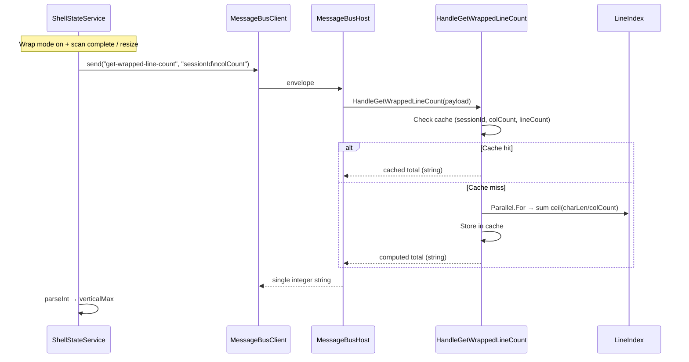

# Wrapped Line Count — Design

## Overview

Replaces bulk `get-line-lengths` with single-integer `get-wrapped-line-count` backend handler. Backend computes total visual rows via `Parallel.For` with thread-local accumulators. Per-session cache keyed by (sessionId, colCount, lineCount). Frontend sets verticalMax directly from response. Scroll navigation sends visual row index; backend resolves to (startLine, characterOffset) via `ResolveVisualRowIndex`.

## Architecture



### Design Decisions

1. **Single integer response** — eliminates O(N) payload for large files
2. **Server-side Parallel.For** — thread-local accumulators + Interlocked.Add; deterministic sum
3. **Cache key = (sessionId, colCount, lineCount)** — lineCount changes as scan progresses; colCount on resize
4. **Backend visual row resolution** — frontend sends visual row index in wrapped get-view request; backend iterates to find (startLine, characterOffset)
5. **Char-length available from scan** — unified scan computes char length alongside byte length; no fallback needed
6. **Complete removal of get-line-lengths** — handler, subscription, signals all removed

## Components and Interfaces

### Backend: ComputeWrappedLineCount

```csharp
internal static long ComputeWrappedLineCount(LineIndex lineIndex, int lineCount, int colCount)
```

Pure computation. Parallel.For over [0, lineCount), each line: charLen ?? byteLen; len==0 → 1; else ceil(len/colCount). Thread-local subtotals merged via Interlocked.Add.

### Backend: HandleGetWrappedLineCount

```csharp
internal static string HandleGetWrappedLineCount(
    string payload,
    Dictionary<string, FileViewService> sessions,
    object sessionLock,
    Dictionary<string, (int colCount, int lineCount, long total)> wrappedLineCountCache)
```

Parse `{sessionId}\n{colCount}`. Validate session first, then colCount ≥ 1. Check cache → hit returns cached total. Miss → compute, store, return.

### Backend: ResolveVisualRowIndex

```csharp
internal static (int startLine, int characterOffset) ResolveVisualRowIndex(
    LineIndex lineIndex, int lineCount, int colCount, long visualRowIndex)
```

Iterates lines summing visual rows. When cumulative exceeds target → return (line, rowWithinLine × colCount). Clamps to last visual row on overflow. Returns (0, 0) for lineCount==0 or visualRowIndex==0.

### Backend: Cache Structure

```csharp
var wrappedLineCountCache = new Dictionary<string, (int colCount, int lineCount, long total)>();
```

Eviction: `wrappedLineCountCache.Remove(viewSessionId)` in HandleCloseFile.

### Frontend: ShellStateService

**Added:**
- `wrappedLineCountSubscription` — subscribes to `get-wrapped-line-count` responses
- `handleWrappedLineCountResponse(payload)` — validates non-negative integer, sets verticalMax
- `requestWrappedLineCount(sessionId)` — builds `${sessionId}\n${colCount}`, sends message

**Trigger points:**
- `toggleWrapMode` (when toggling on)
- `handleScrollInfoResponse` (scan terminal state + wrapMode active)
- `activateTab` (wrapMode active)
- `updateViewDimensions` (wrapMode active, via 150ms resize debounce)

**Removed:**
- `lineLengths` signal, `totalLogicalLines` signal
- `lineLengthsSubscription`, `handleLineLengthsResponse`, `requestLineLengths`
- `updateWrappedScrollbarMax`, `computeWrappedScrollbarMax` import
- `scrollByVisualRows` import (scroll now uses visual row index + clamp)

**Modified:**
- `activeTotalLogicalLines` — uses `scrollbarState.verticalMax` directly
- `verticalThumbFraction` (wrapped) — uses `startLine / maxScroll` (startLine = visual row index)
- `handleArrowKey`/`handleWheel` (wrapped) — clamp(startLine ± steps, 0, maxScroll)
- `handleDragEnd` (wrapped vertical) — calls `sendWrappedViewRequest` not `sendScrollViewRequest`

### Frontend: Wrapped Scroll Navigation

Frontend sends visual row index as `startLine` field in 6-field wrapped get-view request. Backend resolves via `ResolveVisualRowIndex` before calling `GetWrappedViewAsync`.

### Message Protocol

| Message | Direction | Payload | Response |
|---------|-----------|---------|----------|
| `get-wrapped-line-count` | FE→BE | `{sessionId}\n{colCount}` | Single integer string OR `ERROR:...` |

## Correctness Properties

1. **Computation correctness** — for any line lengths and colCount ≥ 1, result = sum(len==0 ? 1 : ceil(len/colCount))
2. **Visual row index round-trip** — resolve then recompute cumulative = original index
3. **Cache key correctness** — hit iff colCount AND lineCount unchanged; miss otherwise
4. **Char-length fallback** — null charLen → byteLen used, same result as if charLen were byteLen
5. **Response parsing** — valid non-negative integer → verticalMax; otherwise → 0

## Error Handling

| Condition | Handler | Response |
|-----------|---------|----------|
| Session not found | HandleGetWrappedLineCount | `"ERROR: Session not found: {id}"` |
| colCount < 1 | HandleGetWrappedLineCount | `"ERROR: colCount must be >= 1"` |
| Invalid payload | HandleGetWrappedLineCount | `"ERROR: Invalid payload"` |
| Visual row > total | ResolveVisualRowIndex | Clamp to last visual row |
| ERROR: response | Frontend handler | verticalMax = 0 |
| Non-integer response | Frontend handler | verticalMax = 0 |

## Testing Strategy

- **C# PBT (FsCheck, MaxTest=10):** Properties 1-4 (computation, round-trip, cache, fallback)
- **TS PBT (fast-check, numRuns=10):** Property 5 (response parsing)
- **Structural verification:** get-line-lengths removed, lineLengths/totalLogicalLines removed
