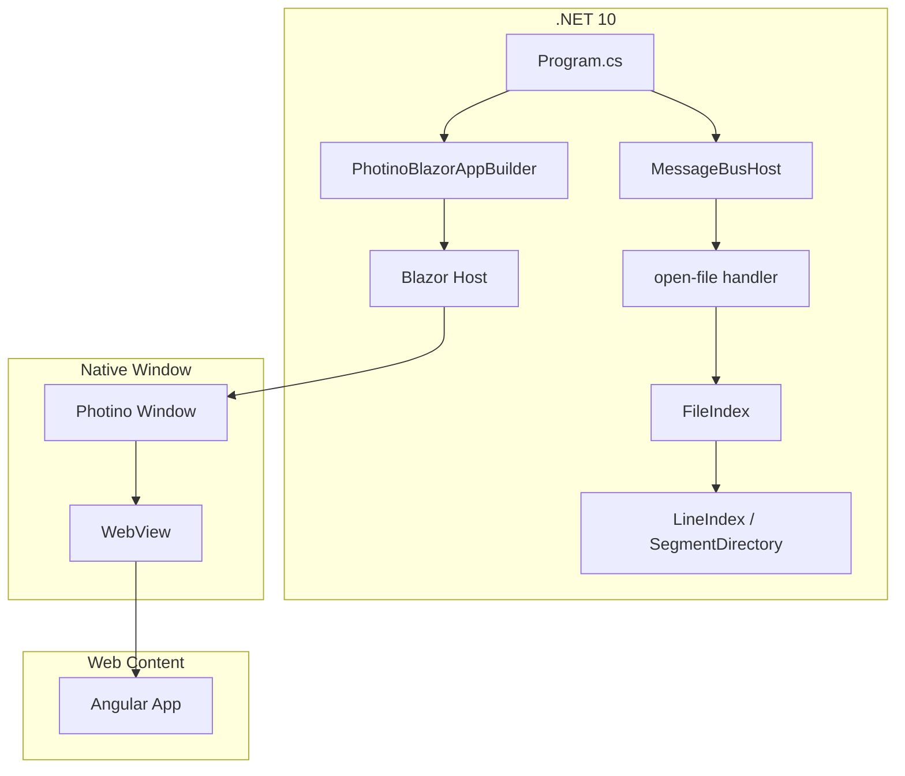

# Global Design

#[[file:.kiro/specs/_global/design-shared.md]]
#[[file:.kiro/specs/_global/design-file-index.md]]

## Overview

This document captures the full product design for all shipped features. Architecture, build pipeline, communication model, and error handling patterns are provided by design-shared.md. File Index internals in `design-file-index.md`. This document covers feature-specific component interfaces, state, correctness properties, and testing.

## Architecture



See `design-shared.md` for layer details. See `design-file-index.md` for FileIndex internals.

## Components and Interfaces

### 1. .NET Host Application (`Program.cs`)

Entry point — configures and launches Photino.Blazor app, sets up Message Bus.

**Responsibilities:**
- Create and configure `PhotinoBlazorAppBuilder`
- Register Blazor root component
- Configure Photino window properties (title, size, resizability)
- Instantiate `PhotinoMessageBridge` + `MessageBusHost`
- Register message handlers (e.g. "open-file") on the bus
- Start application event loop

**Interface:**
```csharp
var app = builder.Build();

app.MainWindow
    .SetTitle("Text Viewer")
    .SetUseOsDefaultSize(true)
    .SetResizable(true);

// Message Bus setup
var bridge = new PhotinoMessageBridge(app.MainWindow);
var messageBus = new MessageBusHost(bridge);

messageBus.RegisterHandler("open-file", async (correlationId, payload) =>
{
    var files = app.MainWindow.ShowOpenFile("Open File", "", false, null);
    if (files != null && files.Length > 0 && !string.IsNullOrEmpty(files[0]))
        return files[0];
    return "";
});

app.Run();
```

### 2. Blazor Root Component (`App.razor`)

Minimal Blazor component — mounting point for Angular app.

**Interface:**
```razor
@* App.razor *@
<!DOCTYPE html>
<html>
<head>
    <meta charset="utf-8" />
    <base href="/" />
    <link rel="stylesheet" href="styles.css" />
</head>
<body>
    <app-root></app-root>
    <script src="polyfills.js"></script>
    <script src="main.js"></script>
</body>
</html>
```

### 3. Angular `AppComponent`

```typescript
@Component({ standalone: true, selector: 'app-root' })
export class AppComponent implements OnDestroy {
  displayText = signal('Hello World');

  private readonly messageBus = inject(MessageBusClient);
  private pendingCorrelationId: string | null = null;
  private subscription: SubscriptionHandle;

  constructor() { /* subscribe to 'open-file' responses */ }
  ngOnDestroy(): void { /* unsubscribe */ }

  @HostListener('document:keydown', ['$event'])
  onKeydown(event: KeyboardEvent): void;
}
```

| Method | Trigger | Effect |
|--------|---------|--------|
| `onKeydown` | `document:keydown` | If Ctrl+O/Cmd+O and `pendingCorrelationId === null` → `preventDefault`, `messageBus.send('open-file')`, store correlationId |
| subscription handler | Message_Bus inbound | If non-empty payload → set `displayText`; clear `pendingCorrelationId` |

### 4. Project File (`TextViewer.csproj`)

**Publish Configuration:**
```xml
<PropertyGroup>
  <TargetFramework>net10.0</TargetFramework>
  <PublishSingleFile>true</PublishSingleFile>
  <SelfContained>true</SelfContained>
  <IncludeAllContentForSelfExtract>true</IncludeAllContentForSelfExtract>
  <EnableCompressionInSingleFile>true</EnableCompressionInSingleFile>
  <RuntimeIdentifiers>win-x64;osx-x64;osx-arm64;linux-x64</RuntimeIdentifiers>
</PropertyGroup>
```

**Embedded Resources:**
```xml
<ItemGroup>
  <EmbeddedResource Include="wwwroot\**\*" />
  <Content Remove="wwwroot\**\*" />
</ItemGroup>
```

## Data Models

### FileIndex Integration

FileIndex is created by the caller after receiving a file path from the open-file handler. Full class diagram, interfaces, data models, thread-safety model, and testing strategy in `design-file-index.md`.

Key integration points:
- Caller creates `FileIndex(path, ct, logger)` → calls `StartScanAsync()`
- Polls `State` to update Status_Display
- Disposes on new file selection or app shutdown

### Frontend State

```typescript
interface AppState {
  displayText: string;              // Current text in Display_Area ("Hello World" initially)
  pendingCorrelationId: string | null; // Guards against duplicate dialog requests (null = idle)
}
```

### Window Configuration

| Property | Type | Default Value |
|----------|------|---------------|
| Title | string | "Text Viewer" |
| UseOsDefaultSize | bool | true |
| Resizable | bool | true |

### Message Protocol

All frontend↔backend communication uses the Message Bus envelope format. See `design-bus-service.md` for full protocol spec.

| Direction | Format | Example |
|-----------|--------|---------|
| JS → .NET | Envelope: `type\ncorrelationId\npayload` | `"open-file\nabc-123\n"` |
| .NET → JS | Envelope: `type\ncorrelationId\npayload` | `"open-file\nabc-123\nC:\Users\me\report.pdf"` |

## Error Handling

| Category | Strategy |
|----------|----------|
| Missing embedded assets | Provider returns not-found → blank page; build validation prevents |
| WebView unavailable | Photino throws `PlatformNotSupportedException` → app exits |
| Build-time failures | MSBuild target fails → blocks build |
| Message Bus errors | See `design-bus-service.md` |
| FileIndex errors | See `design-file-index.md` error handling table |
| File access denied / not found | FileIndex → Failed state + Error property; caller displays |

## Correctness Properties

### Property 1: State guard prevents duplicate sends

*For any* sequence of Ctrl+O key presses and message responses interleaved in any order, the frontend shall never have more than one outstanding "open-file" message without an intervening response.

**Validates: Requirements 3.2, 3.4**

## Testing Strategy

### Property-Based Tests

**Library**: fast-check (TypeScript PBT)

**Config**: Minimum 100 iterations per property.

| Property | Generates | Asserts |
|----------|-----------|---------|
| State guard (Property 1) | Random sequences of `{keypress, response}` events | At most 1 outstanding send at any time |

### Unit Tests

| Test | Validates |
|------|-----------|
| Ctrl+O triggers `messageBus.send("open-file")` | Req 3.1 |
| Other key combos don't trigger send | Req 3.1 |
| `preventDefault` called on Ctrl+O in both states | Req 3.3 |
| Cmd+O works (meta key) | Req 3.1 |
| Initial `displayText` is "Hello World" | Req 6.1, 6.2 |
| Non-empty response sets displayText | Req 5.1 |
| Empty response leaves display unchanged | Req 5.2 |
| Backend handler returns path on dialog confirm | Req 4.3 |
| Backend handler returns "" on dialog cancel | Req 4.4 |
| Angular `AppComponent` renders "Hello World" | Req 2.1 |
| Window title is "Text Viewer" | Req 1.1 |

### Integration Tests

| Test | Validates |
|------|-----------|
| App launches without exceptions | Req 1 |
| Ctrl+O → dialog → path displayed | Req 3.1, 4.1, 4.3, 5.1 |
| Ctrl+O → dialog cancel → display unchanged | Req 4.4, 5.2 |
| Published binary runs w/o external files | shared: deploy model |

### Test Boundaries

- Frontend unit/property tests: mock `MessageBusClient.send()` and `subscribe()`, simulate responses via subscription handler
- Backend unit tests: mock `IMessageBridge`, verify handler invocation and response encoding
- Integration tests: real `MessageBusClient` with mocked bridge, verify full round-trip
- No E2E browser automation — Photino bridge tested via integration
