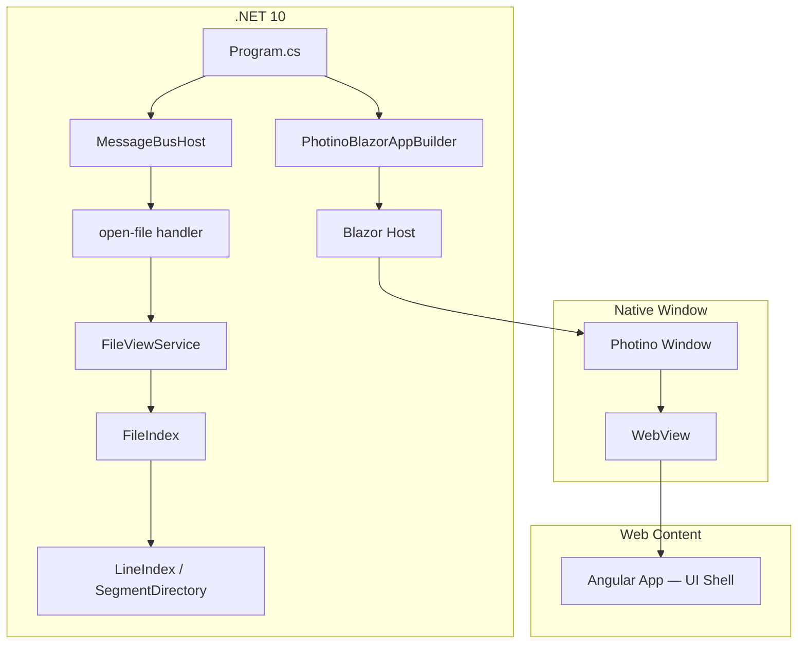

# Global Design

#[[file:.kiro/specs/_global/design-shared.md]]
#[[file:.kiro/specs/_global/design-file-index.md]]
#[[file:.kiro/specs/_global/design-file-view-service.md]]
#[[file:.kiro/specs/_global/design-viewer-ui-shell.md]]

## Overview

This document captures the full product design for all shipped features. Architecture, build pipeline, communication model, and error handling patterns provided by design-shared.md. Feature-specific designs in separate docs (referenced above):
- File Index internals → `design-file-index.md`
- File View Service → `design-file-view-service.md`
- Viewer UI Shell → `design-viewer-ui-shell.md`
- Message Bus → `design-bus-service.md`

## Architecture



See `design-shared.md` for layer details. See feature design docs for internals.

## Components and Interfaces

### 1. .NET Host Application (`Program.cs`)

Entry point — configures and launches Photino.Blazor app, sets up Message Bus.

**Responsibilities:**
- Create and configure `PhotinoBlazorAppBuilder`
- Register Blazor root component
- Configure Photino window properties (title, size, resizability)
- Instantiate `PhotinoMessageBridge` + `MessageBusHost`
- Register message handlers (e.g. "open-file", "exit") on the bus
- Start application event loop

**Interface:**
```csharp
var app = builder.Build();

app.MainWindow
    .SetTitle("Text Viewer")
    .SetUseOsDefaultSize(true)
    .SetResizable(true);

var bridge = new PhotinoMessageBridge(app.MainWindow);
var messageBus = new MessageBusHost(bridge);

messageBus.RegisterHandler("open-file", async (correlationId, payload) =>
{
    var files = app.MainWindow.ShowOpenFile("Open File", "", false, null);
    if (files != null && files.Length > 0 && !string.IsNullOrEmpty(files[0]))
        return files[0];
    return "";
});

messageBus.RegisterHandler("exit", async (correlationId, payload) =>
{
    app.MainWindow.Close();
    return "";
});

app.Run();
```

### 2. Blazor Root Component (`App.razor`)

Minimal Blazor component — mounting point for Angular app.

**Interface:**
```razor
@* App.razor *@
<!DOCTYPE html>
<html>
<head>
    <meta charset="utf-8" />
    <base href="/" />
    <link rel="stylesheet" href="styles.css" />
</head>
<body>
    <app-root></app-root>
    <script src="polyfills.js"></script>
    <script src="main.js"></script>
</body>
</html>
```

### 3. Angular UI Shell

Full component hierarchy, state management, templates, and CSS in `design-viewer-ui-shell.md`. Summary:

- **AppComponent** — CSS Grid shell host, keyboard shortcut handler, error modal overlay
- **ShellStateService** — singleton signal-based state (tabs, activeTabId, tabPosition, pendingCorrelationId, errorMessage)
- **MenuBarComponent** — File menu (Open..., Exit), synchronous DOM collapse before dialog
- **TabContainerComponent** — tab headers, close buttons, position-aware
- **TextViewAreaComponent** — empty state prompt or active tab content
- **StatusBarComponent** — active file path display

### 4. Project File (`TextViewer.csproj`)

**Publish Configuration:**
```xml
<PropertyGroup>
  <TargetFramework>net10.0</TargetFramework>
  <PublishSingleFile>true</PublishSingleFile>
  <SelfContained>true</SelfContained>
  <IncludeAllContentForSelfExtract>true</IncludeAllContentForSelfExtract>
  <EnableCompressionInSingleFile>true</EnableCompressionInSingleFile>
  <RuntimeIdentifiers>win-x64;osx-x64;osx-arm64;linux-x64</RuntimeIdentifiers>
</PropertyGroup>
```

**Embedded Resources:**
```xml
<ItemGroup>
  <EmbeddedResource Include="wwwroot\**\*" />
  <Content Remove="wwwroot\**\*" />
</ItemGroup>
```

## Data Models

### FileIndex Integration

FileIndex created by caller after receiving file path. Full class diagram, interfaces, data models, thread-safety model in `design-file-index.md`.

Key integration points:
- Caller creates `FileIndex(path, ct, logger)` → calls `StartScanAsync()`
- Polls `State` to update Status_Display
- Exposes `Encoding` + `BomByteLength` for consumers
- Disposes on new file selection or app shutdown

### FileViewService Integration

FileViewService wraps FileIndex for rectangular text views. Full design in `design-file-view-service.md`.

Key integration points:
- Owns private FileIndex (lifecycle managed internally)
- `GetViewAsync(startLine, startCol, rowCount, colCount, ct)` → `Result<ViewResult, ViewError>`
- Independent file handle per request → ≥4 concurrent reads
- Partial decode: O(startCol + colCount) not O(lineLength)
- Uses FileIndex `Encoding` + `BomByteLength` for character decoding

### Window Configuration

| Property | Type | Default Value |
|----------|------|---------------|
| Title | string | "Text Viewer" |
| UseOsDefaultSize | bool | true |
| Resizable | bool | true |

### Message Protocol

All frontend↔backend communication uses Message Bus envelope format. See `design-bus-service.md` for full protocol spec.

| Direction | Format | Example |
|-----------|--------|---------|
| JS → .NET | Envelope: `type\ncorrelationId\npayload` | `"open-file\nabc-123\n"` |
| .NET → JS | Envelope: `type\ncorrelationId\npayload` | `"open-file\nabc-123\nC:\Users\me\report.pdf"` |

## Error Handling

| Category | Strategy |
|----------|----------|
| Missing embedded assets | Provider returns not-found → blank page; build validation prevents |
| WebView unavailable | Photino throws `PlatformNotSupportedException` → app exits |
| Build-time failures | MSBuild target fails → blocks build |
| Message Bus errors | See `design-bus-service.md` |
| FileIndex errors | See `design-file-index.md` error handling table |
| FileViewService errors | See `design-file-view-service.md` error handling table |
| UI Shell errors | See `design-viewer-ui-shell.md` error handling table |
| File access denied / not found | FileIndex → Failed state + Error property; caller displays |

## Correctness Properties

Properties defined per feature in their respective design docs:
- **UI Shell**: 8 properties (state guard, file name extraction, tab lifecycle, position invariance) — see `design-viewer-ui-shell.md`
- **File Index**: 7 properties (byte-length round-trip, char-length, tier minimality, boundary optimality, lookup, state machine, concurrency) — see `design-file-index.md`
- **File View Service**: 6 properties (row extraction, result count, param validation, replacement chars, column counting, immutability) — see `design-file-view-service.md`

## Testing Strategy

Testing strategies defined per feature in their respective design docs. Cross-cutting patterns:

### Test Boundaries

- **Frontend unit/property tests**: mock `MessageBusClient.send()` and `subscribe()`, simulate responses via subscription handler
- **Backend unit tests**: mock `IMessageBridge`, verify handler invocation and response encoding
- **Integration tests**: real `MessageBusClient` with mocked bridge, verify full round-trip
- **No E2E browser automation** — Photino bridge tested via integration
- **Property-based tests**: fast-check (TS, `{ numRuns: 10 }`), FsCheck (C#, `[Property(MaxTest = 10)]`)
