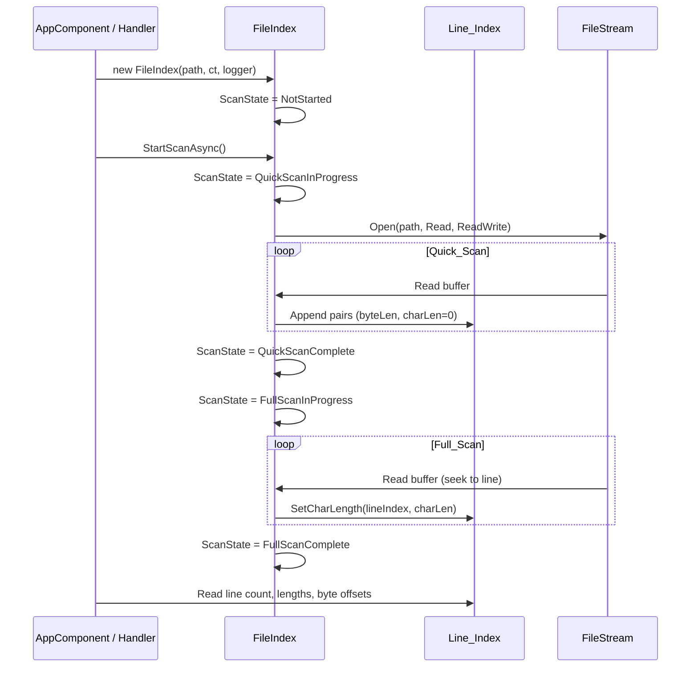
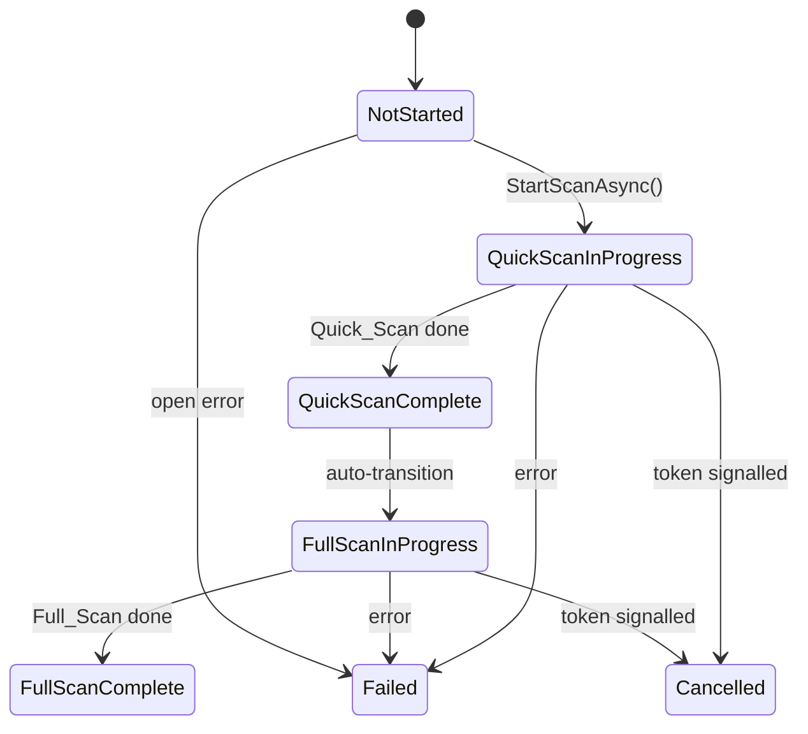
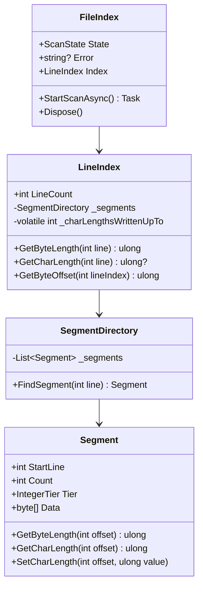

# Design Document

#[[file:.kiro/specs/_global/design-shared.md]]

## Overview

FileIndex scans a single file in two phases to build a memory-compact, thread-safe index of per-line metadata. Quick_Scan identifies line boundaries and records byte lengths (including delimiter bytes); Full_Scan decodes content and records character lengths. The index uses a single SegmentDirectory storing interleaved (Byte_Length, Char_Length) pairs per line, with variable-width integer tiers grouped into segments for minimal memory footprint and a sorted directory enabling O(log N) line lookups.

Key behaviors:
- Two-phase scanning (Quick_Scan → Full_Scan), automatic progression
- Non-exclusive file access (FileShare.ReadWrite)
- Thread-safe Line_Index: single writer, multiple concurrent readers, no torn reads
- Unified segment storage: pairs of (Byte_Length, Char_Length) per line, interleaved
- Tier selection based on max Byte_Length in segment (Char_Length ≤ Byte_Length always fits)
- 4 unsigned integer tiers (byte/ushort/uint/ulong)
- Memory-optimal segment boundaries (split only when savings exceed metadata cost)
- Byte_Length includes line-ending delimiter bytes → enables byte-offset navigation via prefix sum
- CancellationToken + ILogger<FileIndex> injection, IDisposable lifecycle
- ScanState enum for polling-based progress observation

Integration: caller (AppComponent) creates FileIndex via Message Bus handler response, polls ScanState, displays metrics in Status_Display. FileIndex has zero awareness of callers.

## Architecture







## Components and Interfaces

### FileIndex (C#)

```csharp
namespace TextViewer.Services;

public sealed class FileIndex : IDisposable
{
    private readonly string _filePath;
    private readonly CancellationToken _cancellationToken;
    private readonly ILogger<FileIndex> _logger;
    private FileStream? _stream;
    private volatile ScanState _state = ScanState.NotStarted;
    private volatile string? _error;

    public FileIndex(string filePath, CancellationToken cancellationToken, ILogger<FileIndex> logger)
    {
        _filePath = filePath ?? throw new ArgumentNullException(nameof(filePath));
        _cancellationToken = cancellationToken;
        _logger = logger ?? throw new ArgumentNullException(nameof(logger));
        Index = new LineIndex();
    }

    /// <summary>Thread-safe current scan phase.</summary>
    public ScanState State => _state;

    /// <summary>Thread-safe error description (null when no error).</summary>
    public string? Error => _error;

    /// <summary>Thread-safe line index (readable after QuickScanComplete).</summary>
    public LineIndex Index { get; }

    /// <summary>
    /// Starts the two-phase scan. Quick_Scan runs first, then Full_Scan automatically.
    /// Returns when both phases complete, fail, or are cancelled.
    /// </summary>
    public Task StartScanAsync();

    public void Dispose();
}
```

### LineIndex (C#)

```csharp
namespace TextViewer.Services;

/// <summary>
/// Thread-safe, memory-compact index of per-line lengths.
/// Single writer appends during scan; multiple readers query concurrently.
/// Uses a single SegmentDirectory storing (Byte_Length, Char_Length) pairs per line.
/// </summary>
public sealed class LineIndex
{
    private readonly object _writeLock = new();
    private SegmentDirectory _segments = new();
    private volatile int _lineCount;
    private volatile int _charLengthsWrittenUpTo;

    /// <summary>Total lines indexed (visible once Quick_Scan appends).</summary>
    public int LineCount => _lineCount;

    /// <summary>Returns byte length for a given line (0-based). O(log N) lookup.</summary>
    public ulong GetByteLength(int lineIndex);

    /// <summary>
    /// Returns char length for a given line (0-based), or null if Full_Scan
    /// has not yet reached this line. Uses volatile _charLengthsWrittenUpTo
    /// counter: returns null when lineIndex >= _charLengthsWrittenUpTo,
    /// otherwise reads from segment. O(log N) lookup.
    /// </summary>
    public ulong? GetCharLength(int lineIndex);

    /// <summary>
    /// Returns the byte offset of the given line from the start of the file.
    /// Computed as the sum of Byte_Lengths for lines 0 through lineIndex-1.
    /// GetByteOffset(0) == 0. O(N) in worst case, O(S) with segment-level caching.
    /// </summary>
    public ulong GetByteOffset(int lineIndex);

    // --- Writer methods (internal, called by FileIndex during scan) ---

    /// <summary>
    /// Appends line pairs during Quick_Scan. Each pair is (byteLength, 0).
    /// Char_Length slot initialized to 0, written later by Full_Scan.
    /// </summary>
    internal void AppendByteLengths(ReadOnlySpan<ulong> byteLengths);

    /// <summary>
    /// Writes the char length into the second slot of an existing pair.
    /// Called by Full_Scan for each line after Quick_Scan has populated the pair.
    /// </summary>
    internal void SetCharLength(int lineIndex, ulong charLength);

    internal void FinalizeCharLengths();
    internal void Clear();
}
```

### SegmentDirectory (C#)

```csharp
namespace TextViewer.Services;

/// <summary>
/// Sorted collection of segments enabling O(log N) line-to-segment lookup.
/// Single directory storing interleaved (Byte_Length, Char_Length) pairs.
/// </summary>
internal sealed class SegmentDirectory
{
    private readonly List<Segment> _segments = new();
    // Segments sorted by StartLine — binary search for lookup

    /// <summary>Finds the segment containing the given line index.</summary>
    public Segment FindSegment(int lineIndex);

    /// <summary>
    /// Appends pairs, creating/extending segments with optimal tier selection.
    /// Tier determined by max byte length value (first element of each pair).
    /// </summary>
    public void Append(ReadOnlySpan<ulong> byteLengths, int startLineIndex);

    /// <summary>
    /// Updates the char-length slot of an existing pair in-place.
    /// Writes to the second value in the pair at the given line index.
    /// </summary>
    public void SetCharLength(int lineIndex, ulong charLength);

    public int TotalLines { get; }
}
```

### Segment (C#)

```csharp
namespace TextViewer.Services;

/// <summary>
/// A contiguous block of (Byte_Length, Char_Length) pairs stored in a single integer tier.
/// Data layout: [byteLen0, charLen0, byteLen1, charLen1, ...]
/// Both values in a pair use the same tier width.
/// </summary>
internal sealed class Segment
{
    public int StartLine { get; }
    public int Count { get; }
    public IntegerTier Tier { get; }

    // Raw storage — Count × 2 × TierSize bytes
    private byte[] _data;

    /// <summary>Gets the byte length (first value in pair) at the given offset within segment.</summary>
    public ulong GetByteLength(int offsetWithinSegment);

    /// <summary>Gets the char length (second value in pair) at the given offset within segment.</summary>
    public ulong GetCharLength(int offsetWithinSegment);

    /// <summary>
    /// Sets the char length (second value in pair) at the given offset.
    /// Used by Full_Scan to fill in char lengths after Quick_Scan created the pairs.
    /// </summary>
    public void SetCharLength(int offsetWithinSegment, ulong value);
}
```

### Integration with Message Bus

FileIndex creation triggered by the existing `open-file` handler response flow:

```csharp
// In Program.cs handler registration (extends existing open-file handler)
messageBus.RegisterHandler("open-file", async (correlationId, payload) =>
{
    var files = app.MainWindow.ShowOpenFile("Open File", "", false, null);
    if (files != null && files.Length > 0 && !string.IsNullOrEmpty(files[0]))
    {
        // Caller creates FileIndex after receiving path
        return files[0];
    }
    return "";
});
```

The Angular caller receives the file path, then the .NET side (or a future handler) creates a `FileIndex` instance. The caller polls `State` and reads `Index` properties to update the Status_Display. FileIndex itself has no Message Bus dependency.

## Caller Contract

The following responsibilities belong to the caller (AppComponent / handler layer), NOT to FileIndex. FileIndex exposes thread-safe fields and accepts construction parameters — nothing else.

### Lifecycle Management

1. Caller creates `FileIndex(path, cancellationToken, logger)` and calls `StartScanAsync()`
2. Caller periodically polls `State` (e.g., via timer or `Task.Delay` loop) and updates Status_Display accordingly
3. Caller is responsible for calling `Dispose()` when done — this is the only guaranteed resource cleanup path

### New File Selection

When the user selects a new file:
1. Signal `CancellationToken` on the previous FileIndex instance
2. `Dispose()` the previous FileIndex
3. Clear all metrics from the previous file in Status_Display
4. Create a new `FileIndex` for the new path

### Failed / Cancelled Observation

- On observing `ScanState = Failed` or `Cancelled`: do NOT display partial metrics; revert Status_Display to the state prior to the failed/cancelled scan
- On observing `ScanState = Failed`: display the `Error` field content in the main content area (replacing default "hello world" text)

### Max Length Computation

The caller computes max Byte_Length and max Char_Length from the LineIndex for Status_Display. FileIndex/LineIndex does NOT expose `MaxByteLength` or `MaxCharLength` properties — the caller iterates `GetByteLength(0..LineCount-1)` and `GetCharLength(0..LineCount-1)` (or tracks running max during polling) to determine the longest line values for display.

## Data Models

### ScanState Enum

```csharp
namespace TextViewer.Services;

public enum ScanState
{
    NotStarted = 0,
    QuickScanInProgress = 1,
    QuickScanComplete = 2,
    FullScanInProgress = 3,
    FullScanComplete = 4,
    Failed = 5,
    Cancelled = 6
}
```

### IntegerTier Enum

```csharp
namespace TextViewer.Services;

/// <summary>
/// Storage tier for segment pair values. Each tier uses the corresponding
/// unsigned integer type for BOTH values in every pair within the segment.
/// Tier is determined by the maximum Byte_Length in the segment
/// (since Char_Length ≤ Byte_Length, both values always fit).
/// </summary>
internal enum IntegerTier : byte
{
    Byte = 1,    // 1 byte per value, max 255
    UShort = 2,  // 2 bytes per value, max 65,535
    UInt = 4,    // 4 bytes per value, max 4,294,967,295
    ULong = 8   // 8 bytes per value, max 18,446,744,073,709,551,615
}
```

### Segment Memory Layout

Each segment stores interleaved pairs of (Byte_Length, Char_Length):
- **Metadata**: StartLine (int, 4B) + Count (int, 4B) + Tier (byte, 1B) = 9 bytes overhead
- **Data**: Count × 2 × TierSize bytes (two values per line)

```
Data layout: [byteLen0, charLen0, byteLen1, charLen1, ...]

Segment memory = 9 + (Count × 2 × TierSize)

Example: 100 lines, Byte tier → 9 + (100 × 2 × 1) = 209 bytes
Example: 100 lines, UShort tier → 9 + (100 × 2 × 2) = 409 bytes
Example: 100 lines, UInt tier → 9 + (100 × 2 × 4) = 809 bytes
```

### Pair Access Formulas

```
byteOffset(lineOffset) = lineOffset × 2 × TierSize
charOffset(lineOffset) = (lineOffset × 2 + 1) × TierSize

GetByteLength(offset): read TierSize bytes at position offset × 2 × TierSize
GetCharLength(offset): read TierSize bytes at position (offset × 2 + 1) × TierSize
SetCharLength(offset, value): write TierSize bytes at position (offset × 2 + 1) × TierSize
```

### Tier Selection Algorithm

Tier determined by max Byte_Length in the segment (since Char_Length ≤ Byte_Length, both fit):

```
function selectTier(maxByteLength: ulong) -> IntegerTier:
    if maxByteLength <= 255:       return Byte
    if maxByteLength <= 65535:     return UShort
    if maxByteLength <= 4294967295: return UInt
    return ULong
```

### Segment Boundary Decision

A new segment starts when:
1. The next line's Byte_Length requires a **wider** tier than the current segment, OR
2. The next line's Byte_Length could use a **narrower** tier AND the memory saved by starting a new narrower segment exceeds the 9-byte metadata cost of the new segment

**Split condition (narrowing)**:
```
remainingLines = lines still to append in this batch
currentTierSize = current segment's tier byte width
narrowTierSize = tier needed for the new line's Byte_Length
memorySaved = remainingLines × 2 × (currentTierSize - narrowTierSize)  // ×2 for pairs
metadataCost = 9  // new segment overhead

split if memorySaved > metadataCost
```

### Byte-Offset Navigation

Since Byte_Length includes delimiter bytes, the file offset of any line is computable:

```
GetByteOffset(lineIndex):
    offset = 0
    for i in 0..lineIndex-1:
        offset += GetByteLength(i)
    return offset

Invariant: GetByteOffset(0) == 0
Invariant: GetByteOffset(LineCount) == fileSize
```

This enables seeking directly to any line in the file without re-scanning.

### Segment Directory Structure

```
SegmentDirectory:
  _segments: List<Segment> sorted by StartLine
  
  FindSegment(lineIndex):
    Binary search _segments for largest StartLine <= lineIndex
    Return matching segment
    
  Time complexity: O(log S) where S = number of segments
  Since S << N (lines), effective lookup is O(log N)
```

### Thread-Safety Model

| Operation | Mechanism | Guarantee |
|-----------|-----------|-----------|
| ScanState read | `volatile` field | No torn read (enum fits in word) |
| Error read | `volatile` field | Reference assignment is atomic |
| LineCount read | `volatile int` | Atomic read |
| GetByteLength | Segment data immutable after write; directory append uses lock + volatile count publish | No torn read |
| GetCharLength | `Interlocked` write into char slot of pair; volatile `_charLengthsWrittenUpTo` counter; readers see null (not yet written) or final value | No torn read |
| GetByteOffset | Reads only from committed segments (lineIndex < _lineCount) | Consistent sum |
| AppendByteLengths | Holds `_writeLock`; writes pairs (byteLen, 0), publishes segment, then increments `_lineCount` | Readers see complete pairs only |
| SetCharLength | `Interlocked.Exchange` on the char slot within the pair | Atomic write to second value in pair |

**Visibility ordering**: `_lineCount` is incremented AFTER segment data (both slots of each pair) is fully written. Readers check `_lineCount` first → if line is within count, its byte-length data is guaranteed visible. Char-length returns null (line not yet processed by Full_Scan) or the final value, governed by `_charLengthsWrittenUpTo`.

**SetCharLength thread-safety**: During Full_Scan, the writer updates only the char-length slot (second value in each pair). The byte-length slot (first value) is immutable after Quick_Scan. Readers of GetByteLength are never affected by Full_Scan writes. Readers of GetCharLength see either null (line not yet processed by Full_Scan) or the final char length — never a torn intermediate.

**GetCharLength null-sentinel**: A volatile `_charLengthsWrittenUpTo` counter tracks how many lines have had their char-length written by Full_Scan. `GetCharLength(lineIndex)` returns `null` if `lineIndex >= _charLengthsWrittenUpTo`, otherwise reads the value from the segment. The writer increments `_charLengthsWrittenUpTo` AFTER the `Interlocked.Exchange` on the char slot completes. This avoids conflating "not yet written" with a legitimate char-length of 0 (empty lines).

**Quick_Scan abort invariant**: On any Quick_Scan abort (I/O error, cancellation, memory limit), the writer resets `_lineCount` to 0 and clears all segments before transitioning state. This ensures readers see an empty index — no partial Line_Index is ever exposed.

**Concurrent reader capacity**: The design supports unlimited concurrent readers (no reader locks, no reader count limit). This exceeds the minimum 4-reader requirement (Req 4.1).

### Error Property Format

| Scenario | Format |
|----------|--------|
| File not found | `"Failed to open {filePath}: FileNotFoundException"` |
| Access denied | `"Failed to open {filePath}: UnauthorizedAccessException"` |
| I/O error on open | `"Failed to open {filePath}: IOException"` |
| Scan failure | `"Scan failed for {filePath}: {ExceptionType}"` |

### Logging Levels

| Event | Level |
|-------|-------|
| Scan start | Information |
| Phase transition (QuickScanComplete, FullScanInProgress, FullScanComplete) | Information |
| Access error (IOException, UnauthorizedAccessException, FileNotFoundException) | Error |
| Non-access scan issue (corrupted file, unsupported format) | Information |
| Disposal events | Debug |
| Resource release failure during disposal | Warning |

## Correctness Properties

*A property is a characteristic or behavior that should hold true across all valid executions of a system — essentially, a formal statement about what the system should do. Properties serve as the bridge between human-readable specifications and machine-verifiable correctness guarantees.*

### Property 1: Quick_Scan byte-length round-trip

*For any* byte sequence representing file content, the sum of all stored Byte_Lengths SHALL equal the total file size in bytes, AND reconstructing the file by concatenating each line's Byte_Length bytes (content + delimiter) SHALL produce the original byte sequence.

This also validates byte-offset navigation: since the sum of Byte_Lengths[0..N-1] equals the file offset of line N, correct round-trip implies correct `GetByteOffset` for all line indices.

**Validates: Requirements 2.2, 2.3, 2.4**

### Property 2: Full_Scan char-length correctness

*For any* file content and detected encoding, the Char_Length stored for each line SHALL equal the `.Length` of the .NET string produced by decoding that line's content bytes (excluding delimiter bytes) with the encoding (using DecoderFallback.ReplacementFallback), excluding any BOM character.

**Validates: Requirements 3.2, 3.3, 3.4**

### Property 3: Segment tier minimality

*For any* segment in the Line_Index, the IntegerTier of that segment SHALL be the smallest tier whose maximum value is greater than or equal to the maximum Byte_Length stored in that segment. Since Char_Length ≤ Byte_Length for every line, both values in every pair are guaranteed to fit within the selected tier.

**Validates: Requirements 4.4, 5.1**

### Property 4: Segment boundary optimality

*For any* pair of adjacent segments, merging them into a single segment (using the wider tier, with pair storage) SHALL NOT reduce total memory consumption (data + metadata), AND splitting either segment further SHALL NOT reduce total memory consumption.

**Validates: Requirements 5.2, 5.3**

### Property 5: Segment directory lookup correctness

*For any* valid line index (0 ≤ lineIndex < LineCount), `FindSegment(lineIndex)` SHALL return a segment where `StartLine ≤ lineIndex < StartLine + Count`, AND `GetByteLength(lineIndex - StartLine)` SHALL return the byte-length value originally stored for that line, AND `GetCharLength(lineIndex - StartLine)` SHALL return the char-length value stored for that line.

**Validates: Requirements 5.4**

### Property 6: State machine transition validity

*For any* sequence of scan events (success, failure, cancellation), the ScanState SHALL only transition through valid edges: NotStarted→QuickScanInProgress→QuickScanComplete→FullScanInProgress→FullScanComplete, with Failed or Cancelled reachable from any InProgress state or from NotStarted (on open error), and no other transitions permitted.

**Validates: Requirements 7.1, 7.2, 7.3, 7.4, 7.5**

### Property 7: Concurrent read safety (no torn values)

*For any* interleaving of a single writer thread appending/updating Line_Index pairs and multiple reader threads querying GetByteLength, GetCharLength, or GetByteOffset, every reader SHALL observe either the complete previous value or the complete new value — never a partially-written intermediate state.

**Validates: Requirements 4.1, 4.2, 4.3**

## Error Handling

| Scenario | Behavior | ScanState | Error Property |
|----------|----------|-----------|----------------|
| File not found | Skip scan, log Error | Failed | `"Failed to open {path}: FileNotFoundException"` |
| Access denied (UnauthorizedAccessException) | Skip scan, log Error | Failed | `"Failed to open {path}: UnauthorizedAccessException"` |
| I/O error on open (IOException) | Skip scan, log Error | Failed | `"Failed to open {path}: IOException"` |
| I/O error during Quick_Scan | Abort, clear Line_Index, log Error | Failed | `"Scan failed for {path}: IOException"` |
| I/O error during Full_Scan | Abort, log Error | Failed | `"Scan failed for {path}: IOException"` |
| Invalid bytes during Full_Scan | Use replacement char (U+FFFD), count as 1 | continues | (no error) |
| CancellationToken signalled during Quick_Scan | Stop I/O within 500ms, clear Line_Index, transition state | Cancelled | (no error) |
| CancellationToken signalled during Full_Scan | Stop I/O within 500ms, transition state (Quick_Scan data preserved) | Cancelled | (no error) |
| Memory allocation failure during Quick_Scan | Abort, clear Line_Index | Failed | `"Scan failed for {path}: OutOfMemoryException"` |
| Memory allocation failure during Full_Scan | Abort scan | Failed | `"Scan failed for {path}: OutOfMemoryException"` |
| Resource release failure on Dispose | Log Warning, continue disposing others | unchanged | unchanged |
| Dispose called during scan | Signal internal cancellation, release resources | unchanged | unchanged |

### Disposal Strategy

```csharp
public void Dispose()
{
    // 1. Close file stream (if open)
    try { _stream?.Dispose(); }
    catch (Exception ex) { _logger.LogWarning(ex, "Failed to close file stream"); }

    // 2. Release index memory (clear segments)
    try { Index.Clear(); }
    catch (Exception ex) { _logger.LogWarning(ex, "Failed to clear index"); }

    _logger.LogDebug("FileIndex disposed for {FilePath}", _filePath);
}
```

**Cancellation and resource release**: If cancellation occurs during a scan, `Dispose()` is still required by the caller to release remaining resources. The 500ms guarantee (Req 6.1) covers state transition and I/O cessation only — full resource cleanup (buffer deallocation, handle closure, segment memory) happens in `Dispose()`. Resources not released within 500ms SHALL be released eventually, guaranteed by `Dispose()` or the finalizer as a safety net.

## Testing Strategy

### Property-Based Tests (C# — FsCheck + xUnit)

**Library**: FsCheck 3.1.0 + FsCheck.Xunit (already in test project)
**Config**: Minimum 100 iterations per property
**Tag format**: `Feature: file-index, Property N: <title>`

| Property | Generators | Asserts |
|----------|-----------|---------|
| 1: Quick_Scan byte-length round-trip | Random byte arrays (0–10KB) with mixed line endings (LF/CR/CRLF) | Sum of Byte_Lengths == file size; reconstruct from stored lengths == original; GetByteOffset(i) == sum of lengths[0..i-1] |
| 2: Full_Scan char-length correctness | Random strings encoded in UTF-8/UTF-16/ASCII with optional BOM, multi-byte chars, invalid sequences | Stored Char_Length == .NET string.Length of decoded line (excluding delimiters and BOM) |
| 3: Segment tier minimality | Random `ulong[]` pair arrays (0–1000 lines) with values spanning tier boundaries | Every segment's tier == selectTier(max Byte_Length in segment); both values in every pair fit within tier |
| 4: Segment boundary optimality | Random `ulong[]` pair arrays with tier-crossing patterns | No profitable merge or split exists (accounting for pair storage: Count × 2 × TierSize) |
| 5: Segment directory lookup | Random Line_Index states (1–10000 lines) with pairs, random query indices | Correct segment returned, correct byte-length and char-length retrieved |
| 6: State machine validity | Random sequences of {Success, Failure, Cancel} events | All transitions follow valid edges |
| 7: Concurrent read safety | Random write sequences (pairs) + concurrent read threads calling GetByteLength, GetCharLength, GetByteOffset | No torn values observed |

### Unit Tests (xUnit)

| Test | Validates |
|------|-----------|
| FileIndex opens with FileShare.ReadWrite | Req 1.1 |
| FileIndex opens with FileAccess.Read | Req 1.2 |
| Missing file → Failed state + correct Error format | Req 1.4 |
| Access denied → Failed state + correct Error format | Req 1.3 |
| IOException on open → Failed state + correct Error format | Req 1.3 |
| Quick_Scan identifies LF line endings | Req 2.2 |
| Quick_Scan identifies CR line endings | Req 2.2 |
| Quick_Scan identifies CRLF line endings | Req 2.2 |
| Quick_Scan handles mixed line endings | Req 2.2 |
| Quick_Scan Byte_Length includes delimiter bytes (LF=1, CR=1, CRLF=2) | Req 2.3 |
| Quick_Scan final unterminated line stores content bytes only | Req 2.3 |
| Empty file → 0 lines | Req 2.4 |
| File without trailing newline → last segment counts as line | Req 2.4 |
| Quick_Scan error → Line_Index empty, no partial data | Req 2.5 |
| Full_Scan starts automatically after Quick_Scan | Req 3.1 |
| Full_Scan with UTF-8 multi-byte chars | Req 3.2 |
| Full_Scan with BOM → BOM excluded from Char_Length | Req 3.2 |
| Full_Scan with invalid bytes → replacement char counted | Req 3.4 |
| GetByteOffset(0) == 0 | Req 2.3 |
| GetByteOffset(N) == sum of Byte_Lengths[0..N-1] | Req 2.3 |
| GetByteOffset(LineCount) == file size | Req 2.3 |
| Segment stores interleaved pairs (byteLen, charLen) | Req 4.4 |
| Tier selected by max Byte_Length, not max Char_Length | Req 4.4, 5.1 |
| SetCharLength writes to char slot without affecting byte slot | Req 4.3 |
| Dispose releases file handle | Req 6.2 |
| Dispose logs at Debug level | Req 6.6 |
| Disposal failure → log Warning, continue | Req 6.3 |
| CancellationToken → state = Cancelled | Req 7.5 |
| ScanState transitions in correct order (happy path) | Req 7.1–7.3 |
| Error property format matches spec | Req 7.4 |
| Zero-line file → no segments allocated | Req 5.5 |
| Single-line file → one segment with one pair | Req 5.1 |
| Tier widening at segment boundary | Req 5.3 |
| Tier narrowing at segment boundary | Req 5.3 |
| Segment memory == 9 + Count × 2 × TierSize | Req 5.1 |
| Log levels: scan start = Information | Req 6.6 |
| Log levels: access error = Error | Req 1.3, 6.6 |
| Log levels: non-access issue = Information | Req 1.3, 6.6 |

### Integration Tests

| Test | Validates |
|------|-----------|
| Scan real file end-to-end (Quick + Full) | Req 2, 3 |
| GetByteOffset matches actual file positions for real file | Req 2.3 |
| Concurrent readers during active scan | Req 4.1 |
| Cancellation during Quick_Scan stops within 500ms | Req 6.1 |
| Cancellation during Full_Scan stops within 500ms | Req 6.1 |
| Large file (1M+ lines) completes without OOM | Req 5 |
| File modified by another process during scan (ReadWrite sharing) | Req 1.1 |

### Test Boundaries

- Unit tests: mock `FileStream` via abstraction or `MemoryStream`, test Line_Index and segmentation logic in isolation
- Property tests: test pure logic (segmentation algorithm, tier selection, line parsing, pair storage) with generated inputs
- Integration tests: real file I/O, real threading, real cancellation
- No UI tests in this spec — caller/UI behavior tested in separate frontend spec
