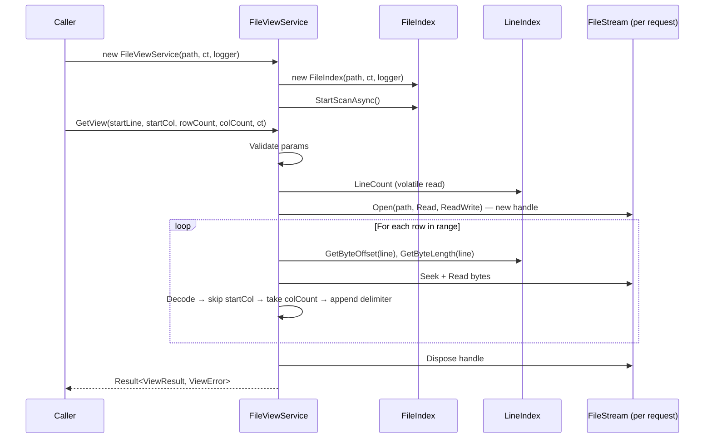
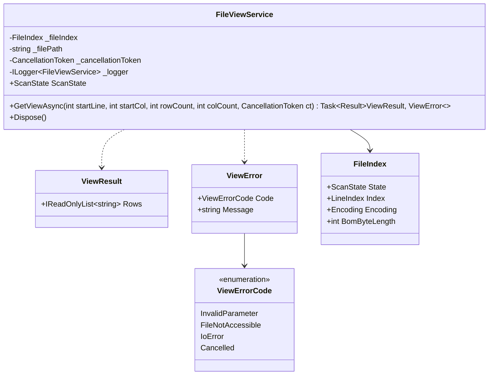

# File View Service — Design

#[[file:.kiro/specs/_global/design-shared.md]]

## Overview

File_View_Service produces rectangular text views from an indexed file. Given (startLine, startCol, rowCount, colCount), it reads only the bytes needed for the requested region using FileIndex byte offsets, decodes them with the detected encoding, and returns a list of row strings representing the viewport.

Key behaviors:
- Owns a private FileIndex instance (lifecycle management)
- Opens independent file handles per request → concurrent safety (≥4 simultaneous)
- Uses FileIndex `Encoding` + `BomByteLength` for character decoding
- Partial decode: only decodes up to (startCol + colCount) chars per line → O(view) not O(line)
- Result pattern for errors (`Result<ViewResult, ViewError>`), `OperationCanceledException` for cancellation
- Serves partial results during scan (empty strings for unscanned lines)
- Reuses existing `ScanState` enum for lifecycle observation
- Column = .NET char (UTF-16 code unit); delimiters appended but not counted

## Architecture





## Components and Interfaces

### FileViewService (C#)

```csharp
namespace TextViewer.Services;

public sealed class FileViewService : IDisposable
{
    private readonly string _filePath;
    private readonly FileIndex _fileIndex;
    private readonly ILogger<FileViewService> _logger;
    private readonly CancellationToken _serviceCancellationToken;

    public FileViewService(string filePath, CancellationToken cancellationToken, ILogger<FileViewService> logger);

    /// <summary>Reflects FileIndex.State for lifecycle observation.</summary>
    public ScanState ScanState => _fileIndex.State;

    /// <summary>
    /// Extracts a rectangular view region from the file.
    /// Opens an independent file handle per call for concurrent safety.
    /// </summary>
    public Task<Result<ViewResult, ViewError>> GetViewAsync(
        int startLine, int startCol, int rowCount, int colCount,
        CancellationToken cancellationToken = default);

    public void Dispose();
}
```

### ViewResult

```csharp
namespace TextViewer.Services;

public sealed class ViewResult
{
    public IReadOnlyList<string> Rows { get; }

    public ViewResult(IReadOnlyList<string> rows)
    {
        Rows = rows;
    }
}
```

### ViewError

```csharp
namespace TextViewer.Services;

public enum ViewErrorCode
{
    InvalidParameter,
    FileNotAccessible,
    IoError,
    Cancelled
}

public sealed class ViewError
{
    public ViewErrorCode Code { get; }
    public string Message { get; }

    public ViewError(ViewErrorCode code, string message)
    {
        Code = code;
        Message = message;
    }
}
```

### Result&lt;T, E&gt;

```csharp
namespace TextViewer.Services;

/// <summary>
/// Discriminated union: either success value or error value.
/// </summary>
public readonly struct Result<T, E>
{
    private readonly T? _value;
    private readonly E? _error;
    public bool IsSuccess { get; }

    public T Value => IsSuccess ? _value! : throw new InvalidOperationException("Result is error");
    public E Error => !IsSuccess ? _error! : throw new InvalidOperationException("Result is success");

    private Result(T value) { _value = value; _error = default; IsSuccess = true; }
    private Result(E error, bool _) { _value = default; _error = error; IsSuccess = false; }

    public static Result<T, E> Success(T value) => new(value);
    public static Result<T, E> Failure(E error) => new(error, false);
}
```

### FileIndex Additions (Encoding exposure)

```csharp
// Added to existing FileIndex class:
public Encoding Encoding { get; private set; } = Encoding.UTF8;
public int BomByteLength { get; private set; } = 0;
```

Set during `DetectEncodingAsync()` before line indexing begins → available immediately after scan starts.

## Data Models

### View Request Parameters

| Parameter | Type | Constraint | Meaning |
|-----------|------|-----------|---------|
| startLine | int | ≥ 0 | 0-based first row |
| startCol | int | ≥ 0 | 0-based first column |
| rowCount | int | ≥ 1 | Number of rows |
| colCount | int | ≥ 1 | Max content chars per row |

### Row String Format

Each row string = `[content][delimiter]` where:
- `content` = up to `colCount` chars starting at `startCol` (may be shorter or empty)
- `delimiter` = original line ending (`\n`, `\r\n`, `\r`, or empty for last unterminated line)
- Column counting uses .NET `char` (UTF-16 code unit) — surrogate pair = 2 columns
- BOM excluded from content and column counting

### Result Count Rules

| Condition | Result |
|-----------|--------|
| Scan in progress, request extends beyond scanned | Rows for scanned lines + empty strings to fill rowCount |
| Scan complete, request extends beyond EOF | Only existing rows (count < rowCount) |
| startLine ≥ total lines (scan complete) | Single empty string |
| Empty file (0 lines, scan complete) | Single empty string |

### GetView Algorithm (pseudocode)

```
GetViewAsync(startLine, startCol, rowCount, colCount, ct):
    // 1. Validate
    if startLine < 0: return Failure(InvalidParameter, "Start_Line must be >= 0")
    if startCol < 0: return Failure(InvalidParameter, "Start_Column must be >= 0")
    if rowCount < 1: return Failure(InvalidParameter, "Row_Count must be >= 1")
    if colCount < 1: return Failure(InvalidParameter, "Column_Count must be >= 1")

    ct.ThrowIfCancellationRequested()

    // 2. Snapshot line count (volatile read)
    // NOTE: ScanState enum uses QuickScanInProgress/QuickScanComplete/FullScanInProgress/FullScanComplete
    // (see Services/ScanState.cs). Req 2.4 description uses shorthand names but the actual enum is authoritative.
    scannedLines = _fileIndex.Index.LineCount
    scanComplete = _fileIndex.State >= ScanState.QuickScanComplete

    // 3. Handle edge cases
    if scanComplete AND scannedLines == 0: return Success([""])
    if scanComplete AND startLine >= scannedLines: return Success([""])

    // 4. Open independent file handle
    stream = new FileStream(path, Open, Read, ReadWrite)
    encoding = _fileIndex.Encoding
    bomLen = _fileIndex.BomByteLength

    // 5. Extract rows
    rows = []
    for i in 0..rowCount-1:
        lineIdx = startLine + i
        if scanComplete AND lineIdx >= scannedLines: break
        if NOT scanComplete AND lineIdx >= scannedLines:
            rows.Add("")
            continue

        byteOffset = _fileIndex.Index.GetByteOffset(lineIdx)
        byteLen = _fileIndex.Index.GetByteLength(lineIdx)

        // Read line bytes — but only decode up to (startCol + colCount) chars needed
        stream.Seek(byteOffset, Begin)

        // Streaming decode: read bytes incrementally, count chars, stop early
        // once we have startCol + colCount chars (or hit delimiter/EOF)
        charsNeeded = startCol + colCount
        (content, delimiter) = decodeUpTo(stream, byteLen, encoding, bomLen if lineIdx==0, charsNeeded)

        // Slice columns from partially-decoded content
        if startCol >= content.Length:
            rows.Add(delimiter)
        else:
            end = min(startCol + colCount, content.Length)
            rows.Add(content[startCol..end] + delimiter)

    stream.Dispose()

    // 6. Ensure non-empty result
    if rows.Count == 0: rows.Add("")
    return Success(ViewResult(rows))
```

### Partial Decode Algorithm (decodeUpTo)

For long lines, decoding the entire line is wasteful. Instead, decode incrementally and stop once enough characters are produced:

```
decodeUpTo(stream, byteLen, encoding, bomSkip, charsNeeded):
    // 1. Determine delimiter bytes at end of line (peek last 2 bytes)
    delimiterBytes = peekDelimiter(stream, byteLen)  // 0, 1, or 2
    contentByteLen = byteLen - delimiterBytes

    // 2. Skip BOM bytes if first line
    readStart = bomSkip
    remaining = contentByteLen - bomSkip

    // 3. Streaming decode with Decoder (maintains state across chunks)
    decoder = encoding.GetDecoder()  // with ReplacementFallback
    charBuf = char[min(charsNeeded, 4096)]
    content = StringBuilder()
    charsDecoded = 0

    while remaining > 0 AND charsDecoded < charsNeeded:
        chunkSize = min(remaining, bufferSize)
        read chunkSize bytes from stream at (byteOffset + readStart)
        chars = decoder.GetChars(chunk, flush: remaining == chunkSize)
        
        take = min(chars.Length, charsNeeded - charsDecoded)
        content.Append(chars, 0, take)
        charsDecoded += take
        
        readStart += chunkSize
        remaining -= chunkSize

    // 4. Read delimiter string
    delimiter = readDelimiterString(stream, byteOffset + contentByteLen, delimiterBytes)

    return (content.ToString(), delimiter)
```

Key: for a 10MB line w/ startCol=0, colCount=80 → decode stops after ~80 chars worth of bytes. O(startCol + colCount) chars decoded, not O(lineByteLen).

### Thread-Safety Model

| Operation | Mechanism | Guarantee |
|-----------|-----------|-----------|
| FileIndex.Index.LineCount | volatile int | Atomic read, monotonically increasing |
| FileIndex.State | volatile field | Atomic read |
| FileIndex.Encoding | Set once before scan publishes lines | Immutable after init |
| FileIndex.BomByteLength | Set once before scan publishes lines | Immutable after init |
| GetByteOffset / GetByteLength | Reads committed segment data | No torn reads (see FileIndex design) |
| File handle per request | Independent FileStream | No seek/read interference |

## Correctness Properties

*A property is a characteristic or behavior that should hold true across all valid executions of a system — essentially, a formal statement about what the system should do. Properties serve as the bridge between human-readable specifications and machine-verifiable correctness guarantees.*

### Property 1: Row extraction correctness

*For any* file content (with any encoding and line endings) and any valid view request parameters (startLine, startCol, rowCount, colCount), each row in the result SHALL equal the substring of the decoded line starting at startCol with length up to colCount, followed by the line's original delimiter — matching the result of independently decoding the full file and slicing the same region.

**Validates: Requirements 1.2, 5.1, 5.5**

### Property 2: Result count invariant

*For any* file with N scanned lines (scan complete) and any valid view request with startLine S and rowCount R: if S >= N, result contains exactly 1 empty string; otherwise result contains exactly min(R, N - S) rows.

**Validates: Requirements 1.4, 1.5, 1.6, 1.7**

### Property 3: Invalid parameters rejected before I/O

*For any* view request where startLine < 0, startCol < 0, rowCount < 1, or colCount < 1, the service SHALL return a ViewError with code InvalidParameter without opening any file handle or querying the FileIndex for line data.

**Validates: Requirements 1.8, 4.1, 4.2, 4.3, 4.4, 4.5**

### Property 4: Invalid byte replacement

*For any* byte sequence that contains subsequences invalid for the detected encoding, each invalid subsequence SHALL decode to U+FFFD (replacement character), and each U+FFFD SHALL count as exactly one column position.

**Validates: Requirements 5.2**

### Property 5: Column counting — code units counted, delimiters excluded

*For any* row extraction, the number of content characters (before the delimiter) in the output SHALL be at most colCount .NET chars (UTF-16 code units), and the appended delimiter SHALL not reduce the content character budget — i.e., delimiter bytes are appended verbatim but never counted toward colCount.

**Validates: Requirements 5.3, 5.4**

### Property 6: FileIndex immutability during extraction

*For any* view request, the FileIndex LineCount and all line byte lengths observable before the request SHALL remain unchanged after the request completes — view extraction is strictly read-only with respect to the index.

**Validates: Requirements 6.3**

## Error Handling

| Scenario | Behavior | Result |
|----------|----------|--------|
| Invalid params (startLine < 0, etc.) | Return immediately, no I/O | `Failure(InvalidParameter, "{param} must be >= {min}")` |
| File not found / deleted | Catch `FileNotFoundException` | `Failure(FileNotAccessible, "File not accessible: {path}: FileNotFoundException")` |
| Access denied | Catch `UnauthorizedAccessException` | `Failure(IoError, "Read error: {path}: UnauthorizedAccessException")` |
| I/O error during read | Catch `IOException` | `Failure(IoError, "Read error: {path}: IOException")` |
| CancellationToken signalled | Throw `OperationCanceledException` | Exception propagates to caller |
| FileIndex in Failed state | Check before opening handle | `Failure(FileNotAccessible, "File index failed: {path}")` |

### Disposal Strategy

```csharp
public void Dispose()
{
    _fileIndex.Dispose();
    _logger.LogDebug("FileViewService disposed for {FilePath}", _filePath);
}
```

Per-request file handles disposed in `finally` block within `GetViewAsync`.

## Testing Strategy

### Property-Based Tests (FsCheck + xUnit)

| Property | Generators | Asserts |
|----------|-----------|---------|
| 1: Row extraction | Random byte content (0–4KB) w/ mixed encodings (UTF-8, UTF-16 LE/BE, UTF-32 LE/BE) + line endings (LF/CR/CRLF), random valid params | Extracted row == independent decode + slice |
| 2: Result count | Random line counts (0–100), random startLine/rowCount spanning/exceeding file | Count == min(R, max(0, N-S)) or 1 for edge cases |
| 3: Invalid params rejected | Random negative/zero values for each param | Error returned, no file I/O (mock verifies) |
| 4: Invalid byte replacement | Random byte arrays w/ injected invalid sequences per encoding (UTF-8, UTF-16 LE/BE, UTF-32 LE/BE) | U+FFFD present, column count correct |
| 5: Column counting | Random strings w/ surrogates, control chars, various delimiters | Content length ≤ colCount code units; delimiter appended outside budget |
| 6: FileIndex immutability | Random requests against populated FileIndex | LineCount + byte lengths unchanged |

Config: `[Property(MaxTest = 10)]` per workspace testing policy.

Tag format: `Feature: file-view-service, Property {N}: {title}`

### Unit Tests

| Test | Validates |
|------|-----------|
| Valid request → correct rows (ASCII, LF) | Req 1.1, 1.2 |
| startCol beyond line length → delimiter only | Req 1.3 |
| Empty file → single empty string | Req 1.7 |
| startLine beyond EOF → single empty string | Req 1.6 |
| Negative startLine → InvalidParameter error | Req 4.1 |
| Zero rowCount → InvalidParameter error | Req 4.3 |
| UTF-16 LE file w/ BOM → BOM excluded | Req 5.5 |
| Surrogate pair spans 2 columns | Req 5.3 |
| Tab char = 1 column | Req 5.3 |
| CRLF delimiter appended, not counted | Req 5.4 |
| File opened with FileAccess.Read | Req 6.2 |
| File opened with FileShare.ReadWrite | Req 6.2 |
| IOException → IoError result | Req 7.2 |
| FileNotFoundException → FileNotAccessible | Req 7.3 |
| Cancellation → OperationCanceledException | Req 7.4 |
| ViewError has code + message | Req 7.5 |
| ScanState reflects FileIndex state | Req 2.4 |
| Dispose disposes FileIndex | Req 2.5 |

### Integration Tests

| Test | Validates |
|------|-----------|
| 4 concurrent requests → all correct | Req 6.1 |
| Request during QuickScan → partial result | Req 1.4, 2.3 |
| Real UTF-8 file end-to-end | Req 1, 5 |
| Real UTF-16 file end-to-end | Req 5.1 |
| Real UTF-32 LE file w/ BOM end-to-end | Req 3.1, 5.1 |
| Real UTF-32 BE file w/ BOM end-to-end | Req 3.1, 5.1 |
| Cancellation stops mid-extraction | Req 2.6, 7.4 |

### Test Boundaries

- **Unit**: Mock FileIndex/FileStream, test extraction logic in isolation
- **Property**: Pure extraction logic (decode + slice + count), validation logic
- **Integration**: Real file I/O, real FileIndex scan, real concurrency
