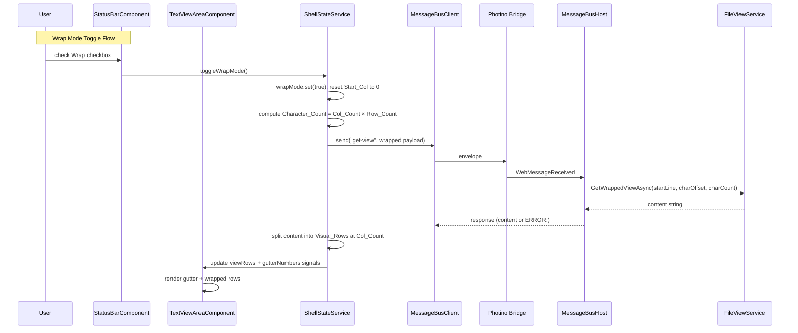
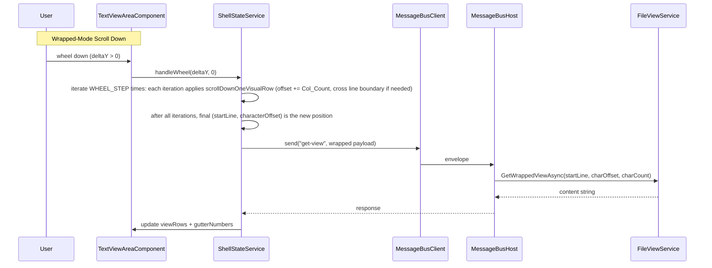
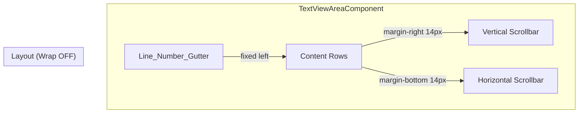
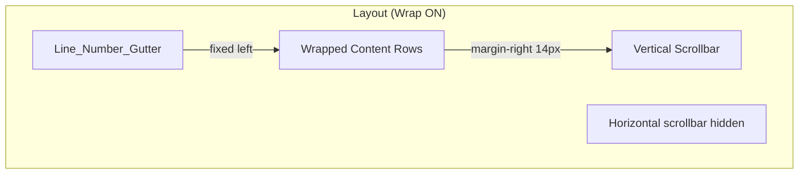

#[[file:.kiro/specs/_global/design-shared.md]]

# Line Wrap & Line Numbers — Design

## Overview

This feature adds two capabilities to the text viewer: (1) a line number gutter rendered to the left of text content, and (2) a wrap mode that hard-wraps lines at the Col_Count column boundary. The design extends existing components (ShellStateService, TextViewAreaComponent, StatusBarComponent, FileViewService) rather than introducing new services.

Key additions:

- **Line_Number_Gutter** — fixed-position column showing 1-based line numbers, width computed from Total_Logical_Lines digit count
- **Wrap_Mode toggle** — checkbox on StatusBar, per-application state affecting all tabs
- **Wrapped-mode view request** — new message format using startLine + Character_Offset + Character_Count instead of rectangular startLine/startCol/rowCount/colCount
- **Backend GetWrappedViewAsync** — new FileViewService method extracting character-count-based slices without counting delimiters
- **Wrapped-mode rendering** — splits response at Col_Count boundaries, hides horizontal scrollbar
- **Wrapped-mode scrolling** — navigates by Visual_Row (Character_Offset increments of Col_Count)
- **Gutter-aware measurement** — Col_Count subtracts Gutter_Width from available pixel width

The design preserves the existing non-wrapped flow unchanged when Wrap_Mode is off.

## Architecture









### Design Decisions

1. **Gutter is a sibling element, not part of view-content** — The gutter is rendered as a separate fixed-position div alongside `.view-content`. This keeps it immune to horizontal scrolling without CSS hacks and simplifies the measurement logic (gutter width subtracted from available width before computing Col_Count).

2. **Gutter width from Total_Logical_Lines, not visible lines** — Using the total line count for digit-width calculation ensures the gutter never resizes during scrolling. Width only changes when the file scan discovers more lines (rare, happens once during initial scan).

3. **Wrap_Mode is application-level state** — Stored as a signal in ShellStateService, not per-tab. Toggling affects all tabs uniformly. Non-active tabs are marked `needsRefresh` and get a new request when activated.

4. **Single "get-view" handler dispatches both modes** — The backend "get-view" handler inspects the second field of the payload. If it's `"W"`, it routes to `GetWrappedViewAsync`; otherwise it uses the existing `GetViewAsync`. This avoids a separate message type and keeps the frontend's latest-wins cancellation logic unified.

5. **Character_Offset tracks wrapped scroll position** — Instead of a separate "visual row index", the frontend tracks position as (startLine, characterOffset). This maps directly to the backend's extraction parameters and avoids needing the frontend to know all line lengths upfront.

6. **Frontend splits response into Visual_Rows** — The backend returns a flat character stream (with embedded delimiters). The frontend splits at Col_Count boundaries and on newline characters. This keeps the backend simple (just extract N characters) and gives the frontend full control over rendering.

7. **Scrollbar_Max in wrapped mode computed from line metadata** — The frontend computes total Visual_Rows as `sum(ceil(charLength / colCount))` for each line. This requires per-line char_lengths. The definitive source is a new `get-line-lengths` message: the frontend sends the View_Session_ID, and the backend returns a newline-delimited list of integer char_lengths (one per logical line, content length excluding delimiter). The frontend caches this per-session and re-requests when the scan completes or the file changes. The existing `get-scroll-info` lineCount field provides Total_Logical_Lines (for gutter width) but NOT per-line lengths.

8. **Wrapped-mode vertical scrollbar uses Visual_Row units** — Scrollbar_Max = total Visual_Rows across all lines. Thumb position = current visual row index / Scrollbar_Max. This gives smooth proportional scrolling.

9. **No word wrap** — Hard wrap at exact Col_Count boundary. Simpler implementation, predictable column alignment, consistent with the "text viewer" (not editor) philosophy.

10. **Gutter numbers in wrapped mode: topmost-visible-row rule** — When a logical line's first visual row is scrolled above the viewport, the line number appears on the topmost visible visual row of that line. This ensures the user always knows which line they're reading.

## Components and Interfaces

### New State in ShellStateService

```typescript
// Application-level wrap mode
readonly wrapMode = signal<boolean>(false);

// Per-tab wrapped-mode position tracking (extends TabViewState)
// characterOffset: number — added to TabViewState

// Computed: line numbers for the current view
readonly activeGutterNumbers = computed<(number | null)[]>(() => { /* ... */ });

// Computed: total logical lines for active tab (for gutter width)
// Source: lineCount from get-scroll-info response (NOT scrollbar verticalMax in wrapped mode)
readonly activeTotalLogicalLines = computed<number>(() => { /* ... */ });
```

### TabViewState Extension (shell.types.ts)

```typescript
export interface TabViewState {
  // ... existing fields ...
  /** Character offset within startLine for wrapped-mode scrolling (0 when wrap off) */
  characterOffset: number;
  /** Whether this tab needs a content refresh (set when wrap mode toggled while inactive) */
  needsRefresh: boolean;
}
```

### New Computed Signals in ShellStateService

```typescript
/** Gutter width in pixels for the active tab */
readonly activeGutterWidth = computed(() => {
  const totalLines = this.activeTotalLogicalLines();
  if (totalLines === 0) return 0;
  const digits = Math.max(1, Math.floor(Math.log10(totalLines)) + 1);
  const charWidth = this.charMetricsWidth(); // stored from measurement
  return digits * charWidth + 16; // 8px left + 8px right padding
});
```

### Wrap Mode Toggle (ShellStateService)

```typescript
toggleWrapMode(): void {
  const newMode = !this.wrapMode();
  this.wrapMode.set(newMode);

  const tab = this.activeTab();
  if (!tab) return; // No active tab — just update state, no request

  // Reset Start_Col to 0 for active tab
  this.updateScrollPosition(tab.viewSessionId, undefined, 0);

  // Mark all non-active tabs as needing refresh
  const states = this.tabViewStates();
  const updated = new Map(states);
  for (const [sessionId, state] of updated.entries()) {
    if (sessionId !== tab.viewSessionId) {
      updated.set(sessionId, { ...state, needsRefresh: true });
    }
  }

  // Reset characterOffset for active tab
  const activeState = updated.get(tab.viewSessionId);
  if (activeState) {
    updated.set(tab.viewSessionId, { ...activeState, characterOffset: 0 });
  }
  this.tabViewStates.set(updated);

  // Send appropriate view request for active tab
  if (newMode) {
    this.sendWrappedViewRequest(tab.viewSessionId);
  } else {
    this.sendStandardViewRequest(tab.viewSessionId);
  }
}
```

### Wrapped-Mode View Request (ShellStateService)

```typescript
private sendWrappedViewRequest(sessionId: string): void {
  const states = this.tabViewStates();
  const state = states.get(sessionId);
  if (!state) return;

  // Latest-wins: cancel pending
  if (state.pendingCorrelationId) {
    this.messageBus.cancel(state.pendingCorrelationId);
  }

  const dims = this.viewDimensions();
  if (!dims) return;

  const characterCount = dims.colCount * dims.rowCount;
  // Cap at INT32_MAX
  const cappedCount = Math.min(characterCount, 2_147_483_647);

  // Payload: viewSessionId\nW\nstartLine\ncharacterOffset\ncharacterCount
  const payload = `${sessionId}\nW\n${state.startLine}\n${state.characterOffset}\n${cappedCount}`;
  const correlationId = this.messageBus.send('get-view', payload);

  const updated = new Map(this.tabViewStates());
  updated.set(sessionId, { ...state, pendingCorrelationId: correlationId });
  this.tabViewStates.set(updated);
}
```

### Wrapped-Mode Response Handling (ShellStateService)

```typescript
// In handleViewResponse, after receiving successful response in wrap mode:
private splitIntoVisualRows(content: string, colCount: number): string[] {
  if (content.length === 0) return [];
  const rows: string[] = [];
  let current = '';
  for (let i = 0; i < content.length; i++) {
    const ch = content[i];
    if (ch === '\n') {
      rows.push(current);
      current = '';
    } else if (ch === '\r') {
      // Handle \r\n as single delimiter
      if (i + 1 < content.length && content[i + 1] === '\n') i++;
      rows.push(current);
      current = '';
    } else {
      current += ch;
      if (current.length === colCount) {
        rows.push(current);
        current = '';
      }
    }
  }
  if (current.length > 0) rows.push(current);
  return rows;
}
```

### Gutter Number Computation (ShellStateService)

The gutter number computation delegates to the `computeWrappedGutterNumbers` pure function (see below) in wrapped mode, and `computeNonWrappedLineNumbers` in non-wrapped mode. The ShellStateService `activeGutterNumbers` computed signal calls the appropriate function based on `wrapMode()`.

```typescript
/**
 * Computed signal for gutter numbers.
 * Delegates to pure functions based on current mode.
 */
readonly activeGutterNumbers = computed<(number | null)[]>(() => {
  const rows = this.activeViewRows();
  if (!rows || rows.length === 0) return [];

  const state = this.activeTabViewState();
  if (!state) return [];

  if (!this.wrapMode()) {
    return computeNonWrappedLineNumbers(state.startLine, rows.length);
  }

  // Wrapped mode: use response content to detect line boundaries
  const content = this.activeResponseContent(); // raw response string cached from last successful response
  const dims = this.viewDimensions();
  if (!dims) return [];
  return computeWrappedGutterNumbers(content, dims.colCount, state.startLine, state.characterOffset);
});
```

### Wrapped-Mode Scroll Logic (ShellStateService)

```typescript
/**
 * Scroll down by one visual row in wrapped mode.
 * Increases characterOffset by colCount. If offset >= line content length,
 * advances to next line with offset 0.
 *
 * Boundary guard (Req 8.5): If startLine is the last line AND
 * characterOffset + colCount >= lineLen, this is the last visual row →
 * returns the same position unchanged (no request sent).
 */
private scrollDownOneVisualRow(
  state: { startLine: number; characterOffset: number },
  colCount: number,
  lineLengths: Map<number, number>,
  totalLogicalLines: number
): { startLine: number; characterOffset: number; atEnd: boolean } {
  const { startLine, characterOffset } = state;
  const lineLen = lineLengths.get(startLine) ?? 0;

  if (lineLen === 0) {
    // Empty line — advance to next line if not last
    if (startLine + 1 >= totalLogicalLines) {
      return { startLine, characterOffset, atEnd: true };
    }
    return { startLine: startLine + 1, characterOffset: 0, atEnd: false };
  }

  const newOffset = characterOffset + colCount;
  if (newOffset >= lineLen) {
    // Crossed line boundary → next line, offset 0
    if (startLine + 1 >= totalLogicalLines) {
      return { startLine, characterOffset, atEnd: true };
    }
    return { startLine: startLine + 1, characterOffset: 0, atEnd: false };
  }
  return { startLine, characterOffset: newOffset, atEnd: false };
}

/**
 * Scroll up by one visual row in wrapped mode.
 * Decreases characterOffset by colCount. If negative,
 * moves to previous line's last wrapped row.
 *
 * Boundary guard (Req 8.4): If startLine == 0 AND characterOffset == 0,
 * returns same position unchanged (no request sent).
 */
private scrollUpOneVisualRow(
  state: { startLine: number; characterOffset: number },
  colCount: number,
  lineLengths: Map<number, number>
): { startLine: number; characterOffset: number; atTop: boolean } {
  const { startLine, characterOffset } = state;

  // Already at top
  if (startLine === 0 && characterOffset === 0) {
    return { startLine: 0, characterOffset: 0, atTop: true };
  }

  const newOffset = characterOffset - colCount;
  if (newOffset >= 0) {
    return { startLine, characterOffset: newOffset, atTop: false };
  }

  // Move to previous line
  if (startLine === 0) {
    return { startLine: 0, characterOffset: 0, atTop: true };
  }

  const prevLine = startLine - 1;
  const prevLineLen = lineLengths.get(prevLine) ?? 0;

  if (prevLineLen === 0) {
    return { startLine: prevLine, characterOffset: 0, atTop: false };
  }

  // Last wrapped row of previous line
  const lastRowOffset = Math.floor((prevLineLen - 1) / colCount) * colCount;
  return { startLine: prevLine, characterOffset: lastRowOffset, atTop: false };
}

/**
 * Applies N visual-row scroll steps iteratively (Req 8.6).
 * Each step applies scrollDownOneVisualRow/scrollUpOneVisualRow independently,
 * which correctly handles boundary crossing over short/empty lines.
 * Stops early if boundary reached (atEnd/atTop).
 * Returns final position and whether a request should be sent.
 */
private scrollByVisualRows(
  state: { startLine: number; characterOffset: number },
  steps: number, // positive = down, negative = up
  colCount: number,
  lineLengths: Map<number, number>,
  totalLogicalLines: number
): { startLine: number; characterOffset: number; positionChanged: boolean } {
  let current = { startLine: state.startLine, characterOffset: state.characterOffset };
  const originalStart = state.startLine;
  const originalOffset = state.characterOffset;
  const absSteps = Math.abs(steps);

  for (let i = 0; i < absSteps; i++) {
    if (steps > 0) {
      const result = this.scrollDownOneVisualRow(current, colCount, lineLengths, totalLogicalLines);
      if (result.atEnd) break;
      current = { startLine: result.startLine, characterOffset: result.characterOffset };
    } else {
      const result = this.scrollUpOneVisualRow(current, colCount, lineLengths);
      if (result.atTop) break;
      current = { startLine: result.startLine, characterOffset: result.characterOffset };
    }
  }

  const positionChanged = current.startLine !== originalStart || current.characterOffset !== originalOffset;
  return { ...current, positionChanged };
}
```

**Wheel handler in wrapped mode** calls `scrollByVisualRows(state, ±WHEEL_STEP, ...)`. If `positionChanged` is false → no request sent (Req 8.4, 8.5). If true → send wrapped-mode view request with new position.

### StatusBarComponent Extension

```typescript
@Component({
  selector: 'app-status-bar',
  standalone: true,
  templateUrl: './status-bar.component.html',
  styleUrl: './status-bar.component.css'
})
export class StatusBarComponent {
  private readonly state = inject(ShellStateService);
  readonly filePath = this.state.activeFilePath;
  readonly wrapMode = this.state.wrapMode;

  onWrapToggle(): void {
    this.state.toggleWrapMode();
  }
}
```

### StatusBarComponent Template Addition

```html
<label class="wrap-checkbox">
  <input type="checkbox" [checked]="wrapMode()" (change)="onWrapToggle()" />
  Wrap
</label>
```

### TextViewAreaComponent Template (Updated)

```html
<div class="text-view-area" #contentArea tabindex="0"
     (wheel)="onWheel($event)"
     (keydown)="onKeydown($event)">
  @if (!hasOpenTabs()) {
    <div class="empty-state">Ctrl-O to open a file</div>
  } @else {
    @if (viewRows()) {
      <div class="line-number-gutter" #gutterEl
           [style.width.px]="gutterWidth()">
        @for (num of gutterNumbers(); track $index) {
          <div class="gutter-cell">{{ num ?? '' }}</div>
        }
      </div>
      <div class="view-content">
        @for (row of viewRows(); track $index) {
          <div class="view-row">{{ row }}</div>
        }
      </div>
    }
    @if (viewError()) {
      <div class="view-error">{{ viewError() }}</div>
    }

    @if (scrollbarState(); as sb) {
      @if (!sb.disabled) {
        <div class="scrollbar-vertical" aria-label="Vertical scrollbar">
          <div class="scrollbar-track" #verticalTrack>
            <div class="scrollbar-thumb"
                 [style.height.px]="computeVerticalThumbPx()"
                 [style.top.px]="computeVerticalThumbTopPx()"
                 (mousedown)="onVerticalThumbMousedown($event)">
            </div>
          </div>
          <span class="scrollbar-max">{{ sb.verticalMax }}</span>
        </div>
        @if (!wrapMode()) {
          <div class="scrollbar-horizontal" aria-label="Horizontal scrollbar">
            <div class="scrollbar-track" #horizontalTrack>
              <div class="scrollbar-thumb"
                   [style.width.px]="computeHorizontalThumbPx()"
                   [style.left.px]="computeHorizontalThumbLeftPx()"
                   (mousedown)="onHorizontalThumbMousedown($event)">
              </div>
            </div>
            <span class="scrollbar-max">{{ sb.horizontalMax }}</span>
          </div>
        }
      }
    }
  }
</div>
```

### TextViewAreaComponent Measurement Update

```typescript
private measure(): void {
  const host = this.el.nativeElement as HTMLElement;
  const pixelWidth = host.clientWidth;
  const pixelHeight = host.clientHeight;
  if (pixelWidth === 0 || pixelHeight === 0) return;

  const charMetrics = this.computeCharMetrics();
  const rowCount = Math.max(1, Math.floor(pixelHeight / charMetrics.height));

  // Subtract gutter width from available width for Col_Count
  const gutterEl = this.gutterEl?.nativeElement;
  const gutterWidth = gutterEl ? gutterEl.clientWidth : 0;
  const colCount = Math.max(1, Math.floor((pixelWidth - gutterWidth) / charMetrics.width));

  const dims: ViewDimensions = { rowCount, colCount };
  if (!this.lastDimensions ||
      this.lastDimensions.rowCount !== dims.rowCount ||
      this.lastDimensions.colCount !== dims.colCount) {
    this.lastDimensions = dims;
    this.state.updateViewDimensions(dims);
  }
}
```

### Gutter CSS

```css
.line-number-gutter {
  position: absolute;
  top: 0;
  left: 0;
  height: 100%;
  overflow: hidden;
  background: #1e1e1e;
  border-right: 1px solid #3c3c3c;
  z-index: 1;
  user-select: none;
}

.gutter-cell {
  font-family: monospace;
  font-size: 14px;
  line-height: normal;
  white-space: pre;
  text-align: right;
  padding: 0 8px;
  color: #858585;
}

/* Adjust view-content to account for gutter */
.view-content {
  margin-left: var(--gutter-width, 0px);
}
```

### Backend: GetWrappedViewAsync (FileViewService.cs)

```csharp
/// <summary>
/// Extracts a character-count-based slice for wrapped-mode display.
/// Reads starting from the specified line at the specified character offset,
/// collecting up to characterCount content characters. Newline delimiters
/// are NOT counted toward characterCount but ARE included in the output.
/// </summary>
public Task<Result<string, ViewError>> GetWrappedViewAsync(
    int startLine, int characterOffset, int characterCount,
    CancellationToken cancellationToken = default)
{
    // Validate parameters
    if (startLine < 0)
        return Task.FromResult(Result<string, ViewError>.Failure(
            new ViewError(ViewErrorCode.InvalidParameter,
                "ERROR: startLine out of range")));
    if (characterOffset < 0)
        return Task.FromResult(Result<string, ViewError>.Failure(
            new ViewError(ViewErrorCode.InvalidParameter,
                "ERROR: characterOffset out of range")));
    if (characterCount < 1)
        return Task.FromResult(Result<string, ViewError>.Failure(
            new ViewError(ViewErrorCode.InvalidParameter,
                "ERROR: characterCount out of range")));

    using var linkedCts = CancellationTokenSource.CreateLinkedTokenSource(
        _serviceCancellationToken, cancellationToken);
    var ct = linkedCts.Token;
    ct.ThrowIfCancellationRequested();

    if (_fileIndex.State == ScanState.Failed)
        return Task.FromResult(Result<string, ViewError>.Failure(
            new ViewError(ViewErrorCode.FileNotAccessible,
                $"File index failed: {_filePath}")));

    var scannedLines = _fileIndex.Index.LineCount;
    var scanComplete = _fileIndex.State >= ScanState.QuickScanComplete
                       && _fileIndex.State < ScanState.Failed;

    // Start line beyond file
    if (startLine >= scannedLines)
        return Task.FromResult(Result<string, ViewError>.Success(""));

    // Scan in progress and line beyond scanned range
    if (!scanComplete && startLine >= scannedLines)
        return Task.FromResult(Result<string, ViewError>.Success(""));

    var result = new StringBuilder();
    int contentCharsCollected = 0;
    int currentLine = startLine;
    int currentOffset = characterOffset;

    FileStream? stream = null;
    try
    {
        stream = new FileStream(_filePath, FileMode.Open,
            FileAccess.Read, FileShare.ReadWrite);
        var encoding = _fileIndex.Encoding;
        var bomByteLength = _fileIndex.BomByteLength;

        while (contentCharsCollected < characterCount
               && currentLine < scannedLines)
        {
            ct.ThrowIfCancellationRequested();

            // Read and decode the current line
            var byteOffset = _fileIndex.Index.GetByteOffset(currentLine);
            var byteLen = (int)_fileIndex.Index.GetByteLength(currentLine);
            stream.Seek((long)byteOffset, SeekOrigin.Begin);
            var lineBytes = new byte[byteLen];
            int totalRead = 0;
            while (totalRead < byteLen)
            {
                int read = stream.Read(lineBytes, totalRead, byteLen - totalRead);
                if (read == 0) break;
                totalRead += read;
            }

            int bomSkip = (currentLine == 0) ? bomByteLength : 0;
            // Decode full line content (no char limit needed here)
            var (content, delimiter) = DecodeUpTo(
                lineBytes, totalRead, encoding, bomSkip, int.MaxValue);

            // Handle offset overflow: skip lines whose content is shorter
            if (currentOffset >= content.Length)
            {
                currentOffset -= content.Length;
                currentLine++;
                continue;
            }

            // Extract characters from currentOffset
            int available = content.Length - currentOffset;
            int toTake = Math.Min(available,
                characterCount - contentCharsCollected);
            result.Append(content, currentOffset, toTake);
            contentCharsCollected += toTake;

            // If we consumed the entire remaining line content, append delimiter
            if (currentOffset + toTake >= content.Length
                && delimiter.Length > 0)
            {
                result.Append(delimiter);
            }

            currentLine++;
            currentOffset = 0;
        }
    }
    catch (FileNotFoundException)
    {
        return Task.FromResult(Result<string, ViewError>.Failure(
            new ViewError(ViewErrorCode.FileNotAccessible,
                $"File not accessible: {_filePath}")));
    }
    catch (IOException)
    {
        return Task.FromResult(Result<string, ViewError>.Failure(
            new ViewError(ViewErrorCode.IoError,
                $"Read error: {_filePath}")));
    }
    finally
    {
        stream?.Dispose();
    }

    return Task.FromResult(Result<string, ViewError>.Success(
        result.ToString()));
}
```

### Backend: Get-View Handler Update (Program.cs)

```csharp
messageBus.RegisterHandler("get-view", async (correlationId, payload) =>
{
    var fields = payload.Split('\n');

    // Detect wrapped mode: second field is "W"
    if (fields.Length == 5 && fields[1] == "W")
    {
        // Wrapped-mode request: viewSessionId\nW\nstartLine\ncharOffset\ncharCount
        var viewSessionId = fields[0];

        if (!int.TryParse(fields[2], out var startLine) || startLine < 0)
            return "ERROR: startLine out of range";
        if (!int.TryParse(fields[3], out var charOffset) || charOffset < 0)
            return "ERROR: characterOffset out of range";
        if (!int.TryParse(fields[4], out var charCount) || charCount < 1)
            return "ERROR: characterCount out of range";

        FileViewService? service;
        lock (sessionLock) { sessions.TryGetValue(viewSessionId, out service); }
        if (service is null)
            return "ERROR: Session not found";

        var result = await service.GetWrappedViewAsync(
            startLine, charOffset, charCount);
        if (!result.IsSuccess)
        {
            // GetWrappedViewAsync error messages already start with "ERROR: "
            // Return the error message directly — do NOT wrap with additional "ERROR:" prefix
            return result.Error.Message;
        }

        return result.Value;
    }

    // Standard rectangular mode (existing logic)
    if (fields.Length != 5)
        return "ERROR: Invalid payload structure: expected 5 fields";

    // ... existing rectangular handler code ...
});
```

**Error format convention (Req 6.7):** `GetWrappedViewAsync` returns error messages already formatted as `"ERROR: {paramName} out of range"`. The handler returns `result.Error.Message` directly without wrapping, avoiding double-prefix `"ERROR:ERROR: ..."`. All error responses from the `get-view` handler start with `"ERROR: "` (with space after colon) for consistency.

### Gutter Width Computation (Pure Function)

```typescript
/**
 * Computes gutter width in pixels.
 * @param totalLogicalLines Total line count for the file
 * @param charWidth Width of a single monospace character in pixels
 * @returns Gutter width in pixels (digits * charWidth + 16px padding)
 */
export function computeGutterWidth(
  totalLogicalLines: number,
  charWidth: number
): number {
  if (totalLogicalLines <= 0) return 0;
  const digits = Math.max(1, Math.floor(Math.log10(totalLogicalLines)) + 1);
  return digits * charWidth + 16;
}
```

### Non-Wrapped Line Number Computation (Pure Function)

```typescript
/**
 * Computes line numbers for non-wrapped mode.
 * @param startLine Zero-based first visible line
 * @param rowCount Number of rows returned from backend
 * @returns Array of 1-based line numbers
 */
export function computeNonWrappedLineNumbers(
  startLine: number,
  rowCount: number
): number[] {
  return Array.from({ length: rowCount }, (_, i) => startLine + i + 1);
}
```

### Col_Count Computation (Pure Function)

```typescript
/**
 * Computes Col_Count accounting for gutter width.
 * @param availablePixelWidth Total pixel width of the text-view-area host
 * @param gutterWidth Gutter element's client width (0 if not rendered)
 * @param charWidth Width of a single monospace character in pixels
 * @returns Column count (minimum 1)
 */
export function computeColCount(
  availablePixelWidth: number,
  gutterWidth: number,
  charWidth: number
): number {
  return Math.max(1, Math.floor((availablePixelWidth - gutterWidth) / charWidth));
}
```

### Wrapped-Mode Scrollbar_Max Computation (Pure Function)

```typescript
/**
 * Computes total visual rows for wrapped mode (Scrollbar_Max).
 * @param lineLengths Array of content char lengths for each logical line
 * @param colCount Number of columns in the viewport
 * @returns Total visual rows across all lines
 */
export function computeWrappedScrollbarMax(
  lineLengths: number[],
  colCount: number
): number {
  let total = 0;
  for (const len of lineLengths) {
    if (len === 0) {
      total += 1; // Empty lines contribute 1 visual row
    } else {
      total += Math.ceil(len / colCount);
    }
  }
  return total;
}
```

### Wrapped-Mode Visual Row Splitting (Pure Function)

```typescript
/**
 * Splits response content into visual rows for wrapped-mode rendering.
 * Breaks at Col_Count character boundaries. Newline delimiters end the
 * current row early and start a new logical line.
 *
 * @param content Response string from backend (includes delimiters)
 * @param colCount Maximum characters per visual row
 * @returns Array of visual row strings (no delimiters in output)
 */
export function splitIntoVisualRows(content: string, colCount: number): string[] {
  if (content.length === 0) return [];
  const rows: string[] = [];
  let current = '';

  for (let i = 0; i < content.length; i++) {
    const ch = content[i];
    if (ch === '\n') {
      rows.push(current);
      current = '';
    } else if (ch === '\r') {
      if (i + 1 < content.length && content[i + 1] === '\n') i++;
      rows.push(current);
      current = '';
    } else {
      current += ch;
      if (current.length === colCount) {
        rows.push(current);
        current = '';
      }
    }
  }
  if (current.length > 0) rows.push(current);
  return rows;
}
```

### Wrapped-Mode Gutter Number Computation (Pure Function)

```typescript
/**
 * Computes gutter numbers for wrapped-mode display.
 * The line number appears on the topmost visible visual row of each logical line.
 * Subsequent visual rows of the same line get null (empty gutter cell).
 *
 * Algorithm:
 * 1. Split content into visual rows (reuses splitIntoVisualRows).
 * 2. Walk the raw content character-by-character, tracking which visual row
 *    index we're on and which logical line we're in.
 * 3. For each visual row:
 *    - If it's the first visual row of a new logical line → line number.
 *    - If characterOffset > 0 and this is the first row (topmost visible row
 *      of a partially-scrolled line) → line number (Req 3.2).
 *    - Otherwise → null.
 *
 * @param content Response content string (with delimiters)
 * @param colCount Characters per visual row
 * @param startLine Zero-based starting logical line
 * @param characterOffset Character offset within startLine (0 = first row visible)
 * @returns Array of (1-based line number | null) per visual row
 */
export function computeWrappedGutterNumbers(
  content: string,
  colCount: number,
  startLine: number,
  characterOffset: number
): (number | null)[] {
  const rows = splitIntoVisualRows(content, colCount);
  if (rows.length === 0) return [];

  const gutterNumbers: (number | null)[] = [];
  let currentLine = startLine;

  // First row: always gets line number (topmost-visible-row rule, Req 3.1/3.2/3.3)
  gutterNumbers.push(currentLine + 1);

  // Walk content to detect line boundaries and assign gutter numbers to remaining rows
  let rowIdx = 1;
  let colPos = 0;
  for (let i = 0; i < content.length && rowIdx < rows.length; i++) {
    const ch = content[i];
    if (ch === '\n' || ch === '\r') {
      // Handle \r\n as single delimiter
      if (ch === '\r' && i + 1 < content.length && content[i + 1] === '\n') i++;
      // New logical line starts on next visual row
      currentLine++;
      colPos = 0;
      if (rowIdx < rows.length) {
        gutterNumbers.push(currentLine + 1);
        rowIdx++;
      }
    } else {
      colPos++;
      if (colPos === colCount) {
        colPos = 0;
        // Wrapped continuation of same logical line — no line number
        if (rowIdx < rows.length) {
          gutterNumbers.push(null);
          rowIdx++;
        }
      }
    }
  }

  return gutterNumbers;
}
```

## Data Models

### Wrapped-Mode View Request Payload Format

```
{View_Session_ID}\nW\n{startLine}\n{characterOffset}\n{characterCount}
```

| Field | Position | Type | Constraints |
|-------|----------|------|-------------|
| View_Session_ID | 0 | string | UUID, no newlines |
| Mode marker | 1 | string | Literal "W" |
| startLine | 2 | int | 0–2,147,483,647, decimal digits only, no leading zeros |
| characterOffset | 3 | int | 0–2,147,483,647, decimal digits only, no leading zeros |
| characterCount | 4 | int | 1–2,147,483,647, decimal digits only, no leading zeros |

Delimiter: U+000A. Exactly 4 newlines in valid payload (5 fields).

### Wrapped-Mode View Response Format

**Success:** Single string containing collected characters including encountered delimiters. The frontend splits this at Col_Count boundaries and on newline characters.

**Error:** `ERROR:` prefix followed by error description (same convention as standard mode).

### Standard View Request Payload Format (unchanged)

```
{View_Session_ID}\n{startLine}\n{startCol}\n{rowCount}\n{colCount}
```

The "get-view" handler distinguishes modes by checking if `fields[1] == "W"`.

### TabViewState (extended)

```typescript
export interface TabViewState {
  scanComplete: boolean;
  viewRows: string[] | null;
  errorMessage: string | null;
  pendingCorrelationId: string | null;
  deferred: boolean;
  scrollbarState: ScrollbarState;
  startLine: number;
  startCol: number;
  /** Character offset within startLine for wrapped-mode (0 when wrap off) */
  characterOffset: number;
  /** True if tab needs refresh after wrap mode toggle while inactive */
  needsRefresh: boolean;
}
```

### Gutter State

| Signal | Type | Description |
|--------|------|-------------|
| `wrapMode` | `boolean` | Application-level wrap mode toggle |
| `activeGutterNumbers` | `(number \| null)[]` | Line numbers for current view (null = empty cell) |
| `activeGutterWidth` | `number` | Computed gutter pixel width |
| `activeTotalLogicalLines` | `number` | Total lines for active tab (from `get-line-lengths` response lineCount field, independent of Scrollbar_Max which in wrapped mode represents visual rows) |
| `charMetricsWidth` | `number` | Cached char width from last measurement |

## Correctness Properties

*A property is a characteristic or behavior that should hold true across all valid executions of a system — essentially, a formal statement about what the system should do. Properties serve as the bridge between human-readable specifications and machine-verifiable correctness guarantees.*

### Property 1: Non-wrapped line number computation

*For any* valid Start_Line (≥ 0) and any number of rows returned (1 to Row_Count), the computed line numbers array SHALL have length equal to the number of rows returned, and each element at index i SHALL equal Start_Line + i + 1.

**Validates: Requirements 1.1, 1.5, 1.7, 2.1**

### Property 2: Gutter width computation

*For any* Total_Logical_Lines value (≥ 1) and any positive Char_Metrics width, the computed Gutter_Width SHALL equal `max(1, floor(log10(totalLines)) + 1) * charWidth + 16`, ensuring stable width regardless of which lines are currently visible.

**Validates: Requirements 1.4**

### Property 3: Wrapped-mode gutter number placement

*For any* response content string (with embedded newlines), Col_Count (≥ 1), startLine (≥ 0), and characterOffset (≥ 0), the computed gutter numbers array SHALL have exactly one non-null entry per logical line visible in the viewport, placed on the topmost visible visual row of that line, with all other visual rows of the same line receiving null.

**Validates: Requirements 3.1, 3.2, 3.3**

### Property 4: Wrapped-mode request payload round-trip

*For any* valid View_Session_ID (string without newlines), startLine (0–2,147,483,647), characterOffset (0–2,147,483,647), and characterCount (1–2,147,483,647), encoding them as `viewSessionId\nW\nstartLine\ncharacterOffset\ncharacterCount` and parsing back SHALL recover the original values exactly. The numeric fields SHALL contain only ASCII digits with no leading zeros (except "0" itself).

**Validates: Requirements 5.1, 5.2, 5.4**

### Property 5: Wrapped-mode scroll position computation

*For any* current position (startLine, characterOffset), Col_Count (≥ 1), and set of line content lengths, scrolling down by one visual row then up by one visual row SHALL return to the original position (round-trip), provided the original position is not at the file boundary. Additionally, scrolling down from any non-terminal position SHALL either increase characterOffset by Col_Count or advance startLine with characterOffset reset to 0.

**Validates: Requirements 5.3, 8.1, 8.2, 8.3, 8.4, 8.5, 8.6**

### Property 6: Backend wrapped extraction content-count invariant

*For any* file content (sequence of lines with varying lengths and delimiters), valid startLine, characterOffset, and characterCount, the response from GetWrappedViewAsync SHALL contain at most characterCount content characters (where content characters exclude newline delimiters \n, \r\n, \r), while all delimiter characters encountered during traversal SHALL be present in the response at their correct positions.

**Validates: Requirements 6.1, 6.2, 6.3, 6.4, 6.5, 6.6**

### Property 7: Backend wrapped extraction parameter validation

*For any* invalid parameter combination (startLine < 0, characterOffset < 0, or characterCount < 1), GetWrappedViewAsync SHALL return an error response string starting with "ERROR:" that identifies the first invalid parameter name.

**Validates: Requirements 6.7**

### Property 8: Response content splitting into visual rows

*For any* response content string and Col_Count (≥ 1), splitting into visual rows SHALL produce rows where: (a) every row has length ≤ Col_Count, (b) no row contains newline characters, (c) concatenating all rows with the original delimiters reconstructs the original content, and (d) an empty content string produces zero rows.

**Validates: Requirements 7.1, 7.5, 7.6**

### Property 9: Wrapped-mode Scrollbar_Max computation

*For any* array of line content lengths (≥ 0 each) and Col_Count (≥ 1), the computed Scrollbar_Max SHALL equal the sum of `ceil(len / colCount)` for each line where len > 0, plus 1 for each line where len = 0. This value SHALL be recomputed correctly when Col_Count changes.

**Validates: Requirements 7.4**

### Property 10: Col_Count computation with gutter

*For any* available pixel width (> 0), gutter width (≥ 0), and char width (> 0), the computed Col_Count SHALL equal `max(1, floor((pixelWidth - gutterWidth) / charWidth))`. Row_Count SHALL be independent of gutter width — computed solely from pixel height and char height.

**Validates: Requirements 9.1, 9.3, 9.4**

## Error Handling

| Scenario | Strategy |
|----------|----------|
| Wrapped-mode request with invalid params (startLine < 0, charOffset < 0, charCount < 1) | Backend returns `ERROR: {paramName} out of range`; frontend detects `ERROR:` prefix, preserves old rows, shows error |
| Wrapped-mode request for session not found | Backend returns `ERROR:Session not found: {id}`; frontend shows error |
| File I/O error during wrapped extraction | Backend returns `ERROR:Read error: {path}`; frontend preserves old rows |
| Start line beyond file | Backend returns empty string; frontend renders zero visual rows |
| Wrap toggle with no active tab | Frontend updates wrapMode state only, no backend request |
| Wrap toggle error response | Frontend keeps previously displayed rows, shows error alongside |
| Character_Count overflow (Col_Count × Row_Count > INT32_MAX) | Frontend caps at 2,147,483,647 before sending |
| Gutter width change triggers Col_Count = 0 | Minimum Col_Count enforced at 1 |

## Testing Strategy

### Property-Based Tests (fast-check, `{ numRuns: 10 }`)

Each correctness property maps to one or more property-based test files:

| Property | Test File | What It Tests |
|----------|-----------|---------------|
| 1: Non-wrapped line numbers | `shell-state.line-numbers.property.spec.ts` | `computeNonWrappedLineNumbers` pure function |
| 2: Gutter width | `shell-state.line-numbers.property.spec.ts` | `computeGutterWidth` pure function |
| 3: Wrapped gutter placement | `shell-state.line-numbers.property.spec.ts` | `computeWrappedGutterNumbers` pure function |
| 4: Request payload round-trip | `shell-state.wrap-mode.property.spec.ts` | Encode/parse wrapped payload |
| 5: Scroll position round-trip | `shell-state.wrap-mode.property.spec.ts` | `scrollDownOneVisualRow` / `scrollUpOneVisualRow` |
| 6: Backend content-count invariant | C# xUnit + FsCheck | `GetWrappedViewAsync` with generated file content |
| 7: Backend param validation | C# xUnit + FsCheck | `GetWrappedViewAsync` with invalid params |
| 8: Visual row splitting | `shell-state.wrap-mode.property.spec.ts` | `splitIntoVisualRows` pure function |
| 9: Scrollbar_Max computation | `shell-state.wrap-mode.property.spec.ts` | `computeWrappedScrollbarMax` pure function |
| 10: Col_Count with gutter | `shell-state.line-numbers.property.spec.ts` | `computeColCount` pure function |

### Unit Tests (Jest)

- StatusBarComponent renders Wrap checkbox with correct label and default state
- Wrap toggle sends correct request format (wrapped vs standard)
- Wrap toggle marks non-active tabs as needsRefresh
- Wrap toggle with no active tab sends no request
- Error response preserves old rows
- Horizontal scrollbar hidden when wrapMode is on
- Gutter not rendered when no active tab
- Gutter not rendered when viewRows is null

### Integration Tests

- End-to-end wrap toggle: toggle on → backend receives wrapped request → response rendered as wrapped rows with gutter
- Scroll in wrapped mode: wheel down → new request with updated characterOffset → correct visual rows
- File with very long lines: verify wrapping at exact Col_Count boundary
- Gutter width update on scan progress: as lineCount grows, gutter width adjusts and Col_Count recomputes

### Test Configuration

- Property-based tests: `{ numRuns: 10 }` (per workspace steering rule)
- Tag format: `Feature: line-wrap-numbers, Property {N}: {title}`
- Framework: Jest + fast-check (TypeScript), xUnit + FsCheck (C#)
