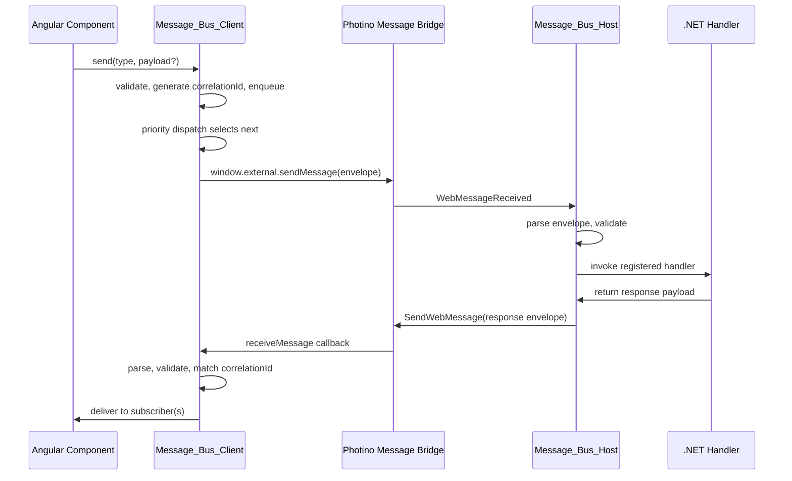
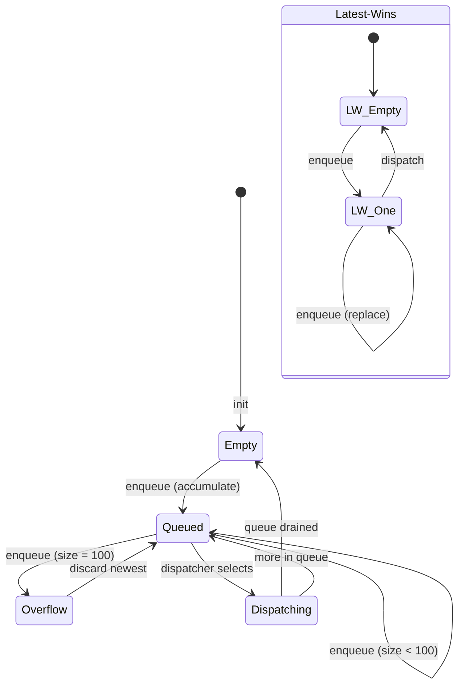
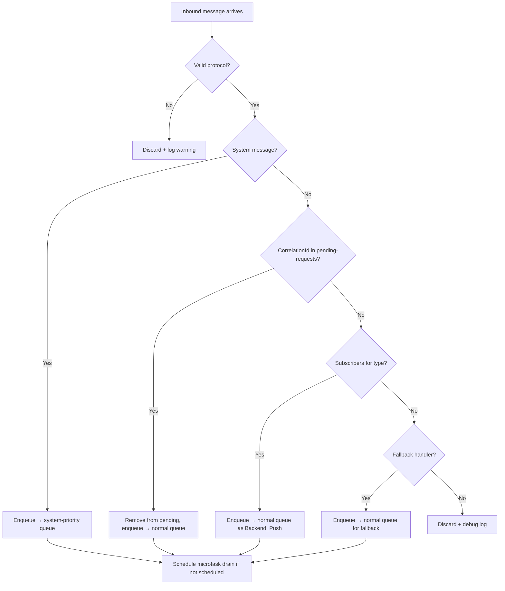

# Design Document

#[[file:.kiro/specs/_global/design-shared.md]]

## Overview

Two-sided message bus replacing direct bridge calls. Angular `Message_Bus_Client` (singleton injectable) handles outbound queuing, priority dispatch, correlation tracking, inbound routing. .NET `Message_Bus_Host` handles inbound parsing, sequential handler dispatch, outbound encoding. Wire protocol: newline-delimited envelope over existing string bridge.

Key behaviors:
- Correlation-tracked request/response
- Per-type queuing (accumulate or latest-wins)
- Priority-based outbound dispatch w/ arrival-time tiebreaking
- System message channel w/ guaranteed delivery
- Configurable timeouts + pending-request lifecycle

## Architecture





## Components and Interfaces

### Message_Bus_Client (Angular)

```typescript
import { Injectable, OnDestroy } from '@angular/core';
import { Observable, Subject } from 'rxjs';

// --- Types ---

export type QueueMode = 'accumulate' | 'latest-wins';
export type Priority = 0 | 1 | 2; // High=0, Normal=1, Low=2

export interface MessageTypeConfig {
  queueMode: QueueMode;
  priority: Priority;
  timeoutMs: number; // default 30000
}

export interface BusError {
  errorType: 'bridge-error' | 'validation-error' | 'timeout' | 'capacity-overflow' | 'queue-overflow';
  messageType: string;
  correlationId: string;
  description: string;
}

export interface InboundMessage {
  messageType: string;
  correlationId: string;
  payload: string;
}

export interface SubscriptionHandle {
  unsubscribe(): void;
}

// --- Service ---

@Injectable({ providedIn: 'root' })
export class MessageBusClient implements OnDestroy {
  // --- Configuration ---
  configure(messageType: string, config: Partial<MessageTypeConfig>): void;

  // --- Sending ---
  send(messageType: string, payload?: string): string; // returns correlationId
  cancel(correlationId: string): void;

  // --- Subscribing ---
  subscribe(messageType: string, handler: (msg: InboundMessage) => void): SubscriptionHandle;

  // --- Fallback ---
  setFallbackHandler(handler: ((msg: InboundMessage) => void) | null): void;

  // --- System ---
  setSystemHandler(handler: (msg: InboundMessage) => void): void;

  // --- Observables ---
  readonly errors$: Observable<BusError>;

  // --- Lifecycle ---
  ngOnDestroy(): void;
}
```

**Internal state:**

```typescript
// Internal (not exported as public API)
interface QueueEntry {
  messageType: string;
  correlationId: string;
  payload: string;
  arrivalTimestamp: number; // monotonic counter — GLOBAL across all Message_Types
}
```

**Arrival_Timestamp scope**: Global monotonic counter (single `number` incremented per `send()` call across ALL Message_Types). Required for cross-type priority tiebreaking fairness. Not wall-clock — pure sequence number.

```typescript
interface MessageQueue {
  config: MessageTypeConfig;
  entries: QueueEntry[];     // accumulate: FIFO array; latest-wins: 0 or 1 entry
  frozen: boolean;           // true after first enqueue → no reconfig
}

interface PendingRequest {
  correlationId: string;
  messageType: string;
  enqueuedAt: number;        // Date.now() for timeout calc
  timeoutMs: number;
}
```

**Destroy lifecycle** (`ngOnDestroy()`):
1. Unregister `window.external.receiveMessage` callback
2. Complete `errors$` Subject
3. Clear system-priority queue and normal queue
4. Clear pending-requests map (no timeout notifications for cleared entries)
5. Complete all internal Subjects → subscribers receive completion notification

### Message_Bus_Host (.NET)

```csharp
public sealed class MessageBusHost : IDisposable
{
    // --- Handler Registration ---
    public void RegisterHandler(string messageType, Func<string, string, Task<string?>> handler);
    // handler params: (correlationId, payload) → response payload (null = no response)

    // --- Outbound ---
    public void Send(string messageType, string payload);
    // Generates correlationId, encodes, sends via bridge

    public void SendSystemMessage(string systemType, string payload);
    // systemType must start with "system:"

    public void SendResponse(string messageType, string correlationId, string payload);
    // Send response with specific correlationId (for handler responses)

    // --- Lifecycle ---
    public void Dispose();
}
```

**Internal processing loop:**

```csharp
// Sequential message processing (no concurrency)
private async Task ProcessMessage(string rawMessage)
{
    var (messageType, correlationId, payload) = MessageProtocol.Decode(rawMessage);
    // validate fields
    // find registered handler
    // await handler(correlationId, payload)
    // encode response, SendWebMessage
}
```

### MessageProtocol (shared logic, both sides)

```typescript
// Frontend (TypeScript)
export class MessageProtocol {
  static encode(messageType: string, correlationId: string, payload: string): string;
  static decode(raw: string): { messageType: string; correlationId: string; payload: string } | null;
  static validateMessageType(type: string): boolean;
  static validateCorrelationId(id: string): boolean;
  static validatePayload(payload: string): boolean;
}
```

```csharp
// Backend (C#)
public static class MessageProtocol
{
    public static string Encode(string messageType, string correlationId, string payload);
    public static (string MessageType, string CorrelationId, string Payload)? Decode(string raw);
    public static bool ValidateMessageType(string type);
    public static bool ValidateCorrelationId(string id);
    public static bool ValidatePayload(string payload);
}
```

## Data Models

### Wire Envelope

```
{Message_Type}\n{Correlation_ID}\n{payload}
```

| Field | Position | Constraints | Separator |
|-------|----------|-------------|-----------|
| Message_Type | 1st | `[a-z0-9:-]+`, 1–64 chars | `\n` after |
| Correlation_ID | 2nd | `[a-zA-Z0-9-]+`, 1–36 chars | `\n` after |
| Payload | 3rd | 0–2,097,152 chars, may contain `\n` | none (rest of string) |

### Queue State

| Property | Accumulate | Latest-Wins |
|----------|-----------|-------------|
| Max entries | 100 | 1 |
| On enqueue (full) | Discard newest | Replace existing |
| Dispatch order | FIFO (front) | Single entry |
| Arrival_Timestamp | Per-entry | Updated on replace |

### Priority Dispatch

| Priority | Value | Use Case |
|----------|-------|----------|
| High | 0 | System commands, urgent ops |
| Normal | 1 | Default — standard requests |
| Low | 2 | Background, non-urgent |

### Dispatch Algorithm

```
function selectNext(queues: Map<string, MessageQueue>): QueueEntry | null {
  let best: QueueEntry | null = null;
  let bestPriority = Infinity;
  let bestTimestamp = Infinity;

  for (const queue of queues.values()) {
    if (queue.entries.length === 0) continue;
    const front = queue.entries[0];
    const priority = queue.config.priority;

    if (priority < bestPriority ||
        (priority === bestPriority && front.arrivalTimestamp < bestTimestamp)) {
      best = front;
      bestPriority = priority;
      bestTimestamp = front.arrivalTimestamp;
    }
  }
  return best;
}
```

### Capacity Constraints

| Resource | Limit |
|----------|-------|
| Accumulate queue per type | 100 messages |
| Latest-wins queue per type | 1 message |
| Pending-requests map (global) | 1000 entries |
| Payload size | 2,097,152 chars |
| Message_Type length | 64 chars |
| Correlation_ID length | 36 chars |

### Inbound Delivery Mechanism (System Preemption)

Client maintains two inbound queues:
- **System-priority queue** — receives all decoded system messages (`"system:"` prefix)
- **Normal queue** — receives all other valid inbound messages

When microtask fires to drain inbound deliveries:
1. Drain system queue **completely** (all entries, FIFO within system queue)
2. Then process normal queue entries (FIFO)

Consequence: system message arriving *after* non-system messages queued but *before* microtask fires → still delivered first. This guarantees Req 10.2 preemption semantics.

```typescript
// Pseudocode — inbound drain
private drainInbound(): void {
  // Phase 1: all system messages first
  while (this.systemInboundQueue.length > 0) {
    this.routeInbound(this.systemInboundQueue.shift()!);
  }
  // Phase 2: normal messages
  while (this.normalInboundQueue.length > 0) {
    this.routeInbound(this.normalInboundQueue.shift()!);
  }
}
```

### Backend_Push Identification Rule

A Backend_Push is identified by:
1. Correlation_ID does NOT exist in pending-requests map, AND
2. At least one Subscriber registered for its Message_Type

Routing for unknown Correlation_ID (not in pending-requests):
| Has Subscribers for type? | Is System_Message? | Action |
|---------------------------|-------------------|--------|
| Yes | No | Deliver as Backend_Push to subscribers |
| Yes | Yes | Deliver via system routing (system queue) |
| No | Yes | Deliver to system handler |
| No | No (+ fallback registered) | Route to Fallback_Handler |
| No | No (+ no fallback) | Discard + `console.debug` log |

Only truly orphaned responses (unknown ID, no subscribers, no fallback) are discarded.

### Inbound Routing Decision Tree



## Correctness Properties

*A property is a characteristic or behavior that should hold true across all valid executions of a system — essentially, a formal statement about what the system should do. Properties serve as the bridge between human-readable specifications and machine-verifiable correctness guarantees.*

### Property 1: Protocol round-trip

*For any* valid Message_Type, Correlation_ID, and payload (including payloads containing newlines), encoding then decoding SHALL produce values identical to the original inputs.

**Validates: Requirements 8.1, 8.2, 8.3, 8.4, 8.7**

### Property 2: No-payload equivalence

*For any* valid Message_Type and Correlation_ID, encoding with `undefined`/no payload SHALL produce an identical wire string as encoding with empty string `""`.

**Validates: Requirements 2.4, 8.5, 8.6**

### Property 3: Correlation_ID uniqueness

*For any* N calls to `send()` (N ≥ 2), all returned Correlation_IDs SHALL be distinct.

**Validates: Requirements 1.3, 2.1, 2.2**

### Property 4: Inbound routing correctness

*For any* inbound message with a non-system Message_Type, if subscribers exist for that type then all subscribers SHALL receive the message; if no subscribers exist then the fallback handler (if registered) SHALL receive it.

**Validates: Requirements 1.10, 3.3, 3.4, 11.2**

### Property 5: Subscriber error isolation

*For any* set of N subscribers on the same Message_Type where K subscribers throw errors (0 ≤ K < N), all non-throwing subscribers SHALL still receive the message.

**Validates: Requirements 3.5, 13.5**

### Property 6: Per-type inbound delivery order

*For any* sequence of inbound messages of the same Message_Type, subscribers SHALL receive them in arrival order (FIFO).

**Validates: Requirements 3.6**

### Property 7: Unsubscribe stops delivery

*For any* subscriber that has called `unsubscribe()` on its handle, no subsequent inbound messages SHALL be delivered to that subscriber.

**Validates: Requirements 3.2**

### Property 8: Accumulate queue FIFO with bounded capacity

*For any* sequence of enqueue operations on an accumulate-mode queue, the queue SHALL maintain FIFO order, never exceed 100 entries, and discard the newest message when at capacity.

**Validates: Requirements 4.1, 4.2, 4.3, 4.4, 16.1**

### Property 9: Latest-wins queue stores only newest

*For any* sequence of enqueue operations on a latest-wins queue, the queue SHALL contain at most 1 entry, and that entry SHALL always be the most recently enqueued message with its Arrival_Timestamp.

**Validates: Requirements 5.1, 5.2, 16.2**

### Property 10: Configuration immutability

*For any* Message_Type that has been configured and has had at least one message enqueued, subsequent calls to `configure()` for that type SHALL be rejected.

**Validates: Requirements 6.2**

### Property 11: Priority dispatch ordering

*For any* set of non-empty queues, the dispatcher SHALL select the message from the queue with the lowest Priority value; among queues with equal Priority, it SHALL select the one whose front entry has the earliest Arrival_Timestamp.

**Validates: Requirements 7.1, 7.2, 7.3, 7.4, 7.5**

### Property 12: Sequential outbound dispatch

*For any* sequence of dispatch operations, at most one message SHALL be in-flight (transmitted to bridge) at any time — the next dispatch SHALL not begin until the current completes.

**Validates: Requirements 7.7**

### Property 13: System message inbound priority

*For any* mix of system and non-system inbound messages arriving simultaneously, system messages SHALL be delivered to handlers before non-system messages.

**Validates: Requirements 10.2**

### Property 14: Validation rejects invalid fields

*For any* Message_Type not matching `[a-z0-9:-]+` (1–64 chars), or Correlation_ID not matching `[a-zA-Z0-9-]+` (1–36 chars), or payload exceeding 2,097,152 chars, the message SHALL be rejected (throw on outbound, discard on inbound).

**Validates: Requirements 8.9, 8.10, 15.1, 15.2, 15.3, 15.4, 15.5, 15.6, 15.7**

### Property 15: Pending-request lifecycle

*For any* pending request: (a) receiving a matching response removes it from pending and delivers; (b) exceeding timeout removes it and delivers timeout notification; (c) calling cancel removes it without notification; (d) responses with unknown Correlation_IDs that have no subscribers for the Message_Type and no fallback handler are discarded.

**Validates: Requirements 12.1, 12.3, 12.4, 12.5, 12.6**

### Property 16: Latest-wins discard cleans pending

*For any* latest-wins queue replacement, the Correlation_ID of the discarded message SHALL be removed from the pending-requests map.

**Validates: Requirements 12.7**

### Property 17: Pending-requests capacity

*For any* state where the pending-requests map contains 1000 entries, the next `send()` call SHALL throw an error and not enqueue.

**Validates: Requirements 16.3**

### Property 18: Sequential host handler processing

*For any* sequence of messages received by Message_Bus_Host, handlers SHALL be invoked sequentially — never concurrently — in arrival order.

**Validates: Requirements 14.1, 14.2, 14.4**

## Error Handling

| Scenario | Side | Behavior |
|----------|------|----------|
| Bridge throws on send | Client | Log error, emit to error$, leave pending entry alive → timeout fires naturally |
| Protocol parse failure (< 2 newlines) | Both | Discard, log warning |
| Invalid Message_Type/Correlation_ID/payload | Client outbound | Throw to caller |
| Invalid Message_Type/Correlation_ID/payload | Client inbound | Discard, log warning |
| Invalid fields | Host inbound | Discard, log warning |
| Invalid fields | Host outbound | Throw to handler |
| Handler throws | Host | Catch, log, send `system:error` w/ correlationId |
| Subscriber throws | Client | Catch, log, continue to next subscriber |
| Fallback throws | Client | Catch, log, swallow |
| Queue overflow (accumulate, 100) | Client | Discard newest, log warning, emit to error$ |
| Pending overflow (1000) | Client | Throw to caller |
| Timeout exceeded | Client | Remove from pending, notify subscriber, emit to error$ |
| No retry | Both | All failures fire-once-discard |

### Bridge Send Failure Policy (Req 2.6 alignment)

On bridge error during outbound transmission:
1. Catch error
2. Log `console.error`
3. Emit structured error to `errors$` stream
4. **Do NOT remove Correlation_ID from pending-requests map**
5. Pending entry stays alive → timeout fires naturally → delivers timeout notification to subscriber

Rationale: single consistent lifecycle for callers. Every `send()` ends with either response or timeout — never silent disappearance. Caller already has Correlation_ID; timeout is the universal "no response" signal.

### Null-Response Handler Behavior (Host)

`Task<string?>` return semantics:
| Return value | Wire behavior | Client-side effect |
|-------------|---------------|-------------------|
| `"some-string"` | Encode + send response envelope | Pending removed, delivered to subscriber |
| `""` (empty string) | Encode + send response envelope (empty payload) | Pending removed, delivered to subscriber |
| `null` | **No response sent** | Pending stays in map → timeout fires eventually |

Use cases:
- `null` → fire-and-forget commands where backend processes but frontend doesn't need confirmation
- `""` → explicit "acknowledged, nothing to report" (suppresses timeout on client)

Req 1.8 satisfied: handler "sends response back" is the normal path. `null` opt-out is explicit deviation for fire-and-forget patterns — handler author must choose deliberately.

### Logging Levels per Failure Mode

| Scenario | Log Level |
|----------|-----------|
| Bridge throws on send | `console.error` |
| Protocol parse failure | `console.warn` |
| Invalid fields (outbound) | throw (no log — caller handles) |
| Invalid fields (inbound) | `console.warn` |
| Handler throws (host) | `console.error` (host-side) |
| Subscriber throws | `console.error` |
| Fallback throws | `console.error` |
| Queue overflow | `console.warn` |
| Pending overflow | throw (no log — caller handles) |
| Timeout exceeded | no log (notification to subscriber is sufficient) |
| No subscribers, no fallback | `console.debug` |

## Migration: Open-File Flow

Atomic migration — both sides update together. No backward compat required.

### Frontend Changes

- `AppComponent` MUST use `MessageBusClient.send("open-file")` instead of `window.external.sendMessage("open-file")`
- Direct calls to `window.external.sendMessage` SHALL be prohibited (enforced via lint rule or code review)
- Subscribe to "open-file" responses via `MessageBusClient.subscribe("open-file", ...)`
- Awaiting-response guard remains (signal-based), but now keyed off pending-request existence in `MessageBusClient`

### Backend Changes

- `MessageBusHost.RegisterHandler("open-file", ...)` replaces inline `WebMessageReceived` switch case
- Handler receives `(correlationId, payload)`, returns file path or empty string as payload
- Handler uses same native dialog flow (unchanged business logic)

### Wire Format Change

```
Old: "open-file"                          (bare string, no envelope)
New: "open-file\n{correlationId}\n"       (envelope, empty payload)
```

Response:
```
Old: "/path/to/file.txt"                  (bare string)
New: "open-file\n{correlationId}\n/path/to/file.txt"  (envelope)
```

### Migration Constraints

- Backward compat NOT required — migration is atomic (both sides update in same commit)
- No feature flag / dual-path needed
- Existing `window.external.receiveMessage` callback replaced by `MessageBusClient` internal registration
- Guard signal (`awaitingResponse`) derives from `pendingRequests.has(correlationId)` instead of standalone boolean

## Testing Strategy

### Property-Based Tests (Frontend)

**Library**: fast-check (already installed, v4.5.3)
**Config**: Minimum 100 iterations per property
**Tag format**: `Feature: message-bus-service, Property N: <title>`

| Property | Generators | Asserts |
|----------|-----------|---------|
| 1: Protocol round-trip | Random valid type × id × payload (incl. newlines, unicode) | `decode(encode(t,id,p)) === {t,id,p}` |
| 2: No-payload equivalence | Random valid type × id | `encode(t,id,undefined) === encode(t,id,"")` |
| 3: Correlation_ID uniqueness | Random N (2–500) send calls | All IDs in Set, Set.size === N |
| 4: Inbound routing | Random type × subscriber sets × messages | Correct delivery targets |
| 5: Error isolation | Random N subscribers, K throwers, message | Non-throwers all receive |
| 6: Per-type delivery order | Random message sequences same type | Delivery order === arrival order |
| 7: Unsubscribe stops delivery | Random subscribe/unsubscribe/message sequences | No post-unsubscribe delivery |
| 8: Accumulate FIFO + capacity | Random enqueue sequences (0–200) | FIFO order, size ≤ 100, overflow discards newest |
| 9: Latest-wins newest | Random enqueue sequences | size ≤ 1, stored === last enqueued |
| 10: Config immutability | Random config + enqueue + reconfig sequences | Reconfig rejected after enqueue |
| 11: Priority dispatch | Random multi-priority queue states | Selection matches algorithm |
| 14: Validation rejects invalid | Random invalid type/id/payload strings | Rejection on invalid, acceptance on valid |
| 15: Pending lifecycle | Random send/response/timeout/cancel sequences | Correct pending map state |
| 16: Latest-wins pending cleanup | Random latest-wins replacements | Old correlationId removed from pending |
| 17: Pending capacity | 1000 pending + send | Throw |

### Property-Based Tests (Backend)

**Library**: FsCheck (xUnit integration)
**Config**: 100+ iterations

| Property | Generators | Asserts |
|----------|-----------|---------|
| 1: Protocol round-trip (C#) | Random valid type × id × payload | `Decode(Encode(t,id,p)) === (t,id,p)` |
| 14: Validation (C#) | Random invalid/valid field strings | Correct accept/reject |
| 18: Sequential processing | Random message sequences w/ async handlers | No concurrent handler execution |

### Unit Tests (Frontend — Jest)

| Test | Validates |
|------|-----------|
| `send()` returns non-empty string | Req 2.2 |
| `send()` is synchronous (non-blocking) | Req 2.5 |
| Bridge error → pending stays alive → timeout fires | Req 2.6 |
| Subscribe returns handle w/ unsubscribe | Req 3.1 |
| Microtask delivery (not synchronous) | Req 3.6 |
| Default config = accumulate + Normal | Req 6.5 |
| Invalid queue mode rejected | Req 6.6 |
| Default priority = Normal(1) | Req 7.6 |
| System message prefix detection | Req 10.1 |
| System handler receives unsubscribed system msgs | Req 10.4 |
| Fallback receives unsubscribed non-system msgs | Req 11.2 |
| No fallback → discard + debug log | Req 11.3 |
| Fallback error caught | Req 11.4 |
| Fallback replaceable | Req 11.5 |
| Timeout notification delivered | Req 12.3 |
| Cancel removes from pending | Req 12.6 |
| Error stream emits structured events | Req 13.7 |
| Destroy completes streams | Req 1.5 |
| Backend_Push (unknown ID + subscribers) → delivered | Req 1.10, 12.5 |
| Unknown ID + no subscribers + fallback → fallback receives | Req 11.2, 12.5 |
| Unknown ID + no subscribers + no fallback → discard + debug log | Req 11.3, 12.5 |
| System inbound preemption (system queued after normal, delivered first) | Req 10.2 |
| Null handler response → no wire message, pending stays | Host interface |
| Empty-string handler response → wire message sent, pending removed | Host interface |

### Unit Tests (Backend — xUnit)

| Test | Validates |
|------|-----------|
| Handler registration + invocation | Req 1.7, 1.8 |
| Response carries same Correlation_ID | Req 1.8 |
| Backend_Push sends with generated ID | Req 1.9 |
| Handler exception → system:error sent | Req 13.3 |
| SendSystemMessage validates prefix | Req 10.6 |
| Unknown message type → no handler → discard | Req 1.8 |

### Integration Tests

| Test | Validates |
|------|-----------|
| Ctrl+O → bus.send("open-file") → response → display | Req 9.1, 9.2 |
| Full round-trip: send → host handler → response → subscriber | Req 1–3 |
| Backend_Push → client subscriber delivery | Req 1.9, 1.10 |
| open-file guard prevents duplicate sends while awaiting | Req 9.3 |
| open-file empty response → display unchanged | Req 9.4 |
| No direct `window.external.sendMessage` calls in codebase (lint/grep) | Req 9.1 |
| Backend handler registered for "open-file" processes via MessageBusHost | Req 9.5 |

### Test Boundaries

- Frontend PBT/unit: mock `window.external.sendMessage`, simulate inbound via callback
- Backend unit: mock `SendWebMessage`, invoke `WebMessageReceived` handler directly
- No E2E browser automation — Photino bridge tested via integration only
