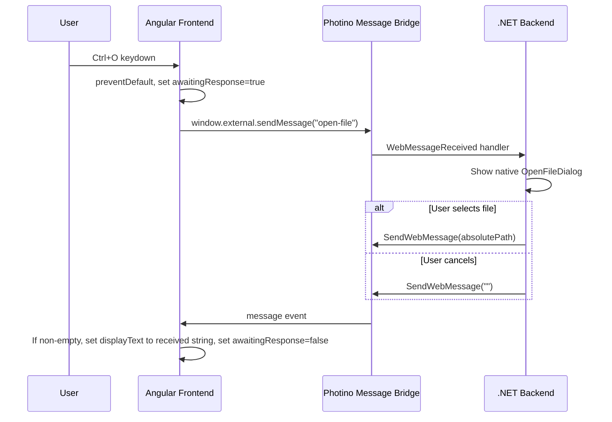

# Design Document

#[[file:.kiro/specs/_global/design-shared.md]]

## Overview

Implements Ctrl+O → native file dialog → display file path flow. Angular frontend captures keyboard shortcut, sends message to .NET backend via Photino bridge, backend shows OS file dialog, returns selected path, frontend displays it.

## Architecture



## Components and Interfaces

### Frontend — `AppComponent` (Angular)

```typescript
@Component({ standalone: true, selector: 'app-root' })
export class AppComponent {
  displayText = signal('Hello World');
  private awaitingResponse = signal(false);

  @HostListener('document:keydown', ['$event'])
  onKeydown(event: KeyboardEvent): void;

  private onMessageReceived(message: string): void;
}
```

| Method | Trigger | Effect |
|--------|---------|--------|
| `onKeydown` | `document:keydown` | If Ctrl+O/Cmd+O and not awaiting → `preventDefault`, send `"open-file"`, set awaiting |
| `onMessageReceived` | Photino bridge message | If non-empty, set `displayText`; clear awaiting |

### Backend — `Program.cs` (message handler)

```csharp
app.MainWindow.RegisterWebMessageReceivedHandler((sender, message) =>
{
    if (message == "open-file")
    {
        // Show native file dialog (single file, no filter)
        // Return full path or empty string on cancel
    }
});
```

| Input Message | Action | Response |
|---------------|--------|----------|
| `"open-file"` | Show native `OpenFileDialog` | Full absolute path or `""` |
| Any other | Ignore | No response |

### Message Protocol (this feature)

- **JS → .NET**: `"open-file"` (literal string)
- **.NET → JS**: `"/path/to/file.txt"` or `""` (raw path or empty)

## Data Models

### Frontend State

```typescript
interface AppState {
  displayText: string;       // "Hello World" initially
  awaitingResponse: boolean; // Guards against duplicate requests
}
```

## Correctness Properties

### Property 1: State guard prevents duplicate sends

*For any* sequence of Ctrl+O key presses and message responses interleaved in any order, the frontend shall never have more than one outstanding "open-file" message without an intervening response.

**Validates: Requirements 1.2, 1.4**

## Error Handling

| Scenario | Handler | Behavior |
|----------|---------|----------|
| Ctrl+O while awaiting | Frontend guard | Swallow keypress, no message sent |
| Empty response from backend | Frontend | No display update, clear awaiting flag |
| Backend receives unknown message | Backend handler | Ignore silently |
| Backend receives "open-file" while dialog open | Backend guard | Ignore (native modal blocks) |
| Native dialog throws exception | Backend | Catch, send empty string |

## Testing Strategy

### Unit Tests

| Test | Validates |
|------|-----------|
| Ctrl+O triggers `sendMessage("open-file")` | Req 1.1 |
| Other key combos don't trigger send | Req 1.1 |
| `preventDefault` called on Ctrl+O in both states | Req 1.3 |
| Cmd+O works (meta key) | Req 1.1 |
| Initial `displayText` is "Hello World" | Req 4.1, 4.2 |
| Non-empty response sets displayText | Req 3.1 |
| Empty response leaves display unchanged | Req 3.2 |

### Property-Based Tests

**Library**: fast-check | **Config**: 100+ iterations

| Property | Generates | Asserts |
|----------|-----------|---------|
| State guard | Random `{keypress, response}` sequences | At most 1 outstanding send |

### Integration Tests

| Test | Validates |
|------|-----------|
| Ctrl+O → dialog → path displayed | Req 1.1, 2.1, 2.3, 3.1 |
| Ctrl+O → dialog cancel → display unchanged | Req 2.4, 3.2 |

### Test Boundaries

- Frontend: mock `window.external.sendMessage`, simulate incoming messages
- Backend: mock native dialog API, verify `SendWebMessage` calls
