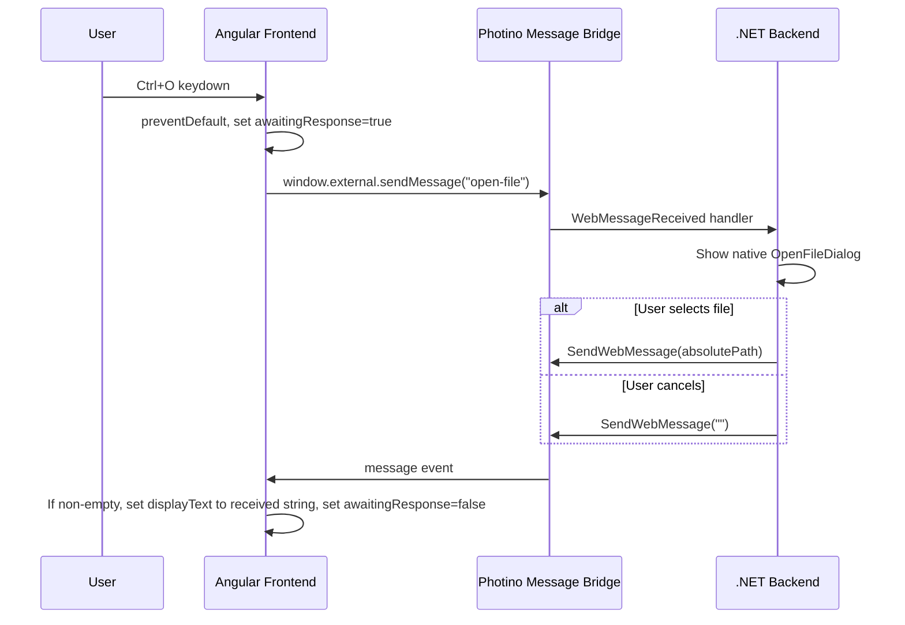

# Design Document

## Overview

Implements Ctrl+O → native file dialog → display file path flow. Angular frontend captures keyboard shortcut, sends message to .NET backend via Photino bridge, backend shows OS file dialog, returns selected path, frontend displays the full path string directly.

Two-layer architecture: Angular handles UI/keyboard + message protocol; .NET handles native dialog + message dispatch. Communication is string-based via Photino's `window.external.sendMessage` (JS→.NET) and `PhotinoWindow.SendWebMessage` (.NET→JS).

## Architecture



### Component Boundaries

- **Frontend (Angular)**: Keyboard event handling, message send/receive, UI rendering
- **Backend (.NET)**: Message routing, native dialog invocation, path response
- **Bridge (Photino)**: String transport layer — no logic, just pass-through

## Components and Interfaces

### Frontend — `AppComponent` (Angular)

```typescript
// app.component.ts
@Component({ standalone: true, selector: 'app-root' })
export class AppComponent {
  displayText = signal('Hello World');
  private awaitingResponse = signal(false);

  // Keyboard handler — listens for Ctrl+O / Cmd+O
  @HostListener('document:keydown', ['$event'])
  onKeydown(event: KeyboardEvent): void;

  // Message receiver — handles .NET responses
  private onMessageReceived(message: string): void;
}
```

**Interface contract:**

| Method | Trigger | Effect |
|--------|---------|--------|
| `onKeydown` | `document:keydown` | If Ctrl+O/Cmd+O and not awaiting → `preventDefault`, send `"open-file"`, set awaiting |
| `onMessageReceived` | Photino bridge message | If non-empty, set `displayText` to received string; clear awaiting |

### Backend — `Program.cs` (extended)

```csharp
// Register message handler on PhotinoWindow
app.MainWindow.RegisterWebMessageReceivedHandler((sender, message) =>
{
    if (message == "open-file")
    {
        // Show native file dialog (single file, no filter)
        // Return full path or empty string on cancel
    }
});
```

**Interface contract:**

| Input Message | Action | Response |
|---------------|--------|----------|
| `"open-file"` | Show native `OpenFileDialog` | Full absolute path (selected) or `""` (cancelled) |
| Any other | Ignore | No response |

### Message Protocol

Simple string-based protocol — no JSON needed for this feature:

- **JS → .NET**: `"open-file"` (literal string command)
- **.NET → JS**: `"/path/to/file.txt"` or `""` (raw path string or empty)

### Bridge Integration

Photino provides the bridge automatically:
- **JS side**: `window.external.sendMessage(str)` sends string to .NET
- **.NET side**: `PhotinoWindow.SendWebMessage(str)` sends string to JS
- **JS receive**: Register listener via `window.external.receiveMessage` callback or Photino's message event

## Data Models

### Frontend State

```typescript
interface AppState {
  displayText: string;       // Current text shown in Display_Area ("Hello World" initially)
  awaitingResponse: boolean; // Guards against duplicate dialog requests
}
```

No persistent storage. State lives in component signals, resets on app restart.

### Message Format

| Direction | Format | Example |
|-----------|--------|---------|
| JS → .NET | Plain string command | `"open-file"` |
| .NET → JS | Plain string (path or empty) | `"C:\Users\me\documents\report.pdf"` or `""` |

Frontend displays the received string directly — no parsing or extraction needed.

## Correctness Properties

*A property is a characteristic or behavior that should hold true across all valid executions of a system — essentially, a formal statement about what the system should do. Properties serve as the bridge between human-readable specifications and machine-verifiable correctness guarantees.*

### Property 1: State guard prevents duplicate sends

*For any* sequence of Ctrl+O key presses and message responses interleaved in any order, the frontend shall never have more than one outstanding "open-file" message without an intervening response. Equivalently: after sending "open-file", subsequent Ctrl+O presses produce no additional sends until a response arrives.

**Validates: Requirements 1.2, 1.4**

## Error Handling

| Scenario | Handler | Behavior |
|----------|---------|----------|
| Ctrl+O while awaiting | Frontend guard | Swallow keypress, no message sent |
| Empty response from backend | Frontend | No display update, clear awaiting flag |
| Backend receives unknown message | Backend handler | Ignore silently |
| Backend receives "open-file" while dialog open | Backend guard | Ignore (native modal dialog blocks anyway) |
| Native dialog throws exception | Backend | Catch, send empty string as response |

No user-visible error messages needed — failures degrade gracefully to "nothing happens" behavior.

## Testing Strategy

### Unit Tests (Example-Based)

| Test | Validates |
|------|-----------|
| Ctrl+O triggers `sendMessage("open-file")` | Req 1.1 |
| Other key combos don't trigger send | Req 1.1 |
| `preventDefault` called on Ctrl+O in both states | Req 1.3 |
| Cmd+O works on macOS (meta key) | Req 1.1 |
| Initial `displayText` is "Hello World" | Req 4.1, 4.2 |
| Non-empty response sets displayText to full received string | Req 3.1 |
| Empty response leaves display unchanged | Req 3.2 |
| Backend sends path on dialog confirm (integration) | Req 2.3 |
| Backend sends "" on dialog cancel (integration) | Req 2.4 |
| Backend ignores non-"open-file" messages | Req 2.5 |

### Property-Based Tests

**Library**: [fast-check](https://github.com/dubzzz/fast-check) (TypeScript PBT library for Angular/Jest)

**Configuration**: Minimum 100 iterations per property.

**Tag format**: `Feature: open-file-dialog, Property {N}: {title}`

| Property | What it generates | What it asserts |
|----------|-------------------|-----------------|
| Property 1: State guard | Random sequences of `{keypress, response}` events | At most 1 outstanding send at any time |

### Integration Tests

| Test | Validates |
|------|-----------|
| End-to-end: Ctrl+O → dialog → path displayed | Req 1.1, 2.1, 2.3, 3.1 |
| End-to-end: Ctrl+O → dialog cancel → display unchanged | Req 2.4, 3.2 |

### Test Boundaries

- Frontend unit/property tests: mock `window.external.sendMessage` and simulate incoming messages
- Backend integration tests: mock native dialog API, verify `SendWebMessage` calls
- No E2E browser automation needed — Photino bridge tested via integration
