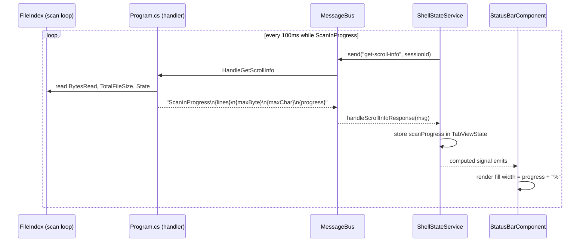

# Design Document

#[[file:.kiro/specs/_global/design-shared.md]]

## Overview

Adds a progress bar to the status bar that visualizes file scan completion during the `ScanInProgress` phase. The bar occupies the flex space between the file-path span and the wrap checkbox. Progress data originates from `FileIndex` (bytes read vs file size), flows through the existing `get-scroll-info` polling mechanism as a fifth response field, and is stored in a new `scanProgress` field on `TabViewState`.

## Architecture



No new message types, subscriptions, or polling timers are introduced. The existing `get-scroll-info` poll already runs every 100 ms during `ScanInProgress`; the only change is appending a fifth field to the response and consuming it on the frontend.

## Components and Interfaces

### Backend Changes

| Component | Change |
|-----------|--------|
| `FileIndex` | Add `volatile long _bytesRead` field incremented by each `ReadAsync` return value. Add `long TotalFileSize` property set from stream length before scan loop. Add `long BytesRead` property (volatile read). |
| `FileViewService` | Expose `long BytesRead => _fileIndex.BytesRead` and `long TotalFileSize => _fileIndex.TotalFileSize` pass-through properties. |
| `Program.HandleGetScrollInfo` | Compute `progressPercentage` from `service.BytesRead` / `service.TotalFileSize`. Append as 5th newline-delimited field. For terminal states or zero-size files, emit `100`. |

### Frontend Changes

| Component | Change |
|-----------|--------|
| `shell.types.ts` | Add `scanProgress: number` field to `TabViewState` interface (default 0). |
| `ShellStateService` | In `handleScrollInfoResponse`, parse 5th field when present and store in `tabViewState.scanProgress`. Add computed signal `activeScanProgress` and `isScanning`. |
| `StatusBarComponent` | Add input signals from `ShellStateService`. Render `<div class="progress-bar">` with inner `<div class="progress-fill" [style.width]="progress + '%'">` when `isScanning()` is true. |
| `status-bar.component.html` | Insert progress bar element between `.file-path` and `.wrap-checkbox`. |
| `status-bar.component.css` | Add `.progress-bar` and `.progress-fill` styles. |

### New Computed Signals (ShellStateService)

```typescript
readonly activeScanState = computed<ScanStateValue>(() => {
  const tab = this.activeTab();
  if (!tab) return 'NotStarted';
  const state = this.tabViewStates().get(tab.viewSessionId);
  if (!state) return 'NotStarted';
  return state.scanComplete ? 'ScanComplete' : 'ScanInProgress';
});

readonly activeScanProgress = computed<number>(() => {
  const tab = this.activeTab();
  if (!tab) return 0;
  const state = this.tabViewStates().get(tab.viewSessionId);
  return state?.scanProgress ?? 0;
});

readonly isScanning = computed<boolean>(() => {
  return this.activeScanState() === 'ScanInProgress';
});
```

## Data Models

### TabViewState Extension

```typescript
export interface TabViewState {
  // ... existing fields ...
  /** Scan progress percentage (0–100) from last get-scroll-info poll */
  scanProgress: number;
}
```

Default value: `0` (set when creating initial `TabViewState` entry in open-file handler).

### Backend Progress Computation

```csharp
// In FileIndex:
private volatile long _bytesRead;
public long TotalFileSize { get; private set; }
public long BytesRead => Volatile.Read(ref _bytesRead);

// In HandleGetScrollInfo:
int progressPercentage;
if (service.ScanState >= ScanState.ScanComplete || service.TotalFileSize == 0)
    progressPercentage = 100;
else
    progressPercentage = (int)(service.BytesRead * 100 / service.TotalFileSize);

return $"{scanState}\n{lineCount}\n{maxByteLength}\n{maxCharLength}\n{progressPercentage}";
```

### Frontend Parsing Update (handleScrollInfoResponse)

Current parser expects 4 fields. Updated to accept 4 or 5 fields:
- 4 fields: backward-compatible (no progress info → leave scanProgress unchanged)
- 5 fields: parse `fields[4]` as integer and store in `tabViewState.scanProgress`

## Correctness Properties

*A property is a characteristic or behavior that should hold true across all valid executions of a system — essentially, a formal statement about what the system should do. Properties serve as the bridge between human-readable specifications and machine-verifiable correctness guarantees.*

### Property 1: Progress bar visibility is determined solely by active tab scan state

*For any* active tab ID (including null) and any scan state value (NotStarted, ScanInProgress, ScanComplete, Failed, Cancelled), the progress bar visibility signal SHALL equal `true` if and only if `activeTabId !== null` AND the active tab's effective scan state is `ScanInProgress`.

**Validates: Requirements 1.1, 1.2, 1.3, 1.4, 5.1, 5.2, 5.3, 5.4**

### Property 2: Fill width equals progress percentage

*For any* integer progress value in [0, 100], the progress bar fill element's inline width style SHALL be exactly `"{value}%"`.

**Validates: Requirements 3.1**

### Property 3: Scroll-info response parsing stores progress

*For any* valid 5-field scroll-info response payload where the first field is `"ScanInProgress"` and the fifth field is a parseable integer, the Shell_State_Service SHALL store that integer as the session's `scanProgress` value.

**Validates: Requirements 3.2**

### Property 4: Progress percentage computation

*For any* pair `(bytesRead, totalFileSize)` where `0 <= bytesRead <= totalFileSize`, the reported progress SHALL equal `floor(bytesRead * 100 / totalFileSize)` when `totalFileSize > 0`, and SHALL equal `100` when `totalFileSize == 0` or scan state is terminal (ScanComplete, Failed, Cancelled).

**Validates: Requirements 4.3, 4.4, 4.5**

### Property 5: Bytes-read invariant after scan

*For any* file content, after `StartScanAsync` completes successfully, `BytesRead` SHALL equal the total byte length of the file stream (i.e., `TotalFileSize`).

**Validates: Requirements 4.1**

## Error Handling

| Scenario | Handling |
|----------|----------|
| `get-scroll-info` response has < 5 fields (backward compat) | Leave `scanProgress` unchanged; progress bar shows last-known or default 0. |
| 5th field is not a valid integer | Ignore field; leave `scanProgress` unchanged. |
| `TotalFileSize` is 0 (empty file) | Backend reports 100; progress bar shows full then hides on ScanComplete. |
| Session not found | Existing `ERROR:` prefix handling; progress bar not affected. |
| Tab closed during scan | Existing `closeTab` cleanup removes TabViewState; progress bar hides via null active tab. |

## Testing Strategy

### Property-Based Tests (fast-check, numRuns: 10)

| Test | Property | Library |
|------|----------|---------|
| Progress bar visibility signal | Property 1 | fast-check |
| Fill width style mapping | Property 2 | fast-check |
| Scroll-info response parsing | Property 3 | fast-check |
| Progress percentage computation (C#) | Property 4 | FsCheck |
| Bytes-read post-scan invariant (C#) | Property 5 | FsCheck |

Each test tagged: `Feature: scan-progress-bar, Property {N}: {title}`

### Unit Tests (example-based)

- StatusBarComponent renders progress bar only when `isScanning()` is true
- StatusBarComponent hides progress bar when `isScanning()` is false
- Initial `TabViewState.scanProgress` defaults to 0
- CSS classes applied correctly (`.progress-bar`, `.progress-fill`)
- DOM order: file-path → progress-bar → wrap-checkbox
- Tab switch to ScanInProgress tab resumes polling (existing activateTab behavior)

### Integration Tests

- End-to-end: open large file → observe progress updates in scroll-info responses
- Thread-safety: concurrent reads of `BytesRead` during active scan (stress test)
