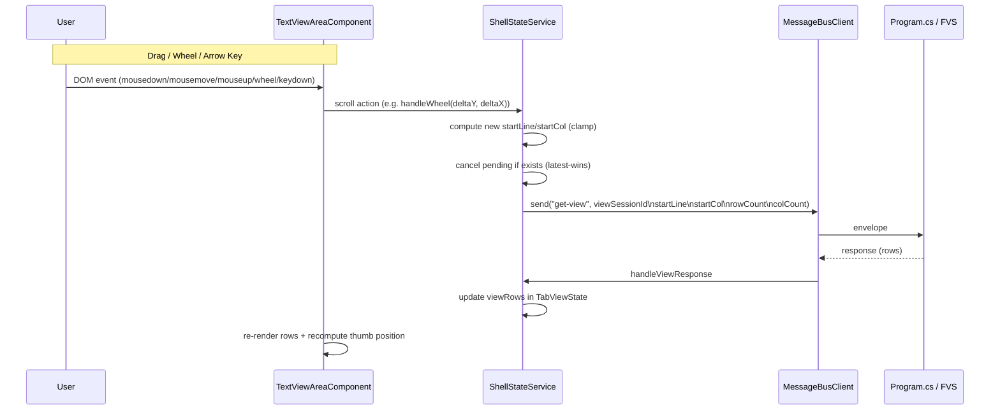
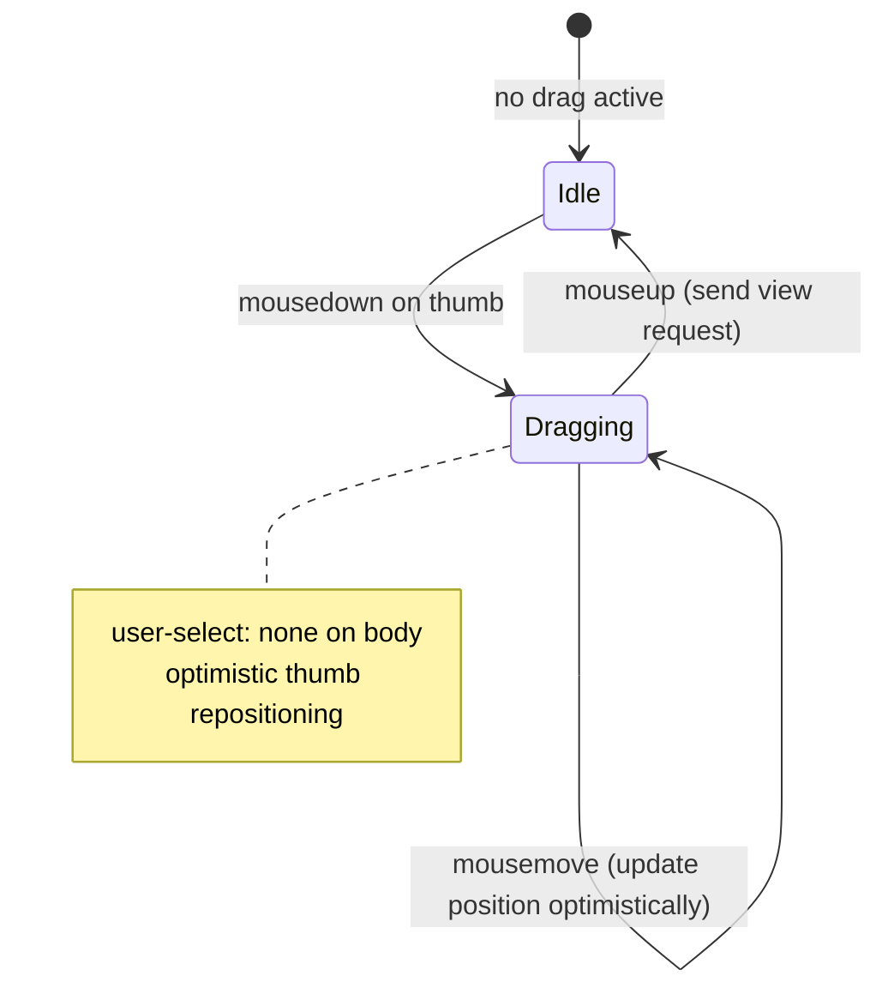

# Scroll Navigation — Design

#[[file:.kiro/specs/_global/design-shared.md]]

## Overview

Scroll Navigation makes the existing scrollbar UI interactive. The text-handling spec (shipped) renders static scrollbar thumbs with correct max values. This feature adds:

- **Scroll position tracking** — `startLine` / `startCol` per tab in `TabViewState`
- **Thumb dragging** — mousedown on thumb → mousemove computes new position → mouseup sends view request
- **Wheel scrolling** — deltaY/deltaX → ±3 lines/cols per tick
- **Arrow key scrolling** — focus-based, ±1 line/col per press
- **Proportional thumb** — size reflects viewport/content ratio, position reflects startLine/startCol
- **Latest-wins view requests** — scroll cancels pending request, sends new one with latest position

All scroll state logic lives in `ShellStateService`. `TextViewAreaComponent` is a pure signal projection that forwards DOM events and renders computed styles.

### Rendering Contract

Scroll-triggered view responses reuse the existing monospace row rendering pipeline unchanged (one block-level `div.view-row` per row, verbatim content, overflow hidden). No new rendering logic introduced.

## Architecture





### Design Decisions

1. **ShellStateService owns scroll state** — `startLine`/`startCol` stored per tab in `TabViewState`. Service exposes action methods (`scrollVertical`, `scrollHorizontal`, `dragStart`, `dragMove`, `dragEnd`). Component just forwards events.

2. **Latest-wins cancellation** — Scroll events fire rapidly. If a `get-view` request is pending, cancel it (via `messageBus.cancel`) and send a new one with the latest position. No queuing, no debounce — the last position wins.

3. **Optimistic thumb during drag** — Thumb position updates on every mousemove via computed signal (derived from `startLine`). No waiting for backend response. Rows update only when response arrives.

4. **Rows stay visible during pending** — While awaiting a scroll response, the previous rows remain displayed. No blank flash. Error responses keep previous rows and show error separately.

5. **Component forwards raw DOM events** — `TextViewAreaComponent` attaches listeners (mousedown on thumb, wheel on host, keydown on host) and calls service methods with extracted values. No scroll logic in the component.

6. **Drag uses document-level listeners** — `mousemove` and `mouseup` attached to `document` during drag (not the thumb element) so dragging outside the scrollbar track still works. Cleaned up on mouseup.

7. **user-select: none during drag** — Applied to `document.body` on drag start, removed on drag end. Prevents text selection while dragging.

8. **Thumb size/position as computed signals** — Derived from `startLine`, `startCol`, `scrollbarState`, `viewDimensions`. Component reads these signals and applies as inline styles.

9. **Arrow keys require focus** — `TextViewAreaComponent` host element has `tabindex="0"`. Arrow keys only handled when the component (or a child) has focus. `preventDefault` suppresses browser scroll.

10. **Wheel always captured** — Wheel events on the text-view-area host always handled (preventDefault). No focus requirement for wheel.

11. **Non-interactive when content fits** — If `scrollbarMax <= viewportSize`, the scrollbar thumb is non-interactive. Mousedown produces no drag state. Wheel/arrow produce no position change.

12. **Per-tab scroll position persistence** — `startLine`/`startCol` stored in `TabViewState`. Tab switch restores thumb position from stored values without a new view request (cached rows already correct per existing text-handling design).

13. **Drag formula uses (scrollbarMax - viewportSize) as the scrollable range** — not raw scrollbarMax. This maps pixel delta to the actual scrollable range `[0, maxScroll]` where `maxScroll = scrollbarMax - viewportSize`. A full-track drag from top to bottom moves exactly from position 0 to the last valid scroll position.

## Components and Interfaces

### TabViewState Extension (shell.types.ts)

```typescript
export interface TabViewState {
  // ... existing fields ...
  scanComplete: boolean;
  viewRows: string[] | null;
  errorMessage: string | null;
  pendingCorrelationId: string | null;
  deferred: boolean;
  scrollbarState: ScrollbarState;

  // NEW: scroll position
  startLine: number;
  startCol: number;
}
```

Default values for new fields: `startLine: 0`, `startCol: 0`.

### DragState (shell.types.ts)

```typescript
/** Transient state during scrollbar thumb drag */
export interface DragState {
  /** Which axis is being dragged */
  axis: 'vertical' | 'horizontal';
  /** Mouse coordinate at drag start (clientY for vertical, clientX for horizontal) */
  startMousePos: number;
  /** startLine or startCol value at drag start */
  startScrollPos: number;
  /** Track length in pixels (track element size minus thumb size) */
  trackLength: number;
  /** Scrollbar max value at drag start */
  scrollbarMax: number;
  /** Viewport size (rowCount or colCount) at drag start */
  viewportSize: number;
}
```

### ShellStateService Extensions

```typescript
// New state signal
readonly dragState = signal<DragState | null>(null);

// New computed signals (for thumb rendering)
readonly verticalThumbSize = computed(() => { /* ... */ });
readonly verticalThumbPosition = computed(() => { /* ... */ });
readonly horizontalThumbSize = computed(() => { /* ... */ });
readonly horizontalThumbPosition = computed(() => { /* ... */ });

// New action methods
handleVerticalDragStart(mouseY: number, trackLength: number): void;
handleHorizontalDragStart(mouseX: number, trackLength: number): void;
handleDragMove(mousePos: number): void;
handleDragEnd(): void;
handleWheel(deltaY: number, deltaX: number): void;
handleArrowKey(direction: 'up' | 'down' | 'left' | 'right'): void;
```

### Thumb Size Computation

```typescript
readonly verticalThumbSize = computed(() => {
  const sb = this.activeScrollbarState();
  const dims = this.viewDimensions();
  if (!sb || sb.disabled || !dims) return 0;
  if (sb.verticalMax <= dims.rowCount) return null; // full track (handled in CSS)
  const trackPixelHeight = /* from template binding or fixed */;
  const ratio = dims.rowCount / sb.verticalMax;
  return Math.max(20, ratio * trackPixelHeight);
});
```

Note: Track pixel height is passed from the component via a signal or computed from the host element. The service computes the ratio; the component applies it.

**Simplified approach**: Service computes ratio and min-clamped percentage. Component multiplies by track element's actual pixel size.

```typescript
/** Returns thumb size as fraction of track (0..1), min-clamped to 20px equivalent */
verticalThumbRatio = computed(() => {
  const sb = this.activeScrollbarState();
  const dims = this.viewDimensions();
  if (!sb || sb.disabled || !dims) return 1; // full track
  if (sb.verticalMax <= dims.rowCount) return 1; // all content visible
  return dims.rowCount / sb.verticalMax;
});

horizontalThumbRatio = computed(() => {
  const sb = this.activeScrollbarState();
  const dims = this.viewDimensions();
  if (!sb || sb.disabled || !dims) return 1;
  if (sb.horizontalMax <= dims.colCount) return 1;
  return dims.colCount / sb.horizontalMax;
});
```

### Thumb Position Computation

```typescript
/** Returns thumb position as fraction of available track (0..1) */
verticalThumbFraction = computed(() => {
  const tab = this.activeTab();
  if (!tab) return 0;
  const state = this.tabViewStates().get(tab.viewSessionId);
  if (!state) return 0;
  const sb = state.scrollbarState;
  const dims = this.viewDimensions();
  if (!dims || sb.disabled || sb.verticalMax <= dims.rowCount) return 0;
  const maxScroll = sb.verticalMax - dims.rowCount;
  if (maxScroll <= 0) return 0;
  return state.startLine / maxScroll;
});

horizontalThumbFraction = computed(() => {
  const tab = this.activeTab();
  if (!tab) return 0;
  const state = this.tabViewStates().get(tab.viewSessionId);
  if (!state) return 0;
  const sb = state.scrollbarState;
  const dims = this.viewDimensions();
  if (!dims || sb.disabled || sb.horizontalMax <= dims.colCount) return 0;
  const maxScroll = sb.horizontalMax - dims.colCount;
  if (maxScroll <= 0) return 0;
  return state.startCol / maxScroll;
});
```

### TextViewAreaComponent Extensions

```typescript
// Expose new signals from service
readonly verticalThumbRatio = this.state.verticalThumbRatio;
readonly verticalThumbFraction = this.state.verticalThumbFraction;
readonly horizontalThumbRatio = this.state.horizontalThumbRatio;
readonly horizontalThumbFraction = this.state.horizontalThumbFraction;

// DOM event handlers (in ngAfterViewInit or template bindings)
onVerticalThumbMousedown(event: MouseEvent): void;
onHorizontalThumbMousedown(event: MouseEvent): void;
onWheel(event: WheelEvent): void;
onKeydown(event: KeyboardEvent): void;
```

#### Component onKeydown Handler

```typescript
onKeydown(event: KeyboardEvent): void {
  const arrowKeys = ['ArrowUp', 'ArrowDown', 'ArrowLeft', 'ArrowRight'];
  if (!arrowKeys.includes(event.key)) return;

  // Guard: if no active tab, return without preventDefault
  if (!this.state.activeTab()) return;

  // Active tab exists — suppress browser scroll and forward to service
  event.preventDefault();
  const directionMap: Record<string, 'up' | 'down' | 'left' | 'right'> = {
    ArrowUp: 'up', ArrowDown: 'down', ArrowLeft: 'left', ArrowRight: 'right',
  };
  this.state.handleArrowKey(directionMap[event.key]);
}
```

#### Component onVerticalThumbMousedown Handler

```typescript
onVerticalThumbMousedown(event: MouseEvent): void {
  event.preventDefault();
  const track = this.verticalTrack.nativeElement;
  const trackLength = track.clientHeight - this.computeVerticalThumbPx();

  // Apply user-select: none to prevent text selection during drag
  document.body.style.userSelect = 'none';

  this.state.handleVerticalDragStart(event.clientY, trackLength);

  const onMouseMove = (e: MouseEvent) => this.state.handleDragMove(e.clientY);
  const onMouseUp = () => {
    document.removeEventListener('mousemove', onMouseMove);
    document.removeEventListener('mouseup', onMouseUp);
    // Restore user-select on drag end
    document.body.style.userSelect = '';
    this.state.handleDragEnd();
  };

  document.addEventListener('mousemove', onMouseMove);
  document.addEventListener('mouseup', onMouseUp);
}
```

#### Component onHorizontalThumbMousedown Handler

```typescript
onHorizontalThumbMousedown(event: MouseEvent): void {
  event.preventDefault();
  const track = this.horizontalTrack.nativeElement;
  const trackLength = track.clientWidth - this.computeHorizontalThumbPx();

  // Apply user-select: none to prevent text selection during drag
  document.body.style.userSelect = 'none';

  this.state.handleHorizontalDragStart(event.clientX, trackLength);

  const onMouseMove = (e: MouseEvent) => this.state.handleDragMove(e.clientX);
  const onMouseUp = () => {
    document.removeEventListener('mousemove', onMouseMove);
    document.removeEventListener('mouseup', onMouseUp);
    // Restore user-select on drag end
    document.body.style.userSelect = '';
    this.state.handleDragEnd();
  };

  document.addEventListener('mousemove', onMouseMove);
  document.addEventListener('mouseup', onMouseUp);
}
```

### Template Changes (text-view-area.component.html)

```html
<div class="text-view-area" #contentArea tabindex="0"
     (wheel)="onWheel($event)"
     (keydown)="onKeydown($event)">
  <!-- ... existing content ... -->

  @if (scrollbarState(); as sb) {
    @if (!sb.disabled) {
      <div class="scrollbar-vertical" aria-label="Vertical scrollbar">
        <div class="scrollbar-track" #verticalTrack>
          <div class="scrollbar-thumb"
               [style.height.px]="computeVerticalThumbPx()"
               [style.top.px]="computeVerticalThumbTopPx()"
               (mousedown)="onVerticalThumbMousedown($event)">
          </div>
        </div>
        <span class="scrollbar-max">{{ sb.verticalMax }}</span>
      </div>
      <div class="scrollbar-horizontal" aria-label="Horizontal scrollbar">
        <div class="scrollbar-track" #horizontalTrack>
          <div class="scrollbar-thumb"
               [style.width.px]="computeHorizontalThumbPx()"
               [style.left.px]="computeHorizontalThumbLeftPx()"
               (mousedown)="onHorizontalThumbMousedown($event)">
          </div>
        </div>
        <span class="scrollbar-max">{{ sb.horizontalMax }}</span>
      </div>
    }
  }
</div>
```

### Scroll Action: handleWheel

```typescript
handleWheel(deltaY: number, deltaX: number): void {
  const tab = this.activeTab();
  if (!tab) return;
  const state = this.tabViewStates().get(tab.viewSessionId);
  if (!state) return;
  const sb = state.scrollbarState;
  const dims = this.viewDimensions();
  if (!dims || sb.disabled) return;

  const WHEEL_STEP = 3;
  let newStartLine = state.startLine;
  let newStartCol = state.startCol;

  if (deltaY !== 0 && sb.verticalMax > dims.rowCount) {
    const maxScroll = sb.verticalMax - dims.rowCount;
    newStartLine = clamp(state.startLine + Math.sign(deltaY) * WHEEL_STEP, 0, maxScroll);
  }
  if (deltaX !== 0 && sb.horizontalMax > dims.colCount) {
    const maxScroll = sb.horizontalMax - dims.colCount;
    newStartCol = clamp(state.startCol + Math.sign(deltaX) * WHEEL_STEP, 0, maxScroll);
  }

  if (newStartLine === state.startLine && newStartCol === state.startCol) return;

  this.updateScrollPosition(tab.viewSessionId, newStartLine, newStartCol);
  this.sendScrollViewRequest(tab.viewSessionId, newStartLine, newStartCol);
}
```

### Scroll Action: handleArrowKey

```typescript
handleArrowKey(direction: 'up' | 'down' | 'left' | 'right'): void {
  const tab = this.activeTab();
  if (!tab) return; // no active tab → do nothing, caller must not preventDefault
  const state = this.tabViewStates().get(tab.viewSessionId);
  if (!state) return;
  const sb = state.scrollbarState;
  const dims = this.viewDimensions();
  if (!dims || sb.disabled) return;

  let newStartLine = state.startLine;
  let newStartCol = state.startCol;

  switch (direction) {
    case 'down':
      if (sb.verticalMax > dims.rowCount)
        newStartLine = clamp(state.startLine + 1, 0, sb.verticalMax - dims.rowCount);
      break;
    case 'up':
      if (sb.verticalMax > dims.rowCount)
        newStartLine = clamp(state.startLine - 1, 0, sb.verticalMax - dims.rowCount);
      break;
    case 'right':
      if (sb.horizontalMax > dims.colCount)
        newStartCol = clamp(state.startCol + 1, 0, sb.horizontalMax - dims.colCount);
      break;
    case 'left':
      if (sb.horizontalMax > dims.colCount)
        newStartCol = clamp(state.startCol - 1, 0, sb.horizontalMax - dims.colCount);
      break;
  }

  if (newStartLine === state.startLine && newStartCol === state.startCol) return;

  this.updateScrollPosition(tab.viewSessionId, newStartLine, newStartCol);
  this.sendScrollViewRequest(tab.viewSessionId, newStartLine, newStartCol);
}
```

### Scroll Action: Drag

```typescript
handleVerticalDragStart(mouseY: number, trackLength: number): void {
  if (trackLength <= 0) return; // guard: prevent division by zero
  const tab = this.activeTab();
  if (!tab) return;
  const state = this.tabViewStates().get(tab.viewSessionId);
  if (!state) return;
  const sb = state.scrollbarState;
  const dims = this.viewDimensions();
  if (!dims || sb.verticalMax <= dims.rowCount) return; // non-interactive

  this.dragState.set({
    axis: 'vertical',
    startMousePos: mouseY,
    startScrollPos: state.startLine,
    trackLength,
    scrollbarMax: sb.verticalMax,
    viewportSize: dims.rowCount,
  });
}

handleHorizontalDragStart(mouseX: number, trackLength: number): void {
  if (trackLength <= 0) return; // guard: prevent division by zero
  const tab = this.activeTab();
  if (!tab) return;
  const state = this.tabViewStates().get(tab.viewSessionId);
  if (!state) return;
  const sb = state.scrollbarState;
  const dims = this.viewDimensions();
  if (!dims || sb.horizontalMax <= dims.colCount) return; // non-interactive

  this.dragState.set({
    axis: 'horizontal',
    startMousePos: mouseX,
    startScrollPos: state.startCol,
    trackLength,
    scrollbarMax: sb.horizontalMax,
    viewportSize: dims.colCount,
  });
}

handleDragMove(mousePos: number): void {
  const drag = this.dragState();
  if (!drag) return;
  const tab = this.activeTab();
  if (!tab) return;

  const delta = mousePos - drag.startMousePos;
  const maxScroll = drag.scrollbarMax - drag.viewportSize;
  const scrollDelta = Math.round((delta / drag.trackLength) * maxScroll);
  const newPos = clamp(drag.startScrollPos + scrollDelta, 0, maxScroll);

  if (drag.axis === 'vertical') {
    this.updateScrollPosition(tab.viewSessionId, newPos, undefined);
  } else {
    this.updateScrollPosition(tab.viewSessionId, undefined, newPos);
  }
}

handleDragEnd(): void {
  const drag = this.dragState();
  if (!drag) return;
  this.dragState.set(null);

  const tab = this.activeTab();
  if (!tab) return;
  const state = this.tabViewStates().get(tab.viewSessionId);
  if (!state) return;

  this.sendScrollViewRequest(tab.viewSessionId, state.startLine, state.startCol);
}
```

### Private Helpers

```typescript
private updateScrollPosition(sessionId: string, startLine?: number, startCol?: number): void {
  const states = this.tabViewStates();
  const existing = states.get(sessionId);
  if (!existing) return;
  const updated = new Map(states);
  updated.set(sessionId, {
    ...existing,
    startLine: startLine ?? existing.startLine,
    startCol: startCol ?? existing.startCol,
  });
  this.tabViewStates.set(updated);
}

private sendScrollViewRequest(sessionId: string, startLine: number, startCol: number): void {
  const states = this.tabViewStates();
  const existing = states.get(sessionId);
  if (!existing) return;

  // Latest-wins: cancel pending request if exists
  if (existing.pendingCorrelationId) {
    this.messageBus.cancel(existing.pendingCorrelationId);
  }

  const dims = this.viewDimensions();
  if (!dims) return;

  const payload = `${sessionId}\n${startLine}\n${startCol}\n${dims.rowCount}\n${dims.colCount}`;
  const correlationId = this.messageBus.send('get-view', payload);

  const updated = new Map(this.tabViewStates());
  updated.set(sessionId, {
    ...existing,
    startLine,
    startCol,
    pendingCorrelationId: correlationId,
  });
  this.tabViewStates.set(updated);
}

function clamp(value: number, min: number, max: number): number {
  return Math.max(min, Math.min(max, value));
}
```

## Data Models

### Scroll Position (per-tab, in TabViewState)

| Field | Type | Default | Description |
|-------|------|---------|-------------|
| startLine | number | 0 | Zero-based first visible line |
| startCol | number | 0 | Zero-based first visible column |

### DragState (transient, single instance in service)

| Field | Type | Description |
|-------|------|-------------|
| axis | 'vertical' \| 'horizontal' | Which scrollbar is being dragged |
| startMousePos | number | clientY or clientX at mousedown |
| startScrollPos | number | startLine or startCol at mousedown |
| trackLength | number | Available track pixels (track size - thumb size) |
| scrollbarMax | number | Scrollbar max value at drag start |
| viewportSize | number | rowCount or colCount at drag start |

### Thumb Rendering Model

| Computed Value | Formula | Applied As |
|----------------|---------|-----------|
| verticalThumbRatio | rowCount / verticalMax | height percentage of track |
| horizontalThumbRatio | colCount / horizontalMax | width percentage of track |
| verticalThumbFraction | startLine / (verticalMax - rowCount) | top offset percentage of available track |
| horizontalThumbFraction | startCol / (horizontalMax - colCount) | left offset percentage of available track |

Minimum thumb size: 20px (enforced in component when converting ratio to pixels).

### View Request Payload (unchanged from text-handling)

```
{viewSessionId}\n{startLine}\n{startCol}\n{rowCount}\n{colCount}
```

Now uses actual `startLine`/`startCol` from scroll position instead of hardcoded `0\n0`.

### Scroll Constants

| Constant | Value | Used By |
|----------|-------|---------|
| WHEEL_STEP | 3 | Wheel handler (lines/cols per tick) |
| ARROW_STEP | 1 | Arrow key handler (lines/cols per press) |
| MIN_THUMB_SIZE | 20 | Thumb size computation (pixels) |

## Correctness Properties

*A property is a characteristic or behavior that should hold true across all valid executions of a system — essentially, a formal statement about what the system should do. Properties serve as the bridge between human-readable specifications and machine-verifiable correctness guarantees.*

### Property 1: Scroll step computation is clamped to valid range

*For any* current scroll position (startLine or startCol), any step size (1 for arrow, 3 for wheel), any direction (positive or negative), any scrollbarMax, and any viewportSize (rowCount or colCount) where scrollbarMax > viewportSize, the computed new position SHALL equal `clamp(current + sign * step, 0, scrollbarMax - viewportSize)` and the result SHALL always be in the range `[0, scrollbarMax - viewportSize]`.

**Validates: Requirements 3.1, 3.2, 4.1, 4.2, 4.3, 4.4**

### Property 2: Drag position computation is clamped to valid range

*For any* drag state (with valid startScrollPos, trackLength > 0, scrollbarMax, viewportSize where scrollbarMax > viewportSize) and any mouse delta, the computed scroll position SHALL equal `clamp(startScrollPos + round(delta / trackLength * (scrollbarMax - viewportSize)), 0, scrollbarMax - viewportSize)` and the result SHALL always be in the range `[0, scrollbarMax - viewportSize]`.

**Validates: Requirements 1.2, 2.2**

### Property 3: Non-interactive when content fits viewport

*For any* scrollbarMax and viewportSize where scrollbarMax ≤ viewportSize, all scroll actions (drag start, wheel, arrow key) SHALL produce no change to the scroll position, the thumb position fraction SHALL be 0, and the thumb size ratio SHALL be 1 (full track).

**Validates: Requirements 1.5, 2.5, 3.6, 3.7, 5.6, 6.4**

### Property 4: Thumb position fraction is proportional to scroll position

*For any* startLine (or startCol) in `[0, scrollbarMax - viewportSize]` where scrollbarMax > viewportSize, the thumb position fraction SHALL equal `startPos / (scrollbarMax - viewportSize)`, producing a value in `[0, 1]` where 0 means thumb at start and 1 means thumb at end.

**Validates: Requirements 5.1, 5.2, 5.4, 5.5**

### Property 5: Thumb size ratio is proportional to viewport coverage

*For any* viewportSize > 0 and scrollbarMax > viewportSize, the thumb size ratio SHALL equal `viewportSize / scrollbarMax`, producing a value in `(0, 1)`. When converted to pixels (ratio × trackPixelSize), the result SHALL be at least 20 pixels (min thumb size).

**Validates: Requirements 6.1, 6.2**

## Error Handling

| Scenario | Handling |
|----------|----------|
| View request fails during/after scroll | Keep previous rows displayed; show error in status area. Do not retry. (Req 1.4, 8.4) |
| Drag outside window bounds | Document-level mousemove/mouseup still fires; drag continues normally |
| Rapid scroll events (wheel spam) | Latest-wins cancellation — cancel pending, send new request (Req 7.2) |
| Tab closed while scroll request pending | Existing close-tab logic cancels pending correlationId (already implemented) |
| scrollbarMax changes during drag | Drag uses captured scrollbarMax from drag start; stale but safe. Next scroll action uses fresh values. |
| Zero track length | Guard: if trackLength ≤ 0, drag start rejected (division by zero prevention) |
| NaN from computation | clamp with integer bounds prevents NaN propagation; Math.round ensures integer result |

## Testing Strategy

### Property-Based Tests (fast-check, 10 iterations per steering rule)

Each correctness property maps to one property-based test:

| Test | Property | Tag |
|------|----------|-----|
| Scroll step clamping | Property 1 | Feature: text-handling-more, Property 1: Scroll step computation is clamped to valid range |
| Drag position clamping | Property 2 | Feature: text-handling-more, Property 2: Drag position computation is clamped to valid range |
| Non-interactive guard | Property 3 | Feature: text-handling-more, Property 3: Non-interactive when content fits viewport |
| Thumb position fraction | Property 4 | Feature: text-handling-more, Property 4: Thumb position fraction is proportional to scroll position |
| Thumb size ratio | Property 5 | Feature: text-handling-more, Property 5: Thumb size ratio is proportional to viewport coverage |

Library: **fast-check** (already in project dependencies).
Iterations: **10** per workspace steering rule.

### Unit Tests (example-based)

| Test | Validates |
|------|-----------|
| Drag start captures initial state correctly | Req 1.1, 2.1 |
| Drag end clears state and sends view request | Req 1.4, 2.4 |
| user-select: none applied during drag, removed after | Req 1.6, 2.6 |
| Wheel preventDefault called | Req 3.5 |
| No view request when position unchanged (boundary) | Req 3.4, 4.6 |
| Arrow keys ignored when no active tab | Req 4.8 |
| Arrow key preventDefault when active tab exists | Req 4.7 |
| Latest-wins: pending request cancelled on new scroll | Req 7.2 |
| View response updates displayed rows | Req 7.3, 8.1 |
| Previous rows preserved while pending | Req 8.3 |
| Error response keeps rows, shows error | Req 8.4 |
| Tab switch restores thumb position without request | Req 7.5 |
| Thumb size applied as inline style | Req 6.5 |
| Thumb position recomputed on view response | Req 5.3 |

### Integration Tests

| Test | Validates |
|------|-----------|
| Full scroll cycle: wheel → view request → response → rows updated | End-to-end scroll flow |
| Drag cycle: mousedown → mousemove → mouseup → view request → response | End-to-end drag flow |

