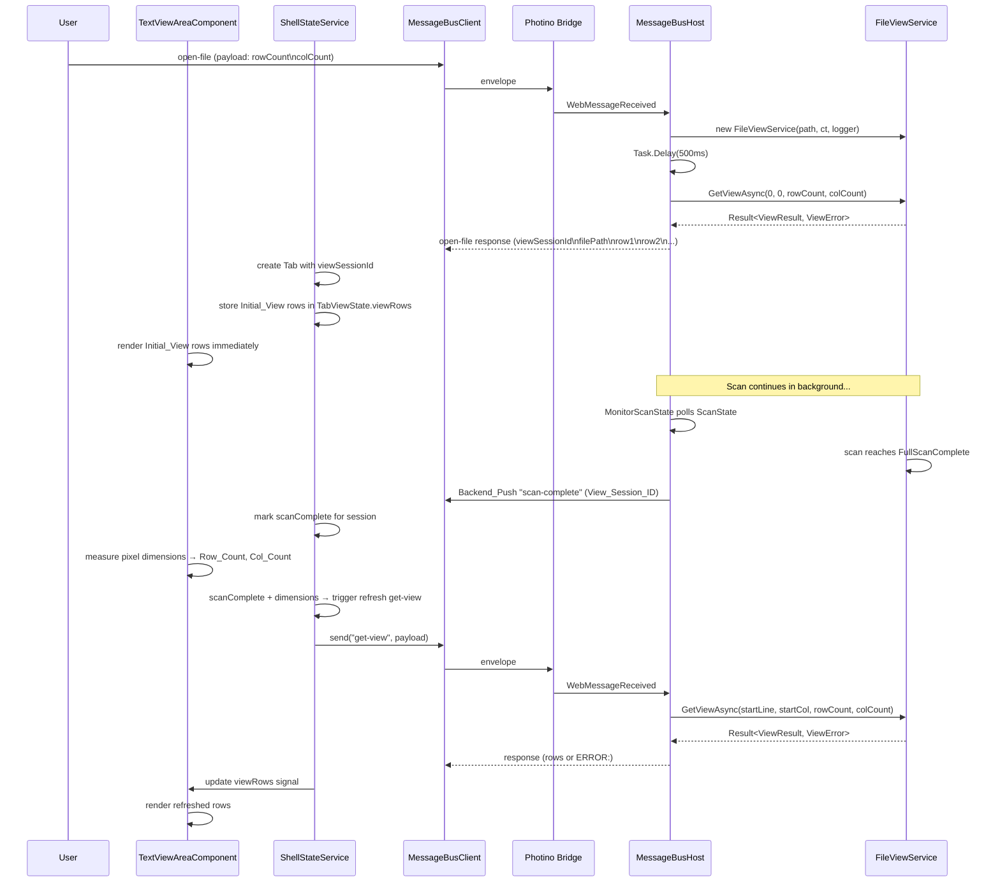
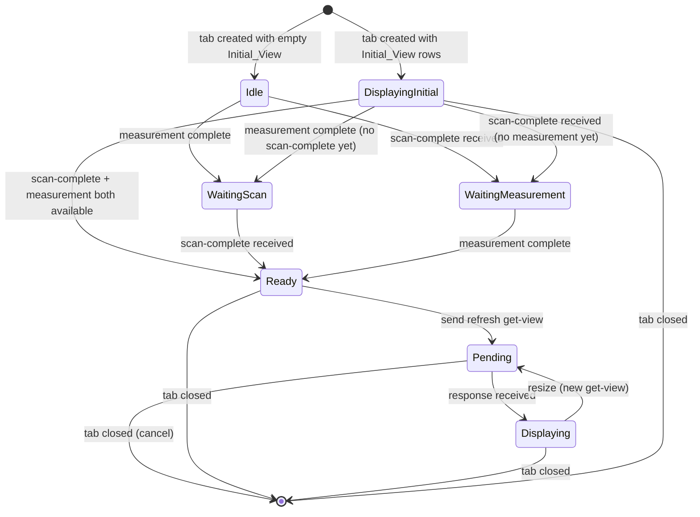

#[[file:.kiro/specs/_global/design-shared.md]]

# Text Handling — Design

## Overview

Text Handling connects the UI Shell's Text_View_Area to the backend FileViewService. When a file is opened, the frontend includes viewport dimensions in the open-file request. The backend creates a FileViewService, waits 500ms for the scan to make initial progress, calls GetViewAsync to produce an Initial_View, and returns it alongside the View_Session_ID and file path in the open-file response. The frontend renders this Initial_View immediately. Later, when the full scan completes, the backend pushes a single "scan-complete" notification, and the frontend sends a refresh "get-view" request to obtain fully-indexed content. The feature introduces:

- **View_Session_ID** — UUID generated by backend on open-file, keying all subsequent communication
- **Initial_View in open-file response** — backend waits 500ms after creating FileViewService, calls GetViewAsync with viewport dimensions from the request, includes rows in the response for immediate rendering
- **Measurement pipeline** — computes Row_Count/Col_Count from pixel dimensions and monospace Char_Metrics
- **View request orchestration** — state machine gating refresh requests on (active tab + scan-complete + measurement)
- **Scan-complete notification** — single backend push at FullScanComplete state triggers frontend refresh
- **Get-view handler** — backend parses request, invokes FileViewService.GetViewAsync, returns rows
- **Row rendering** — TextViewAreaComponent displays rows with per-tab caching
- **Session lifecycle** — create on open, dispose on close, keyed by View_Session_ID

The design extends existing components (ShellStateService, TextViewAreaComponent, Program.cs) rather than introducing new services, keeping the architecture flat.

## Architecture





### Design Decisions

1. **ShellStateService owns orchestration** — All view-request state machine logic lives in ShellStateService (extended). TextViewAreaComponent is a pure projection of signals. This keeps the state machine testable without DOM.

2. **Per-tab state record** — A new `TabViewState` record tracks scan-complete status, pending request, cached rows, and deferred-request flag per View_Session_ID. Stored in a `Map<string, TabViewState>` signal within ShellStateService.

3. **Measurement lives in TextViewAreaComponent** — Pixel measurement requires DOM access (ElementRef). The component measures and emits dimensions via an output signal. ShellStateService reads this signal to gate requests.

4. **Debounced resize via ResizeObserver** — Uses `ResizeObserver` on the host element with 150ms debounce (setTimeout). More reliable than window resize events for layout changes (tab position toggle).

5. **Open-file response format change** — The open-file response payload is `viewSessionId\nfilePath\nrow1\nrow2\n...`. The first two fields are metadata (viewSessionId and filePath), and all subsequent lines are Initial_View rows. If the scan hasn't produced data after 500ms, zero rows are returned (just `viewSessionId\nfilePath`).

6. **Session map in Program.cs** — A `Dictionary<string, FileViewService>` in the closure scope of Program.Main stores sessions. Simple, no DI needed — matches existing handler registration pattern.

7. **Scan-complete via ScanState polling** — FileViewService exposes `ScanState` (volatile read from FileIndex). The open-file handler starts a background task that polls ScanState and sends a single "scan-complete" push when FullScanComplete is reached.

8. **Accumulate queue for scan-complete** — Configured as accumulate mode so the FullScanComplete notification is delivered reliably (not latest-wins which could drop it).

9. **500ms delay for Initial_View** — The open-file handler awaits `Task.Delay(500)` after creating FileViewService, giving the scan time to index initial content. Then calls `GetViewAsync(0, 0, rowCount, colCount)` using viewport dimensions from the open-file request payload. This provides immediate content without requiring a separate round-trip.

10. **Viewport dimensions in open-file request** — Frontend includes current viewport dimensions (rowCount, colCount) in the open-file request payload so the backend knows how much data to return for the Initial_View. If dimensions aren't yet available (first file opened before measurement), fallback values of 40 rows × 120 cols are used.

## Components and Interfaces

### Tab Type Extension (shell.types.ts)

```typescript
export interface Tab {
  id: string;
  filePath: string;
  fileName: string;
  viewSessionId: string; // NEW — UUID from backend open-file response
}
```

### TabViewState (new type in shell.types.ts)

```typescript
export interface TabViewState {
  scanComplete: boolean;
  viewRows: string[] | null;       // cached rows from last successful response
  errorMessage: string | null;     // error from last get-view response
  pendingCorrelationId: string | null; // non-null while awaiting get-view response
  deferred: boolean;               // true if trigger fired before measurement ready
}
```

### ViewDimensions (new type in shell.types.ts)

```typescript
export interface ViewDimensions {
  rowCount: number;
  colCount: number;
}
```

### ShellStateService Extensions

```typescript
// New state signals
readonly tabViewStates = signal<Map<string, TabViewState>>(new Map());
readonly viewDimensions = signal<ViewDimensions | null>(null);

// New computed signals
readonly activeViewRows = computed(() => {
  const tab = this.activeTab();
  if (!tab) return null;
  const state = this.tabViewStates().get(tab.viewSessionId);
  return state?.viewRows ?? null;
});
readonly activeViewError = computed(() => {
  const tab = this.activeTab();
  if (!tab) return null;
  const state = this.tabViewStates().get(tab.viewSessionId);
  return state?.errorMessage ?? null;
});
readonly isViewPending = computed(() => {
  const tab = this.activeTab();
  if (!tab) return false;
  const state = this.tabViewStates().get(tab.viewSessionId);
  return state?.pendingCorrelationId !== null;
});

// New actions
updateViewDimensions(dims: ViewDimensions): void;
// Called by TextViewAreaComponent when measurement completes or changes

// Internal orchestration (private)
private tryTriggerViewRequest(): void;
private handleScanComplete(viewSessionId: string): void;
private handleViewResponse(msg: InboundMessage): void;
```

### TextViewAreaComponent Extensions

```typescript
@Component({
  selector: 'app-text-view-area',
  standalone: true,
  templateUrl: './text-view-area.component.html',
  styleUrl: './text-view-area.component.css'
})
export class TextViewAreaComponent implements AfterViewInit, OnDestroy {
  private readonly state = inject(ShellStateService);
  private readonly el = inject(ElementRef);

  readonly activeTab = this.state.activeTab;
  readonly hasOpenTabs = this.state.hasOpenTabs;
  readonly viewRows = this.state.activeViewRows;
  readonly viewError = this.state.activeViewError;
  readonly isViewPending = this.state.isViewPending;

  private resizeObserver: ResizeObserver | null = null;
  private debounceTimer: ReturnType<typeof setTimeout> | null = null;
  private measureEl: HTMLElement | null = null;

  ngAfterViewInit(): void {
    this.setupResizeObserver();
  }

  ngOnDestroy(): void {
    this.resizeObserver?.disconnect();
    if (this.debounceTimer) clearTimeout(this.debounceTimer);
    this.measureEl?.remove();
  }

  private setupResizeObserver(): void { /* ... */ }
  private measure(): void { /* ... */ }
  private computeCharMetrics(): { width: number; height: number } { /* ... */ }
}
```

### TextViewAreaComponent Template

```html
<div class="text-view-area" #contentArea>
  @if (!hasOpenTabs()) {
    <div class="empty-state">Ctrl-O to open a file</div>
  } @else if (viewError()) {
    <div class="view-error">{{ viewError() }}</div>
  } @else if (viewRows()) {
    <div class="view-content">
      @for (row of viewRows(); track $index) {
        <div class="view-row">{{ row }}</div>
      }
    </div>
  }
</div>
```

### Frontend Open-File Response Parsing (ShellStateService)

The open-file subscription handler parses the new response format:

```typescript
// In open-file subscription handler:
// Parse response: viewSessionId\nfilePath\nrow1\nrow2\n...
const firstNewline = msg.payload.indexOf('\n');
if (firstNewline === -1) {
  // Backward compat: no newline means entire payload is filePath
  viewSessionId = crypto.randomUUID();
  filePath = msg.payload;
  initialRows = null;
} else {
  viewSessionId = msg.payload.substring(0, firstNewline);
  const afterFirst = msg.payload.substring(firstNewline + 1);
  const secondNewline = afterFirst.indexOf('\n');
  if (secondNewline === -1) {
    // Only viewSessionId\nfilePath — no initial rows
    filePath = afterFirst;
    initialRows = null;
  } else {
    filePath = afterFirst.substring(0, secondNewline);
    const rowData = afterFirst.substring(secondNewline + 1);
    initialRows = rowData.length > 0 ? rowData.split('\n') : null;
  }
}

// Create tab and TabViewState with initial rows pre-populated
const newTabViewState: TabViewState = {
  scanComplete: false,
  viewRows: initialRows,  // Immediately available for rendering
  errorMessage: null,
  pendingCorrelationId: null,
  deferred: false,
};
```

### Frontend Open-File Request Payload (ShellStateService)

When triggering open-file, the frontend includes viewport dimensions:

```typescript
triggerOpenFile(): void {
  if (this.pendingCorrelationId() !== null) return;
  this.pendingCorrelationId.set('__pending__');

  // Include viewport dimensions in open-file payload
  const dims = this.viewDimensions();
  const rowCount = dims?.rowCount ?? 40;  // fallback
  const colCount = dims?.colCount ?? 120; // fallback
  const payload = `${rowCount}\n${colCount}`;

  const correlationId = this.messageBus.send('open-file', payload);
  this.pendingCorrelationId.set(correlationId);
}
```

### Get-View Handler (Program.cs)

```csharp
// Session storage (in Main closure scope)
var sessions = new Dictionary<string, FileViewService>();
var sessionLock = new object(); // guards dictionary access from handler + scan-monitor

messageBus.RegisterHandler("get-view", async (correlationId, payload) =>
{
    // Parse payload: viewSessionId\nstartLine\nstartCol\nrowCount\ncolCount
    var fields = payload.Split('\n');
    if (fields.Length != 5)
        return "ERROR:Invalid payload structure: expected 5 fields";

    var viewSessionId = fields[0];

    if (!int.TryParse(fields[1], out var startLine) || startLine < 0)
        return "ERROR:Invalid field: startLine";
    if (!int.TryParse(fields[2], out var startCol) || startCol < 0)
        return "ERROR:Invalid field: startCol";
    if (!int.TryParse(fields[3], out var rowCount) || rowCount < 1)
        return "ERROR:Invalid field: rowCount";
    if (!int.TryParse(fields[4], out var colCount) || colCount < 1)
        return "ERROR:Invalid field: colCount";

    FileViewService? service;
    lock (sessionLock)
    {
        sessions.TryGetValue(viewSessionId, out service);
    }

    if (service is null)
        return $"ERROR:Session not found: {viewSessionId}";

    var result = await service.GetViewAsync(startLine, startCol, rowCount, colCount);

    if (!result.IsSuccess)
        return $"ERROR:{result.Error.Message}";

    // Strip line-ending delimiters from each row, join with \n
    var rows = result.Value.Rows;
    var stripped = new string[rows.Count];
    for (int i = 0; i < rows.Count; i++)
    {
        stripped[i] = StripDelimiter(rows[i]);
    }
    return string.Join('\n', stripped);
});
```

### Open-File Handler Modification (Program.cs)

```csharp
messageBus.RegisterHandler("open-file", async (correlationId, payload) =>
{
    try
    {
        var files = app.MainWindow.ShowOpenFile("Open File", "", false, null);
        if (files != null && files.Length > 0 && !string.IsNullOrEmpty(files[0]))
        {
            var filePath = files[0];
            var viewSessionId = Guid.NewGuid().ToString();

            // Parse viewport dimensions from payload (rowCount\ncolCount)
            // Fallback to 40 rows, 120 cols if not provided or invalid
            int rowCount = 40;
            int colCount = 120;
            if (!string.IsNullOrEmpty(payload))
            {
                var dims = payload.Split('\n');
                if (dims.Length >= 2)
                {
                    if (int.TryParse(dims[0], out var r) && r >= 1) rowCount = r;
                    if (int.TryParse(dims[1], out var c) && c >= 1) colCount = c;
                }
            }

            // Create FileViewService (starts scan automatically)
            var logger = app.Services.GetRequiredService<ILogger<FileViewService>>();
            var service = new FileViewService(filePath, appLifetimeCts.Token, logger);

            lock (sessionLock)
            {
                sessions[viewSessionId] = service;
            }

            // Start scan-complete monitor
            _ = MonitorScanState(service, viewSessionId, messageBus);

            // Wait 500ms for scan to make initial progress
            await Task.Delay(500);

            // Get initial view rows
            var initialRows = "";
            try
            {
                var result = await service.GetViewAsync(0, 0, rowCount, colCount);
                if (result.IsSuccess && result.Value.Rows.Count > 0)
                {
                    var stripped = new string[result.Value.Rows.Count];
                    for (int i = 0; i < result.Value.Rows.Count; i++)
                    {
                        stripped[i] = StripDelimiter(result.Value.Rows[i]);
                    }
                    initialRows = "\n" + string.Join('\n', stripped);
                }
            }
            catch
            {
                // If GetViewAsync fails, return empty Initial_View (zero rows)
                // Frontend will display empty content until scan-complete triggers refresh
            }

            // Return viewSessionId\nfilePath\nrow1\nrow2\n...
            return $"{viewSessionId}\n{filePath}{initialRows}";
        }
        return "";
    }
    catch (Exception ex)
    {
        return $"ERROR:{ex.GetType().Name}: {ex.Message}";
    }
});
```

### Close-File Handler (Program.cs)

```csharp
messageBus.RegisterHandler("close-file", (correlationId, payload) =>
{
    var viewSessionId = payload;
    FileViewService? service;
    lock (sessionLock)
    {
        if (sessions.Remove(viewSessionId, out service))
        {
            service.Dispose();
        }
    }
    return Task.FromResult<string?>(null); // fire-and-forget
});
```

### Scan-Complete Monitor (Program.cs helper)

```csharp
static async Task MonitorScanState(FileViewService service, string viewSessionId, MessageBusHost messageBus)
{
    while (true)
    {
        await Task.Delay(50); // poll interval

        var state = service.ScanState;

        if (state >= ScanState.FullScanComplete)
        {
            messageBus.Send("scan-complete", viewSessionId);
            break;
        }

        if (state == ScanState.Failed)
            break;
    }
}
```

### StripDelimiter Helper (Program.cs)

```csharp
static string StripDelimiter(string row)
{
    if (row.Length == 0) return row;
    if (row.EndsWith("\r\n")) return row[..^2];
    if (row[^1] == '\n' || row[^1] == '\r') return row[..^1];
    return row;
}
```

## Data Models

### View Request Payload Format

```
{View_Session_ID}\n{startLine}\n{startCol}\n{rowCount}\n{colCount}
```

| Field | Position | Type | Constraints |
|-------|----------|------|-------------|
| View_Session_ID | 0 | string | UUID, no newlines |
| startLine | 1 | int | 0–2,147,483,647, decimal digits only, no leading zeros (except "0") |
| startCol | 2 | int | 0–2,147,483,647, decimal digits only, no leading zeros (except "0") |
| rowCount | 3 | int | 1–2,147,483,647, decimal digits only, no leading zeros (except "0") |
| colCount | 4 | int | 1–2,147,483,647, decimal digits only, no leading zeros (except "0") |

Delimiter: U+000A (newline). Exactly 4 newlines in a valid payload (producing 5 fields).

### View Response Format

**Success:** Row strings joined by `\n` (U+000A). Each row has line-ending delimiters stripped before joining. Empty rows are empty strings between newlines.

**Error:** Single string beginning with `ERROR:` (6 chars: E,R,R,O,R,colon) followed by error description.

### Open-File Request Payload Format

```
{rowCount}\n{colCount}
```

| Field | Position | Type | Constraints |
|-------|----------|------|-------------|
| rowCount | 0 | int | 1–2,147,483,647, decimal digits only |
| colCount | 1 | int | 1–2,147,483,647, decimal digits only |

The frontend includes current viewport dimensions so the backend can produce an appropriately-sized Initial_View. If dimensions are not yet available (e.g., first file opened before measurement completes), the frontend sends fallback values: `40\n120`.

### Open-File Response Format (modified)

**Success with Initial_View:** `{viewSessionId}\n{filePath}\n{row1}\n{row2}\n...` — first field is viewSessionId, second is filePath, remaining lines (if any) are Initial_View rows. The frontend splits on the first newline to get viewSessionId, the second newline to get filePath, and treats everything after the second newline as Initial_View row data (split by `\n`).

**Success with empty Initial_View:** `{viewSessionId}\n{filePath}` — two newline-delimited fields, no rows. Frontend displays empty content region until scan-complete triggers refresh.

**Cancel:** Empty string (unchanged).

**Error:** `ERROR:{description}` (unchanged).

### Session Storage

```csharp
// In Program.Main closure
Dictionary<string, FileViewService> sessions;
object sessionLock; // protects sessions dictionary
```

### Frontend State Shape (extended)

| Signal | Type | Description |
|--------|------|-------------|
| `tabViewStates` | `Map<string, TabViewState>` | Per-session view state (keyed by viewSessionId) |
| `viewDimensions` | `ViewDimensions \| null` | Current measured row/col counts (null before first measurement) |

### Measurement Algorithm

```
measure():
  if no active tab → skip
  pixelWidth = hostElement.clientWidth
  pixelHeight = hostElement.clientHeight
  charMetrics = computeCharMetrics()
  rowCount = max(1, floor(pixelHeight / charMetrics.height))
  colCount = max(1, floor(pixelWidth / charMetrics.width))
  emit { rowCount, colCount }

computeCharMetrics():
  create off-screen span (position:absolute, visibility:hidden, white-space:pre)
  apply same font-family + font-size as .view-row
  set textContent = "M"
  measure getBoundingClientRect() → { width, height }
  remove span
  return { width, height }
```

### View Request Orchestration Rules

| Condition | Action |
|-----------|--------|
| open-file response received with Initial_View rows | Store rows in TabViewState.viewRows immediately, render |
| activeTab + scanComplete + dimensions available + no pending | Send refresh get-view |
| activeTab + scanComplete + dimensions NOT available | Set deferred=true |
| dimensions become available + deferred=true for active tab | Send refresh get-view, clear deferred |
| active tab changes + deferred for old tab | Cancel deferred for old tab |
| active tab changes to tab with scanComplete + dimensions | Send refresh get-view (if no cached rows from refresh, or resize occurred) |
| resize + scanComplete for active tab | Send get-view with new dimensions |
| tab closed | Cancel pending, send close-file, remove TabViewState |
| pending response received | Store rows in cache, clear pending |

## Correctness Properties

*A property is a characteristic or behavior that should hold true across all valid executions of a system — essentially, a formal statement about what the system should do. Properties serve as the bridge between human-readable specifications and machine-verifiable correctness guarantees.*

### Property 1: Dimension computation correctness

*For any* positive pixel width W, pixel height H, positive char width CW, and positive char height CH, the computed Row_Count SHALL equal max(1, floor(H / CH)) and Col_Count SHALL equal max(1, floor(W / CW)).

**Validates: Requirements 1.3, 1.4**

### Property 2: View request orchestration invariant

*For any* sequence of events (tab-activate, scan-complete, measurement-complete, resize, tab-close), the system SHALL send a refresh get-view request if and only if all three conditions hold (active tab exists, scan-complete received for that tab's session, dimensions available), SHALL never have more than one pending request per tab, and SHALL cancel pending/deferred requests when the associated tab is closed or deactivated. The Initial_View from the open-file response SHALL be rendered immediately without requiring scan-complete or measurement.

**Validates: Requirements 2.1, 2.2, 2.4, 2.5, 2.6, 2.7, 3.3, 8.4**

### Property 3: Payload format round-trip

*For any* valid View_Session_ID (string without newlines), startLine ≥ 0, startCol ≥ 0, rowCount ≥ 1, colCount ≥ 1 (all within 0–2,147,483,647), encoding these values as a newline-delimited 5-field string and then parsing that string SHALL recover the original values exactly.

**Validates: Requirements 4.1, 6.1, 6.2**

### Property 4: Response encoding correctness

*For any* list of row strings (each potentially ending with \n, \r\n, or \r), the success response encoding SHALL produce a string equal to the rows with line-ending delimiters stripped, joined by \n. *For any* error message string, the error response SHALL be "ERROR:" concatenated with that message.

**Validates: Requirements 4.4, 4.5, 6.5, 6.6**

### Property 5: Payload parse error identification

*For any* malformed payload (wrong field count, or any numeric field containing non-digit characters, leading zeros on values > 0, or values outside 0–2,147,483,647), the parser SHALL return an error response beginning with "ERROR:" that identifies the specific structural or field-level failure.

**Validates: Requirements 4.6, 6.3, 6.4**

### Property 6: Session lifecycle invariant

*For any* sequence of open-file and close-file operations, each open-file SHALL produce a unique View_Session_ID and store a retrievable FileViewService instance; each close-file SHALL dispose and remove the instance; get-view for a closed or never-opened session SHALL return an error; multiple opens of the same file path SHALL produce independent sessions.

**Validates: Requirements 7.1, 7.3, 7.5**

### Property 7: Open-file response format round-trip

*For any* valid viewSessionId (string without newlines), filePath (string without newlines), and list of Initial_View row strings (each without newlines), encoding them as `viewSessionId\nfilePath\nrow1\nrow2\n...` and then parsing that string SHALL recover the original viewSessionId, filePath, and row list exactly. When the row list is empty, the encoding SHALL be `viewSessionId\nfilePath` (no trailing newline).

**Validates: Requirements 7.2, 8.3, 8.4**

### Property 8: Open-file request payload round-trip

*For any* rowCount ≥ 1 and colCount ≥ 1 (both within 1–2,147,483,647), encoding them as `rowCount\ncolCount` and then parsing that string SHALL recover the original values exactly. When the payload is empty or malformed, the backend SHALL use fallback values (40 rows, 120 cols).

**Validates: Requirements 8.2, 8.6**

## Error Handling

| Scenario | Layer | Behavior |
|----------|-------|----------|
| Char_Metrics measurement returns 0 width/height | Frontend | Use fallback (8px width, 16px height) — prevents division by zero |
| get-view payload parse failure | Backend | Return `ERROR:Invalid payload structure: expected 5 fields` or `ERROR:Invalid field: {fieldName}` |
| Session not found for get-view | Backend | Return `ERROR:Session not found: {viewSessionId}` |
| FileViewService.GetViewAsync returns ViewError | Backend | Return `ERROR:{viewError.Message}` |
| scan-complete for unknown session (frontend) | Frontend | Discard silently — no matching tab |
| GetViewAsync fails during 500ms initial view | Backend | Return empty Initial_View (zero rows); frontend shows empty content until scan-complete refresh |
| View response for non-active tab | Frontend | Store in TabViewState cache, don't render |
| View response after tab closed | Frontend | Discard — TabViewState already removed |
| close-file for unknown session (backend) | Backend | No-op, return null (fire-and-forget) |
| ResizeObserver not supported | Frontend | Fallback to window resize event with same debounce |
| open-file response parse failure (no newline) | Frontend | Treat entire payload as filePath (backward compat), generate client-side viewSessionId, empty Initial_View — but this should not occur with updated backend |

## Testing Strategy

### Property-Based Tests (fast-check, `{ numRuns: 10 }`)

**Frontend test file:** `src/app/shell/text-handling.property.spec.ts`

| Property | Generators | Asserts |
|----------|-----------|---------|
| 1: Dimension computation | Random positive floats for pixel W/H (1–5000) and char W/H (1–100) | rowCount = max(1, floor(H/CH)), colCount = max(1, floor(W/CW)) |
| 2: View request orchestration | Random event sequences from {activateTab, scanComplete, measureComplete, resize, closeTab, openFileResponse} (length 1–20) | Refresh request sent iff scanComplete + dimensions; Initial_View rendered immediately; at most 1 pending per tab; cancel on close |
| 3: Payload format round-trip | Random UUIDs (no newlines), random ints 0–2^31-1 for numeric fields | encode → parse recovers original values |
| 4: Response encoding | Random string arrays (0–50 rows, each 0–200 chars with random line endings) | Strip delimiters + join by \n matches expected |
| 5: Payload parse error identification | Random malformed payloads (wrong field count, non-digits, leading zeros, out-of-range) | Error response starts with "ERROR:" and identifies failure |
| 6: Session lifecycle | Random sequences of {open, close, getView} operations (length 1–15) | Invariants hold: unique IDs, correct lookup, dispose on close |
| 7: Open-file response format round-trip | Random viewSessionId, filePath (no newlines), random row arrays (0–50 rows, no newlines in rows) | encode → parse recovers viewSessionId, filePath, and rows exactly |
| 8: Open-file request payload round-trip | Random rowCount (1–2^31-1), colCount (1–2^31-1) | encode → parse recovers values; empty/malformed → fallback (40, 120) |

**Backend test file:** Property tests for payload parsing, response encoding, and open-file response format in xUnit + FsCheck (`[Property(MaxTest = 10)]`).

### Unit Tests

**Frontend:**

| Test | Validates |
|------|-----------|
| Measurement skipped when no active tab | Req 1.7 |
| Measurement triggered on active tab (AfterViewInit) | Req 1.1 |
| Char_Metrics uses "M" reference character | Req 1.2 |
| Resize debounce: multiple events within 150ms → single recompute | Req 1.5 |
| Dimension change emits new values | Req 1.6 |
| scan-complete subscription configured with accumulate queue | Req 3.5 |
| scan-complete for unknown session discarded | Req 3.4 |
| View rows rendered as block elements in order | Req 5.1, 5.2 |
| Overflow hidden on content container | Req 5.3 |
| Error response displayed in distinct style | Req 5.4 |
| Tab switch shows cached rows synchronously | Req 5.5 |
| Pending state with no cache shows empty content | Req 5.6 |
| close-file sent on tab close with viewSessionId | Req 7.7 |
| open-file response parsed: viewSessionId + filePath + initial rows | Req 7.2, 8.3, 8.4 |
| Initial_View rows rendered immediately on open-file response | Req 2.1, 8.4 |
| open-file request includes viewport dimensions | Req 8.2, 8.6 |
| open-file request uses fallback dimensions when measurement unavailable | Req 8.6 |
| scan-complete triggers refresh get-view (not initial display) | Req 2.2, 8.7 |

**Backend:**

| Test | Validates |
|------|-----------|
| get-view with valid payload → correct GetViewAsync params | Req 4.3 |
| get-view with 4 fields → ERROR (wrong count) | Req 6.3 |
| get-view with non-integer startLine → ERROR identifies field | Req 6.4 |
| get-view with unknown session → ERROR session not found | Req 4.2 |
| open-file creates session, returns viewSessionId\nfilePath\nrows | Req 7.1, 7.2, 8.1, 8.2, 8.3 |
| open-file waits 500ms before responding | Req 8.1 |
| open-file parses viewport dimensions from payload | Req 8.2 |
| open-file uses fallback dimensions (40×120) when payload empty | Req 8.6 |
| open-file returns empty Initial_View when GetViewAsync fails | Req 8.5 |
| close-file disposes service and removes from map | Req 7.5 |
| close-file with unknown session → no-op | Req 7.6 |
| scan-complete sent only at FullScanComplete | Req 3.1 |
| scan-complete is Backend_Push (messageBus.Send) | Req 3.2 |
| Multiple opens of same file → independent sessions | Req 7.3 |

### Integration Tests

| Test | Validates |
|------|-----------|
| Full flow: open-file → Initial_View rendered → scan-complete → refresh get-view → updated rows | Req 1–8 |
| Open-file with viewport dimensions → backend returns correctly sized Initial_View | Req 8.1, 8.2, 8.3 |
| Resize triggers new get-view with updated dimensions | Req 1.5, 2.6 |
| Tab switch to cached tab shows rows without new request | Req 5.5 |
| Tab close cancels pending request and sends close-file | Req 2.7, 7.7 |

### Test Boundaries

- **Property tests (frontend)**: Pure logic — dimension math, payload encode/decode, orchestration state machine (mock MessageBusClient)
- **Property tests (backend)**: Payload parsing, response encoding, session map operations (mock FileViewService)
- **Unit tests (frontend)**: Component behavior with mocked ShellStateService signals
- **Unit tests (backend)**: Handler logic with mocked FileViewService and MessageBusHost
- **Integration tests**: Real MessageBusClient ↔ MessageBusHost with mocked FileViewService
