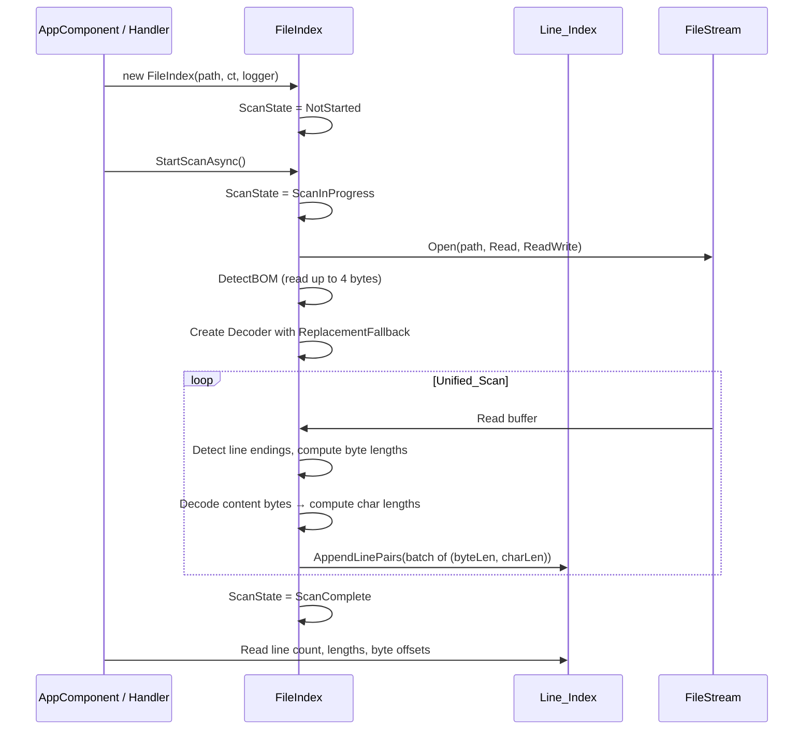
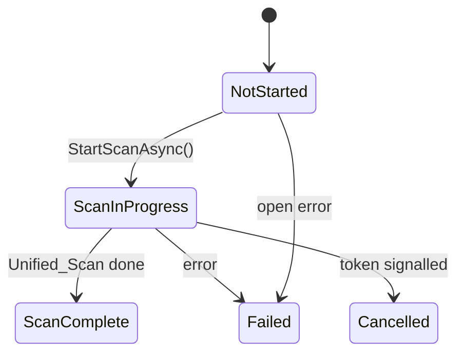
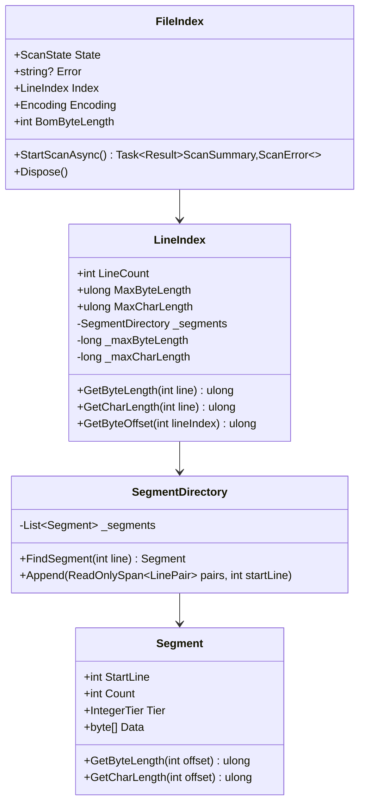

# Unified Scan Pass — Design

#[[file:.kiro/specs/_global/design-shared.md]]

## Overview

FileIndex currently scans files in two sequential phases: Quick_Scan identifies line endings and records byte lengths, then Full_Scan re-reads the file to compute character lengths. This feature merges both phases into a single unified pass that performs BOM detection first, then scans the file sequentially — detecting line endings, recording byte lengths, AND computing character lengths simultaneously. The result is a simpler state machine (NotStarted → ScanInProgress → ScanComplete/Failed/Cancelled), no second file read, and immediate availability of all metrics upon completion.

Key design decisions:
- BOM detection remains a separate initial step (read up to 4 bytes) before the main scan loop begins
- The unified scan loop accumulates raw bytes for each line, detects line endings, computes byte length, decodes content bytes using the detected encoding, and computes char length — all before appending the pair to Line_Index
- Line_Index `AppendLinePairs` replaces separate `AppendByteLengths` + `SetCharLength` — both values written atomically per batch
- Tier selection uses `max(byteLength, charLength)` per segment (in practice always byteLength since charLength ≤ byteLength)
- Abort semantics preserved: any failure during the single pass clears Line_Index entirely
- `GetCharLength` returns non-nullable `ulong` (no progressive availability concept)

## Architecture







## Components and Interfaces

### FileIndex (C#) — Updated

```csharp
namespace TextViewer.Services;

public sealed class FileIndex : IDisposable
{
    private readonly string _filePath;
    private readonly CancellationToken _cancellationToken;
    private readonly ILogger<FileIndex> _logger;
    private FileStream? _stream;
    private volatile ScanState _state = ScanState.NotStarted;
    private volatile string? _error;

    public FileIndex(string filePath, CancellationToken cancellationToken, ILogger<FileIndex> logger);

    public ScanState State => _state;
    public string? Error => _error;
    public LineIndex Index { get; }
    public Encoding Encoding { get; private set; } = Encoding.UTF8;
    public int BomByteLength { get; private set; } = 0;

    /// <summary>
    /// Starts the unified single-pass scan. Returns when scan completes, fails, or is cancelled.
    /// </summary>
    public Task<Result<ScanSummary, ScanError>> StartScanAsync();
    public void Dispose();
}
```

### ScanState Enum — Simplified

```csharp
namespace TextViewer.Services;

public enum ScanState
{
    NotStarted = 0,
    ScanInProgress = 1,
    ScanComplete = 2,
    Failed = 3,
    Cancelled = 4
}
```

### LineIndex (C#) — Updated

```csharp
namespace TextViewer.Services;

public sealed class LineIndex
{
    private readonly object _writeLock = new();
    private SegmentDirectory _segments = new();
    private ulong[] _segmentPrefixBytes = [];
    private volatile int _lineCount;
    private long _totalByteLength;
    private long _maxByteLength;
    private long _maxCharLength;

    public int LineCount => _lineCount;
    public ulong MaxByteLength => (ulong)Interlocked.Read(ref _maxByteLength);
    public ulong MaxCharLength => (ulong)Interlocked.Read(ref _maxCharLength);

    public ulong GetByteLength(int lineIndex);
    public ulong GetCharLength(int lineIndex);
    public ulong GetByteOffset(int lineIndex);

    /// <summary>
    /// Appends complete line pairs (byteLength, charLength) during unified scan.
    /// Thread-safety: holds _writeLock, writes segment data, then increments _lineCount.
    /// </summary>
    internal void AppendLinePairs(ReadOnlySpan<LinePair> pairs);
    internal void Clear();
}
```

### LinePair — New Value Type

```csharp
namespace TextViewer.Services;

/// <summary>
/// Paired byte + char lengths for a single line, used during unified scan batch append.
/// </summary>
internal readonly record struct LinePair(ulong ByteLength, ulong CharLength);
```

### SegmentDirectory — Updated Append

```csharp
namespace TextViewer.Services;

internal sealed class SegmentDirectory
{
    private readonly List<Segment> _segments = new();

    public int TotalLines { get; private set; }
    public Segment FindSegment(int lineIndex);
    public (Segment Segment, int SegmentIndex) FindSegmentWithIndex(int lineIndex);

    /// <summary>
    /// Appends complete pairs, creating segments with optimal tier selection.
    /// Tier determined by max byte length value in each run (charLength ≤ byteLength always fits).
    /// </summary>
    public void Append(ReadOnlySpan<LinePair> pairs, int startLineIndex);
    public void Clear();
}
```

### Segment — Unchanged Interface

```csharp
namespace TextViewer.Services;

internal sealed class Segment
{
    public int StartLine { get; }
    public int Count { get; }
    public IntegerTier Tier { get; }
    internal byte[] Data { get; }

    public ulong GetByteLength(int offsetWithinSegment);
    public ulong GetCharLength(int offsetWithinSegment);
}
```

### Unified Scan Algorithm

```csharp
private async Task RunUnifiedScanAsync()
{
    // 1. BOM detection (reads up to 4 bytes, sets Encoding + BomByteLength)
    DetectBom();

    // 2. Create decoder with replacement fallback
    var decoder = CreateReplacementDecoder();

    // 3. Seek to post-BOM position (or 0 if no BOM)
    // Actually: scan from byte 0, but exclude BOM bytes from first line's char count

    const int BufferSize = 65536;
    var buffer = new byte[BufferSize];
    var batch = new List<LinePair>(1000);
    // Accumulate current line bytes
    var lineBytes = new MemoryStream();
    bool previousByteWasCR = false;
    bool isFirstLine = true;

    // Sequential read loop
    int bytesRead;
    while ((bytesRead = await _stream.ReadAsync(buffer.AsMemory(0, BufferSize), _ct)) > 0)
    {
        for (int i = 0; i < bytesRead; i++)
        {
            byte b = buffer[i];
            // Line ending detection + accumulation (same logic as current Quick_Scan)
            // On line boundary: compute byteLength (including delimiter),
            //   decode content bytes → charLength, emit LinePair
        }
        _ct.ThrowIfCancellationRequested();
    }

    // Flush final line + batch
    // Append remaining pairs to LineIndex
}
```

## Data Models

### ScanState Enum (New)

```csharp
namespace TextViewer.Services;

public enum ScanState
{
    NotStarted = 0,
    ScanInProgress = 1,
    ScanComplete = 2,
    Failed = 3,
    Cancelled = 4
}
```

### LinePair (New)

```csharp
namespace TextViewer.Services;

internal readonly record struct LinePair(ulong ByteLength, ulong CharLength);
```

### ScanSummary / ScanError — Preserved

```csharp
public sealed record ScanSummary(int LineCount, System.Text.Encoding Encoding, int BomByteLength);
public sealed record ScanError(ScanErrorCode Code, string Message);

public enum ScanErrorCode
{
    FileNotFound,
    AccessDenied,
    IoError,
    OutOfMemory,
    Cancelled,
    Unknown
}
```

### Segment Memory Layout — Preserved

Each segment stores interleaved pairs of (Byte_Length, Char_Length):
- **Metadata**: StartLine (int, 4B) + Count (int, 4B) + Tier (byte, 1B) = 9 bytes overhead
- **Data**: Count × 2 × TierSize bytes

```
Data layout: [byteLen0, charLen0, byteLen1, charLen1, ...]
Segment memory = 9 + (Count × 2 × TierSize)
```

### Tier Selection — Preserved

```
selectTier(maxByteLength) → IntegerTier
    if maxByteLength <= 255:       return Byte
    if maxByteLength <= 65535:     return UShort
    if maxByteLength <= 4294967295: return UInt
    return ULong
```

Tier selected per segment by max Byte_Length in that segment's run. Char_Length ≤ Byte_Length guarantees it fits in the same tier.

### Thread-Safety Model — Simplified

| Operation | Mechanism | Guarantee |
|-----------|-----------|-----------|
| ScanState read | `volatile` field | No torn read |
| Error read | `volatile` field | Atomic reference |
| LineCount read | `volatile int` | Atomic read |
| GetByteLength | Segment data immutable after write; lock + volatile count publish | No torn read |
| GetCharLength | Same as GetByteLength — both written atomically in AppendLinePairs | No torn read |
| MaxByteLength | `Interlocked.Read` on `long` field; updated inside `_writeLock` | Atomic 64-bit read |
| MaxCharLength | `Interlocked.Read` on `long` field; updated inside `_writeLock` | Atomic 64-bit read |
| GetByteOffset | Reads only committed segments | Consistent sum |
| AppendLinePairs | `_writeLock`; publishes segment then increments `_lineCount` | Complete pairs only |
| Encoding | Set once before scan publishes lines | Immutable after init |
| BomByteLength | Set once before scan publishes lines | Immutable after init |

**Key simplification**: No `_charLengthsWrittenUpTo` counter needed. Both values written together in `AppendLinePairs`. A line is either fully visible (both lengths) or not visible at all.

### Byte-Offset Navigation — Preserved

```
GetByteOffset(lineIndex):
    if lineIndex == 0: return 0
    if lineIndex == LineCount: return totalByteLength

    (segment, segmentIndex) = FindSegmentWithIndex(lineIndex)
    offset = segmentPrefixBytes[segmentIndex]
    for i in 0..<(lineIndex - segment.StartLine):
        offset += segment.GetByteLength(i)
    return offset
```

### Error Property Format — Preserved

| Scenario | Format |
|----------|--------|
| File not found | `"Failed to open {filePath}: FileNotFoundException"` |
| Access denied | `"Failed to open {filePath}: UnauthorizedAccessException"` |
| I/O error on open | `"Failed to open {filePath}: IOException"` |
| Scan failure | `"Scan failed for {filePath}: {ExceptionType}"` |


## Correctness Properties

*A property is a characteristic or behavior that should hold true across all valid executions of a system — essentially, a formal statement about what the system should do. Properties serve as the bridge between human-readable specifications and machine-verifiable correctness guarantees.*

### Property 1: Byte-length round-trip

*For any* byte sequence representing file content (with any mix of LF, CR, CRLF, and unterminated final lines), the sum of all stored Byte_Lengths SHALL equal the total file size in bytes, AND reconstructing the file by concatenating each line's bytes (sized by Byte_Length) SHALL produce the original byte sequence, AND the line count SHALL equal the number of delimiters plus one if trailing content exists (zero for empty files).

**Validates: Requirements 1.1, 2.1, 2.2, 2.3**

### Property 2: Char-length correctness

*For any* file content and detected encoding (UTF-8, UTF-16 LE/BE, UTF-32 LE/BE), the Char_Length stored for each line SHALL equal the `.Length` of the .NET string produced by decoding that line's content bytes (excluding delimiter bytes) with the encoding using ReplacementFallback, excluding BOM characters on the first line only.

**Validates: Requirements 3.1, 3.2**

### Property 3: Abort produces no partial index

*For any* file content and any failure point during the unified scan (I/O error, cancellation, OOM), after abort the Line_Index SHALL contain zero lines, ScanState SHALL be Failed or Cancelled, and no partial line data SHALL be observable by any reader thread.

**Validates: Requirements 1.4, 2.4, 6.1, 6.3**

### Property 4: State machine transition validity

*For any* sequence of scan events (success, failure, cancel), ScanState SHALL only transition through valid forward edges: NotStarted → ScanInProgress → ScanComplete, or to Failed/Cancelled from any active state. Backward transitions SHALL never occur. Failed and Cancelled are terminal.

**Validates: Requirements 5.7**

### Property 5: Concurrent read safety

*For any* interleaving of a single writer thread appending line pairs and multiple reader threads querying the Line_Index, every reader SHALL observe either a complete previously-written value or the absence of the line (lineIndex >= LineCount). No torn or partially-updated pair SHALL ever be observable.

**Validates: Requirements 7.1, 7.2, 3.3**

### Property 6: Segment tier minimality

*For any* segment in the Line_Index, the IntegerTier SHALL be the smallest tier whose max representable value ≥ the maximum Byte_Length stored in that segment.

**Validates: Requirements 7.3, 8.1**

### Property 7: Segment boundary optimality

*For any* pair of adjacent segments, merging them into one SHALL NOT reduce total memory consumption. AND for any single segment, splitting it at any point SHALL NOT reduce total memory consumption.

**Validates: Requirements 8.2, 8.3**

## Error Handling

| Scenario | Behavior | ScanState | Error Property |
|----------|----------|-----------|----------------|
| File not found | Skip scan, log Error | Failed | `"Failed to open {path}: FileNotFoundException"` |
| Access denied | Skip scan, log Error | Failed | `"Failed to open {path}: UnauthorizedAccessException"` |
| I/O error on open | Skip scan, log Error | Failed | `"Failed to open {path}: IOException"` |
| I/O error during scan | Abort, clear Line_Index | Failed | `"Scan failed for {path}: IOException"` |
| Invalid bytes during scan | Use U+FFFD, count as 1 code unit | continues | (no error) |
| CancellationToken during scan | Stop I/O ≤500ms, clear Line_Index | Cancelled | (no error) |
| Memory failure during scan | Abort, clear Line_Index | Failed | `"Scan failed for {path}: OutOfMemoryException"` |
| Resource release failure on Dispose | Log Warning, continue | unchanged | unchanged |

### Disposal Strategy — Preserved

```csharp
public void Dispose()
{
    try { _stream?.Dispose(); }
    catch (Exception ex) { _logger.LogWarning(ex, "Failed to close file stream"); }

    try { Index.Clear(); }
    catch (Exception ex) { _logger.LogWarning(ex, "Failed to clear index"); }

    _logger.LogDebug("FileIndex disposed for {FilePath}", _filePath);
}
```

## Testing Strategy

### Property-Based Tests (FsCheck + xUnit)

Library: **FsCheck 2.x** with xUnit integration (`FsCheck.Xunit`).
Configuration: `[Property(MaxTest = 10)]` per workspace testing policy.
Tag format: `Feature: unified-scan-pass, Property {N}: {title}`

| Property | Generators | Asserts |
|----------|-----------|---------|
| 1: Byte-length round-trip | Random byte arrays (0–10KB) with mixed LF/CR/CRLF endings | Sum == file size; reconstruct == original; line count correct |
| 2: Char-length correctness | Random strings encoded UTF-8/UTF-16/UTF-32 with optional BOM, multi-byte chars, invalid byte sequences | Stored == .NET Encoding.GetCharCount (with ReplacementFallback) |
| 3: Abort produces no partial index | Random byte arrays + random failure injection point | LineCount == 0; State is Failed or Cancelled |
| 4: State machine validity | Random event sequences {Success, Failure, Cancel} | All transitions follow valid forward edges |
| 5: Concurrent read safety | Random line pairs + concurrent reader threads during append | No torn values; all reads complete |
| 6: Tier minimality | Random ulong pairs (0–1000 lines) spanning tier boundaries | Tier == selectTier(max byteLength in segment) |
| 7: Boundary optimality | Random ulong pairs with tier-crossing patterns | No profitable merge or split between adjacent segments |

### Unit Tests

| Test | Validates |
|------|-----------|
| Opens with FileShare.ReadWrite, FileAccess.Read | Req 11.1 |
| Missing file → Failed + correct Error | Req 11.3 |
| Access denied → Failed + correct Error | Req 11.2 |
| LF/CR/CRLF/mixed line endings | Req 2.1 |
| Byte_Length includes delimiter bytes | Req 2.2 |
| Final unterminated line | Req 2.2 |
| Empty file → 0 lines | Req 2.3 |
| Scan error → empty Line_Index | Req 1.4, 6.1 |
| UTF-8 multi-byte chars | Req 3.1 |
| BOM excluded from Char_Length | Req 3.1 |
| Invalid bytes → U+FFFD counted | Req 3.2 |
| BOM detection for each signature | Req 4.1 |
| File < 4 bytes BOM detection | Req 4.3 |
| State transitions (happy path) | Req 5.2, 5.3 |
| GetByteOffset correctness | Req 10.2 |
| MaxCharLength is non-nullable ulong after ScanComplete | Req 10.3 |
| Dispose releases handle | Req 12.2 |
| Disposal failure → log + continue | Req 12.3 |
| Double Dispose → no exception | Req 12.4 |
| CancellationToken → Cancelled state | Req 6.2 |
| ScanInProgress visible before I/O | Req 5.2 |

### Integration Tests

| Test | Validates |
|------|-----------|
| Scan real file end-to-end (byte + char lengths correct) | Req 1.1, 1.2 |
| No second file read (stream position never seeks backward after BOM) | Req 1.3 |
| Concurrent readers during scan | Req 7.1 |
| Cancellation stops ≤500ms | Req 6.2 |
| Large file (1M+ lines) no OOM | Req 8 |
| GetByteOffset matches file positions | Req 10.2 |

### Test Boundaries

- **Unit**: mock FileStream, test LineIndex/segmentation/BOM detection in isolation
- **Property**: pure logic (segmentation, tier selection, line parsing, char decoding, pairs)
- **Integration**: real file I/O, real threading, real cancellation
- **No UI tests**: caller/Status_Display behavior tested in separate frontend spec
