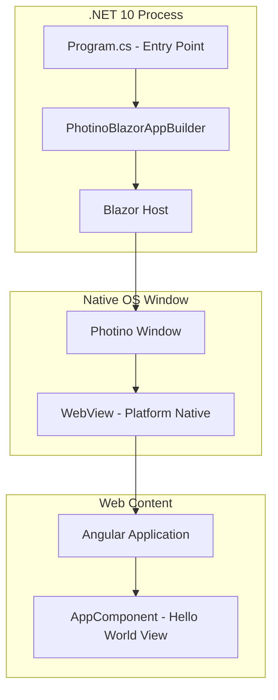
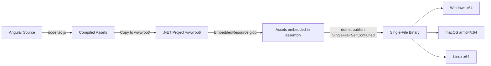
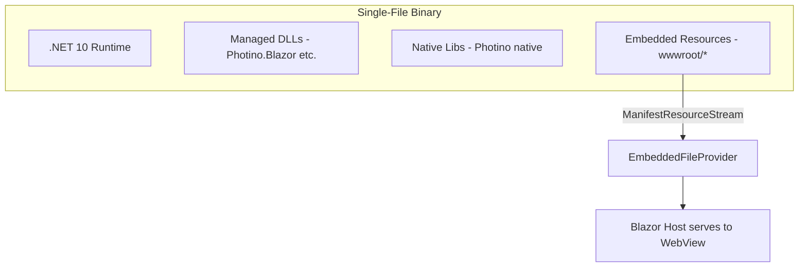

# Design Document

## Overview

This design describes the architecture for a cross-platform desktop application built with C# .NET 10, using Photino.Blazor to host an Angular frontend. The initial version renders a "Hello World" message, establishing the foundational project structure for future development.

The application uses a layered approach:
- **Native layer**: Photino provides the OS-native window using the platform's built-in webview (WebView2 on Windows, WebKit on macOS/Linux)
- **Host layer**: Photino.Blazor bridges .NET and the webview, serving static content
- **Frontend layer**: Angular application compiled to static assets, served through the Blazor host

### Key Design Decisions

1. **Photino.Blazor over Photino.NET directly**: Using Photino.Blazor provides the Blazor component model and service infrastructure, which enables future interop between C# backend services and the Angular frontend via JavaScript interop.

2. **Angular served as static assets**: The Angular app is pre-built and its output (`wwwroot/`) is served by the Blazor static file host. This keeps the Angular build pipeline independent from the .NET build while integrating cleanly at runtime.

3. **Single project structure**: For this initial stub, a single .NET project contains both the host application and the Angular source, simplifying the build and deployment pipeline.

4. **Single-file self-contained deployment**: The published binary embeds all Angular assets as .NET embedded resources and bundles the .NET runtime. No external files/folders needed at runtime. This uses `PublishSingleFile` + `SelfContained` + `IncludeAllContentForSelfExtract` in the publish profile, combined with `EmbeddedResource` items for wwwroot/ contents so Photino.Blazor can serve them from memory.

## Architecture



### Build Pipeline



### Single-File Publish Strategy

The publish pipeline produces one self-contained executable per platform RID. Key mechanisms:

1. **Embedded Resources**: All `wwwroot/**` files included as `EmbeddedResource` items via MSBuild glob → accessible at runtime through `Assembly.GetManifestResourceStream`.
2. **Custom Static File Provider**: At startup, Photino.Blazor's static file serving is configured with a custom `IFileProvider` that reads from embedded resources instead of disk.
3. **Publish Flags**:
   - `PublishSingleFile=true` — packs all managed DLLs into one binary
   - `SelfContained=true` — bundles .NET 10 runtime
   - `IncludeAllContentForSelfExtract=true` — ensures native libs (Photino native, WebView2 loader) also pack into single file
   - `EnableCompressionInSingleFile=true` — reduces binary size



## Components and Interfaces

### 1. .NET Host Application (`Program.cs`)

The entry point that configures and launches the Photino.Blazor application.

**Responsibilities:**
- Create and configure `PhotinoBlazorAppBuilder`
- Register the Blazor root component
- Configure the Photino window properties (title, size, resizability)
- Start the application event loop

**Interface:**
```csharp
// Program.cs - Top-level statements
var appBuilder = PhotinoBlazorAppBuilder.CreateDefault(args);

// Register root component
appBuilder.RootComponents.Add<App>("app");

var app = appBuilder.Build();

// Configure window
app.MainWindow
    .SetTitle("Text Viewer")
    .SetUseOsDefaultSize(true)
    .SetResizable(true);

app.Run();
```

### 2. Blazor Root Component (`App.razor`)

Minimal Blazor component that serves as the mounting point for the Angular application.

**Responsibilities:**
- Provide the HTML shell that loads Angular
- Reference Angular's compiled JavaScript and CSS bundles

**Interface:**
```razor
@* App.razor *@
<!DOCTYPE html>
<html>
<head>
    <meta charset="utf-8" />
    <base href="/" />
    <link rel="stylesheet" href="styles.css" />
</head>
<body>
    <app-root></app-root>
    <script src="runtime.js"></script>
    <script src="polyfills.js"></script>
    <script src="main.js"></script>
</body>
</html>
```

### 3. Angular Application (`ClientApp/`)

The Angular frontend application that renders the UI.

**Responsibilities:**
- Provide the root `AppComponent` that displays "Hello World"
- Compile to static JavaScript/CSS assets

**Key Files:**
- `ClientApp/src/app/app.component.ts` — Root component with "Hello World" template
- `ClientApp/src/app/app.component.html` — Template rendering the Hello World view
- `ClientApp/src/main.ts` — Angular bootstrap entry
- `ClientApp/angular.json` — Build configuration targeting `wwwroot/` output

### 4. Project File (`TextViewer.csproj`)

MSBuild project file that orchestrates both .NET and Angular builds.

**Responsibilities:**
- Target .NET 10 with `Microsoft.NET.Sdk.Razor` SDK
- Reference `Photino.Blazor` NuGet package
- Define build targets to invoke `node tsc.js` and copy output to `wwwroot/`
- Embed all `wwwroot/` contents as `EmbeddedResource` for single-file deployment
- Configure runtime identifiers for cross-platform publishing
- Configure single-file self-contained publish properties

**Publish Configuration (in `<PropertyGroup>`):**
```xml
<PropertyGroup>
  <TargetFramework>net10.0</TargetFramework>
  <PublishSingleFile>true</PublishSingleFile>
  <SelfContained>true</SelfContained>
  <IncludeAllContentForSelfExtract>true</IncludeAllContentForSelfExtract>
  <EnableCompressionInSingleFile>true</EnableCompressionInSingleFile>
  <RuntimeIdentifiers>win-x64;osx-x64;osx-arm64;linux-x64</RuntimeIdentifiers>
</PropertyGroup>
```

**Embedded Resources (wwwroot glob):**
```xml
<ItemGroup>
  <EmbeddedResource Include="wwwroot\**\*" />
  <!-- Exclude from Content to avoid duplication in publish output -->
  <Content Remove="wwwroot\**\*" />
</ItemGroup>
```

### 5. Embedded File Provider (`EmbeddedStaticFileProvider.cs`)

Custom `IFileProvider` implementation that serves wwwroot assets from embedded resources at runtime.

**Responsibilities:**
- Resolve file paths (e.g., `/main.js`) to embedded resource names
- Provide `IFileInfo` and `IDirectoryContents` from `Assembly.GetManifestResourceStream`
- Integrate with Photino.Blazor's static file serving pipeline

**Interface:**
```csharp
public class EmbeddedStaticFileProvider : IFileProvider
{
    private readonly Assembly _assembly;
    private readonly string _baseNamespace;

    public EmbeddedStaticFileProvider(Assembly assembly, string baseNamespace)
    {
        _assembly = assembly;
        _baseNamespace = baseNamespace;
    }

    public IFileInfo GetFileInfo(string subpath)
    {
        // Convert path separators to resource name format
        var resourceName = _baseNamespace + "." +
            subpath.TrimStart('/').Replace('/', '.').Replace('\\', '.');
        var stream = _assembly.GetManifestResourceStream(resourceName);
        // Return EmbeddedResourceFileInfo or NotFoundFileInfo
    }

    public IDirectoryContents GetDirectoryContents(string subpath) => NotFoundDirectoryContents.Singleton;
    public IChangeToken Watch(string filter) => NullChangeToken.Singleton;
}
```

**Registration in `Program.cs`:**
```csharp
var fileProvider = new EmbeddedStaticFileProvider(
    typeof(Program).Assembly,
    "TextViewer.wwwroot");

// Configure Blazor host to use embedded file provider
appBuilder.Services.AddSingleton<IFileProvider>(fileProvider);
```

## Data Models

This initial version has no persistent data models. The only runtime state is:

### Window Configuration

| Property | Type | Default Value |
|----------|------|---------------|
| Title | string | "Text Viewer" |
| UseOsDefaultSize | bool | true |
| Resizable | bool | true |

### Angular Component State

| Component | State | Value |
|-----------|-------|-------|
| AppComponent | message | "Hello World" |

## Error Handling

### Application Startup Errors

| Error Scenario | Handling Strategy |
|----------------|-------------------|
| Missing Angular assets in embedded resources | `EmbeddedStaticFileProvider` returns not-found → Photino window displays blank page; build validation target prevents this |
| WebView not available on platform | Photino throws `PlatformNotSupportedException`; application exits with error code |
| Port conflict (Blazor host) | Photino.Blazor handles port selection internally |
| Single-file extraction failure (disk full, permissions) | .NET runtime surfaces OS error before app code runs |

### Build-Time Errors

| Error Scenario | Handling Strategy |
|----------------|-------------------|
| Angular build failure | MSBuild target fails, blocking .NET build; error surfaced in build output |
| Missing Node.js | Pre-build target checks for Node.js availability and reports clear error |
| Embedded resource missing at runtime | `EmbeddedStaticFileProvider` returns `NotFoundFileInfo` → Photino window shows 404; build target validates all expected assets present before publish |
| Single-file publish failure (native lib conflict) | `IncludeAllContentForSelfExtract` resolves; if platform-specific native lib incompatible, publish errors with clear MSBuild diagnostic |

### Design Decision: Fail-Fast

For this stub application, errors during startup should cause the application to exit immediately with a meaningful error message rather than attempting recovery. This keeps the initial implementation simple and surfaces issues clearly during development.

## Correctness Properties

*A property is a characteristic or behavior that should hold true across all valid executions of a system — essentially, a formal statement about what the system should do. Properties serve as the bridge between human-readable specifications and machine-verifiable correctness guarantees.*

### Property 1: PBT not applicable

*For any* acceptance criterion in this feature, the criterion tests infrastructure wiring, static configuration, or UI rendering rather than algorithmic logic with meaningful input variation. No universal properties exist that would benefit from randomized iteration.

**Validates: Requirements 1.1, 1.2, 1.3, 2.1, 2.2, 3.1, 3.2, 4.1, 4.2, 4.3**

## Testing Strategy

### Why Property-Based Testing Does Not Apply

This feature consists of:
- **Application configuration** (window title, size, resizability) — smoke test territory
- **Framework integration** (Photino.Blazor hosting Angular) — integration test territory
- **UI rendering** ("Hello World" display) — visual/example test territory

None of these have meaningful input variation, pure function behavior, or universal properties that would benefit from 100+ randomized iterations. The acceptance criteria test infrastructure wiring and static UI output, not algorithmic logic.

### Testing Approach

**Smoke Tests:**
- Application launches without throwing exceptions
- Photino window opens successfully
- Angular assets are present in build output
- Published single-file binary executes without external files present

**Integration Tests:**
- Blazor host initializes and serves content to the webview
- Angular application bootstraps within the Photino window
- Window title reads "Text Viewer"
- Window is resizable
- `EmbeddedStaticFileProvider` resolves all expected Angular assets (`main.js`, `polyfills.js`, `runtime.js`, `styles.css`)

**Example-Based Unit Tests:**
- Angular `AppComponent` renders "Hello World" text (Angular TestBed)
- Angular `AppComponent` is the default/root component
- `EmbeddedStaticFileProvider.GetFileInfo` returns valid stream for known resource
- `EmbeddedStaticFileProvider.GetFileInfo` returns not-found for unknown path

**Build Verification Tests:**
- `dotnet build` succeeds and produces expected output structure
- Angular build output contains `main.js`, `polyfills.js`, `runtime.js`
- `dotnet publish -r win-x64` produces exactly one executable file (no loose DLLs/folders)
- Published binary size is reasonable (contains runtime + assets)
- Published output runs on target platforms (CI matrix: Windows, macOS, Linux)
- No `wwwroot/` folder exists alongside published binary

### Test Tools

| Layer | Tool | Purpose |
|-------|------|---------|
| Angular Unit | Karma + Jasmine (Angular default) | Component rendering tests |
| .NET Integration | xUnit + Process launch | Verify app starts and window appears |
| Build Verification | CI pipeline assertions | Cross-platform build validation |
