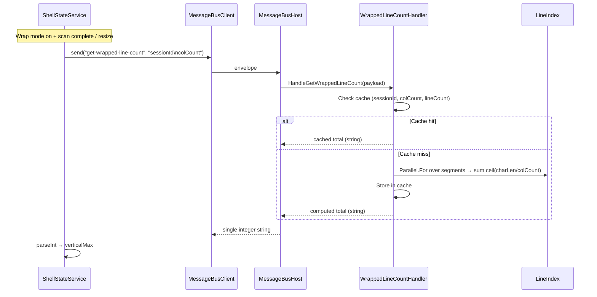
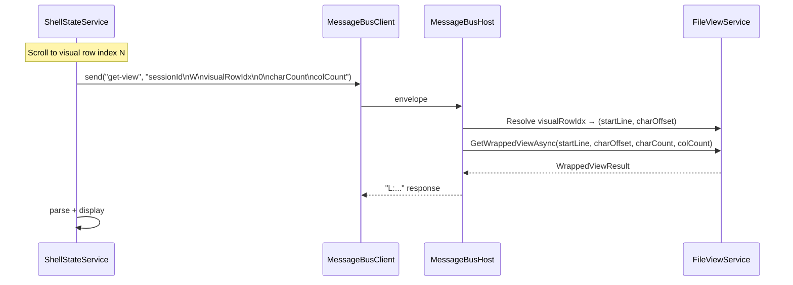

#[[file:.kiro/specs/_global/design-shared.md]]

# Design: wrapped-line-count

## Overview

Replaces the bulk `get-line-lengths` handler (one integer per line, newline-delimited) with a single-integer `get-wrapped-line-count` backend handler. The backend computes total visual rows server-side using `ceil(charLen / colCount)` per line, iterating LineIndex segments concurrently via `Parallel.For`. A per-session cache keyed by `(sessionId, colCount, lineCount)` avoids recomputation on repeated requests. The frontend removes all `lineLengths` signal infrastructure and instead sets `verticalMax` directly from the single-integer response. Scroll navigation uses backend-resolved visual row indices — the frontend sends a visual row index and the backend resolves it to `(startLine, characterOffset)`.

## Architecture





### Design Decisions

1. **Single integer response** — eliminates O(N) payload for large files; frontend needs only `verticalMax`
2. **Server-side computation** — avoids transferring per-line data across Photino bridge
3. **Parallel.For over segments** — LineIndex stores lines in segments; each segment's contribution is independent, enabling lock-free parallel summation with thread-local accumulators
4. **Cache key = (sessionId, colCount, lineCount)** — lineCount changes as scan progresses; colCount changes on resize; sessionId isolates files
5. **Backend visual row resolution** — frontend sends visual row index directly in wrapped get-view request; backend iterates lines to find (startLine, characterOffset), eliminating need for frontend line-length map
6. **Complete removal of get-line-lengths** — no partial migration; handler, subscription, signals all removed in one pass
7. **Fallback to byte length** — when Full_Scan hasn't reached a line yet, byte length approximates char length (exact for ASCII, close for UTF-8)

## Components and Interfaces

### Backend: HandleGetWrappedLineCount (Program.cs)

```csharp
internal static string HandleGetWrappedLineCount(
    string payload,
    Dictionary<string, FileViewService> sessions,
    object sessionLock,
    Dictionary<string, (int colCount, int lineCount, long total)> wrappedLineCountCache)
{
    // Parse payload: "{sessionId}\n{colCount}"
    var newlineIdx = payload.IndexOf('\n');
    if (newlineIdx == -1) return "ERROR: Invalid payload";

    var sessionId = payload[..newlineIdx];
    if (!int.TryParse(payload[(newlineIdx + 1)..], out var colCount) || colCount < 1)
        return "ERROR: colCount must be >= 1";

    FileViewService? service;
    lock (sessionLock) { sessions.TryGetValue(sessionId, out service); }
    if (service is null) return $"ERROR: Session not found: {sessionId}";

    var lineIndex = service.LineIndex;
    var lineCount = lineIndex.LineCount;

    // Cache check
    if (wrappedLineCountCache.TryGetValue(sessionId, out var cached)
        && cached.colCount == colCount && cached.lineCount == lineCount)
    {
        return cached.total.ToString();
    }

    // Parallel computation over line range
    long total = ComputeWrappedLineCount(lineIndex, lineCount, colCount);

    // Update cache
    wrappedLineCountCache[sessionId] = (colCount, lineCount, total);
    return total.ToString();
}
```

### Backend: ComputeWrappedLineCount (pure computation)

```csharp
internal static long ComputeWrappedLineCount(LineIndex lineIndex, int lineCount, int colCount)
{
    if (lineCount == 0) return 0;

    long total = 0;
    Parallel.For(0, lineCount, () => 0L, (i, _, subtotal) =>
    {
        var charLen = lineIndex.GetCharLength(i);
        long len = (long)(charLen ?? lineIndex.GetByteLength(i));
        subtotal += len == 0 ? 1 : (len + colCount - 1) / colCount;
        return subtotal;
    },
    subtotal => Interlocked.Add(ref total, subtotal));

    return total;
}
```

### Backend: ResolveVisualRowIndex (pure computation)

```csharp
internal static (int startLine, int characterOffset) ResolveVisualRowIndex(
    LineIndex lineIndex, int lineCount, int colCount, long visualRowIndex)
{
    if (lineCount == 0) return (0, 0);

    long cumulative = 0;
    for (int i = 0; i < lineCount; i++)
    {
        var charLen = lineIndex.GetCharLength(i);
        long len = (long)(charLen ?? lineIndex.GetByteLength(i));
        long visualRows = len == 0 ? 1 : (len + colCount - 1) / colCount;

        if (cumulative + visualRows > visualRowIndex)
        {
            // Target is within this line
            long rowWithinLine = visualRowIndex - cumulative;
            int characterOffset = (int)(rowWithinLine * colCount);
            return (i, characterOffset);
        }
        cumulative += visualRows;
    }

    // Clamp to last visual row
    var lastLen = lineIndex.GetCharLength(lineCount - 1);
    long lastLineLen = (long)(lastLen ?? lineIndex.GetByteLength(lineCount - 1));
    long lastVisualRows = lastLineLen == 0 ? 1 : (lastLineLen + colCount - 1) / colCount;
    int lastOffset = (int)((lastVisualRows - 1) * colCount);
    return (lineCount - 1, lastOffset);
}
```

### Backend: Cache Structure

```csharp
// In Program.Main, alongside sessions dictionary:
var wrappedLineCountCache = new Dictionary<string, (int colCount, int lineCount, long total)>();
```

Cache eviction on `close-file`:
```csharp
// Inside HandleCloseFile, after sessions.Remove:
wrappedLineCountCache.Remove(viewSessionId);
```

### Frontend: ShellStateService Changes

**Removed:**
- `lineLengths` signal
- `totalLogicalLines` signal
- `lineLengthsSubscription`
- `handleLineLengthsResponse` method
- `requestLineLengths` method
- `updateWrappedScrollbarMax` method
- `get-line-lengths` subscription in constructor

**Added:**
```typescript
// In handleScrollInfoResponse, after scan terminal state detected:
if (this.wrapMode()) {
  this.requestWrappedLineCount(sessionId);
}

// New method:
private requestWrappedLineCount(sessionId: string): void {
  const dims = this.viewDimensions();
  if (!dims) return;
  const payload = `${sessionId}\n${dims.colCount}`;
  this.messageBus.send('get-wrapped-line-count', payload);
}

// New subscription in constructor:
this.wrappedLineCountSubscription = this.messageBus.subscribe(
  'get-wrapped-line-count', (msg: InboundMessage) => {
    this.handleWrappedLineCountResponse(msg.payload);
  });

// New handler:
private handleWrappedLineCountResponse(payload: string): void {
  if (payload.startsWith('ERROR:')) return;
  const value = parseInt(payload, 10);
  const verticalMax = isNaN(value) || value < 0 ? 0 : value;
  const tab = this.activeTab();
  if (!tab) return;
  const state = this.tabViewStates().get(tab.viewSessionId);
  if (!state) return;
  this.updateTabScrollbar(tab.viewSessionId, {
    verticalMax,
    horizontalMax: state.scrollbarState.horizontalMax,
    disabled: verticalMax === 0 && state.scrollbarState.horizontalMax === 0,
  });
}
```

**Modified: `verticalThumbFraction`** — uses visual row index from backend resolution instead of local `lineLengths` map computation.

**Modified: `toggleWrapMode`** — calls `requestWrappedLineCount` instead of `requestLineLengths`.

**Modified: `activateTab`** — calls `requestWrappedLineCount` instead of `requestLineLengths` when wrap mode active.

### Frontend: Wrapped Scroll Navigation

Frontend sends visual row index directly in the wrapped get-view request. The `startLine` field in the 6-field wrapped request becomes the visual row index when navigating via scrollbar drag. Backend resolves to `(startLine, characterOffset)` before calling `GetWrappedViewAsync`.

Modified `HandleGetView` for wrapped mode:
```csharp
// When fields[2] is a visual row index (indicated by scroll-navigation context):
var resolved = ResolveVisualRowIndex(lineIndex, lineCount, wrappedColCount, visualRowIndex);
var result = await service.GetWrappedViewAsync(
    resolved.startLine, resolved.characterOffset, charCount, wrappedColCount);
```

## Data Models

### Cache Entry

```csharp
// Per-session cache for wrapped line count
Dictionary<string, (int colCount, int lineCount, long total)> wrappedLineCountCache;
```

- **Key**: sessionId (string)
- **Value**: tuple of (colCount used, lineCount at computation time, computed total)
- **Invalidation**: colCount changed OR lineCount changed → recompute
- **Eviction**: session closed → remove entry

### Message Protocol

| Message | Direction | Payload | Response |
|---------|-----------|---------|----------|
| `get-wrapped-line-count` | FE→BE | `{sessionId}\n{colCount}` | Single integer string OR `ERROR:...` |

## Correctness Properties

*A property is a characteristic or behavior that should hold true across all valid executions of a system — essentially, a formal statement about what the system should do. Properties serve as the bridge between human-readable specifications and machine-verifiable correctness guarantees.*

### Property 1: Wrapped line count computation correctness

*For any* array of line lengths (where each length ≥ 0) and any colCount ≥ 1, the handler SHALL return a total equal to the sum of: 1 for each line with length 0, and ceil(length / colCount) for each line with length > 0.

**Validates: Requirements 1.1, 1.2, 1.3, 2.2**

### Property 2: Visual row index resolution round-trip

*For any* array of line lengths and any visual row index in range [0, totalVisualRows), resolving the index to (startLine, characterOffset) and then computing the cumulative visual rows up to that position SHALL equal the original visual row index.

**Validates: Requirements 4.1, 4.2, 4.3, 4.4**

### Property 3: Cache key correctness

*For any* sequence of requests to the same session, the handler SHALL return the cached value (without recomputation) if and only if both colCount and lineCount are unchanged from the previous computation; otherwise it SHALL recompute.

**Validates: Requirements 6.1, 6.2, 6.3, 6.4**

### Property 4: Char-length fallback

*For any* line where GetCharLength returns null, the handler SHALL use GetByteLength for that line's visual row computation, producing the same result as if charLen were the byte length value.

**Validates: Requirements 1.4**

### Property 5: Response parsing validation

*For any* string response from the backend, the frontend handler SHALL set verticalMax to the parsed integer if the string represents a valid non-negative integer, and SHALL set verticalMax to 0 otherwise.

**Validates: Requirements 3.4**

## Error Handling

| Condition | Handler | Response |
|-----------|---------|----------|
| Session not found | `HandleGetWrappedLineCount` | `"ERROR: Session not found: {id}"` |
| colCount < 1 | `HandleGetWrappedLineCount` | `"ERROR: colCount must be >= 1"` |
| Invalid payload (no newline) | `HandleGetWrappedLineCount` | `"ERROR: Invalid payload"` |
| Visual row index > total | `ResolveVisualRowIndex` | Clamp to last visual row |
| Backend ERROR: response | Frontend handler | Set verticalMax = 0 |
| Non-integer response | Frontend handler | Set verticalMax = 0 |

## Testing Strategy

**Property-based tests** (PBT applicable — pure computation with clear input/output):
- fast-check `{ numRuns: 10 }` (TypeScript)
- FsCheck `[Property(MaxTest = 10)]` (C#)

**Backend (C# / FsCheck):**
- Property 1: Generate random `int[]` line lengths + random colCount, verify `ComputeWrappedLineCount` matches sequential formula
- Property 2: Generate random line lengths + random visual row index, verify `ResolveVisualRowIndex` round-trips
- Property 3: Generate sequences of (colCount, lineCount) pairs, verify cache hit/miss behavior
- Property 4: Generate LineIndex mock with mixed null/non-null char lengths, verify fallback

**Frontend (TypeScript / fast-check):**
- Property 5: Generate random strings (valid integers, invalid strings, negative numbers, floats), verify `handleWrappedLineCountResponse` sets correct verticalMax

**Unit tests (example-based):**
- Verify `get-wrapped-line-count` handler registration in Program.cs
- Verify `close-file` removes cache entry
- Verify `toggleWrapMode` sends `get-wrapped-line-count` (not `get-line-lengths`)
- Verify scan-complete triggers `get-wrapped-line-count` when wrap mode active
- Verify resize debounce triggers `get-wrapped-line-count`

**Structural verification (smoke):**
- `get-line-lengths` handler removed from Program.cs
- `lineLengths`, `totalLogicalLines`, `requestLineLengths`, `handleLineLengthsResponse`, `lineLengthsSubscription` removed from ShellStateService

**Tag format:** `Feature: wrapped-line-count, Property {N}: {text}`
